# Radio Gateway

A Linux gateway that bridges two-way radios to Mumble VoIP, Broadcastify streaming, and the internet. Handles multiple audio sources with priority-based mixing, SDR receivers, AI-powered announcements, full CAT radio control, and a live web dashboard — all from a single Python process on a Raspberry Pi or any Linux box.

## Highlights

- **Bidirectional radio-to-Mumble bridge** with auto-PTT via AIOC USB, relay, or CAT serial
- **Broadcast-style audio mixer** — additive mixing with soft tanh limiter; 6 priority levels, per-source ducking, attack/release/padding transitions
- **RSPduo dual SDR** — two simultaneous tuners via RTLSDR-Airband + SoapySDR Master/Slave, with click suppressor
- **Live web dashboard** — real-time audio bars, system stats, controls, browser audio player (MP3 + low-latency WebSocket PCM)
- **Three radios** — TH-9800 (CAT serial), TH-D75 (Bluetooth with TX audio, memory channels, fire-and-forget PTT), KV4P HT (USB serial)
- **AI announcements** — scheduled broadcasts via Claude CLI: web search, natural speech composition, gTTS, no API key
- **ADS-B tracking** — dump1090-fa map with dark mode and NEXRAD weather overlay, reverse-proxied through the gateway
- **Room Monitor** — browser page and Android APK stream device mic to the gateway mixer over WebSocket
- **MCP server** — 31 tools for AI control of the entire gateway (status, tuning, PTT, TTS, mixer, config, recordings)
- **Telegram bot** — text commands via Claude Code in tmux, voice notes transmitted directly over radio
- **Cloudflare tunnel** — free public HTTPS, no port forwarding or domain needed

## Screenshots

| Dashboard | Controls | Monitor |
|:-:|:-:|:-:|
| 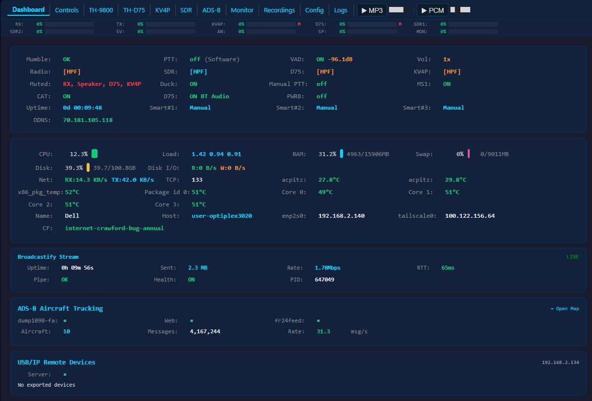 | 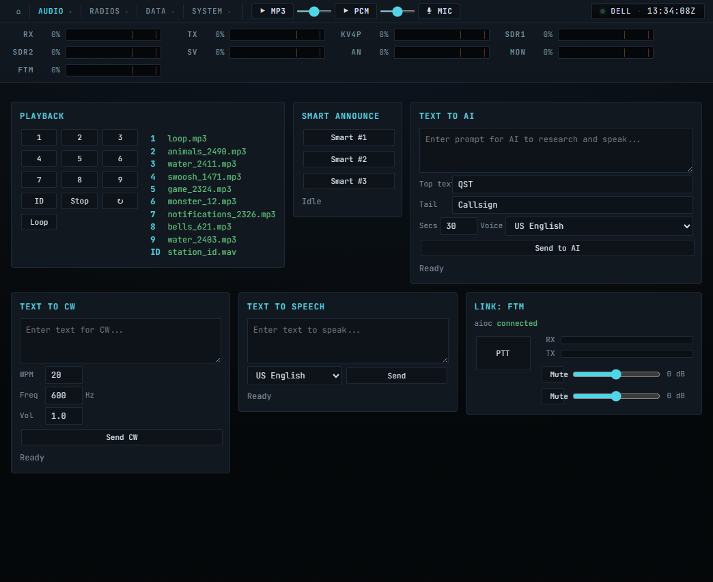 | 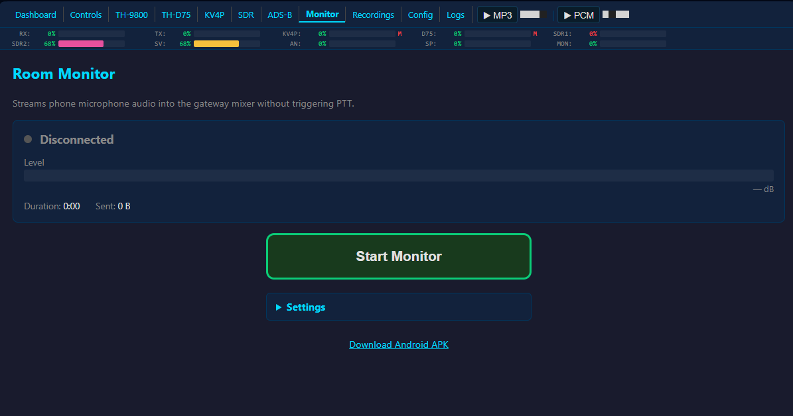 |

| TH-9800 | TH-D75 | KV4P |
|:-:|:-:|:-:|
| 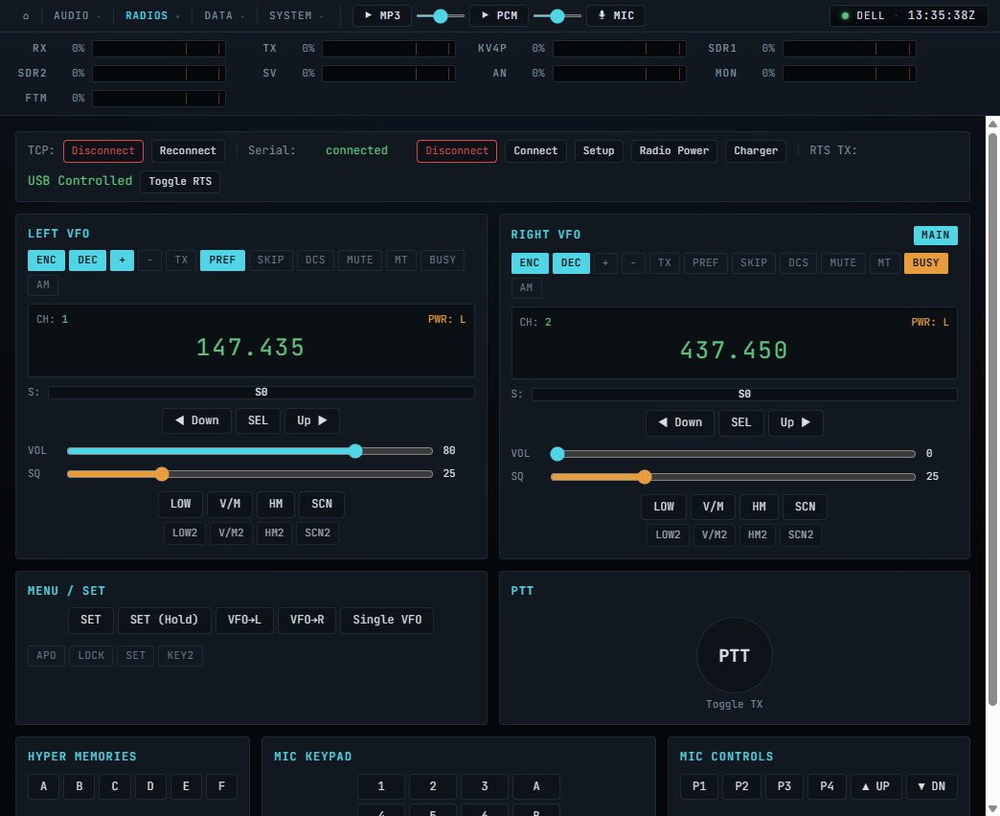 | 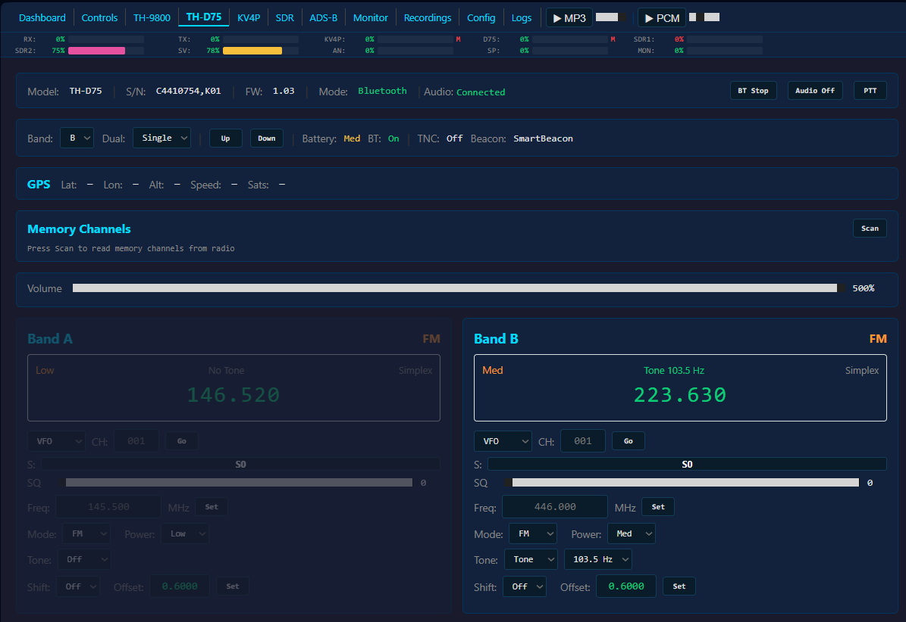 | 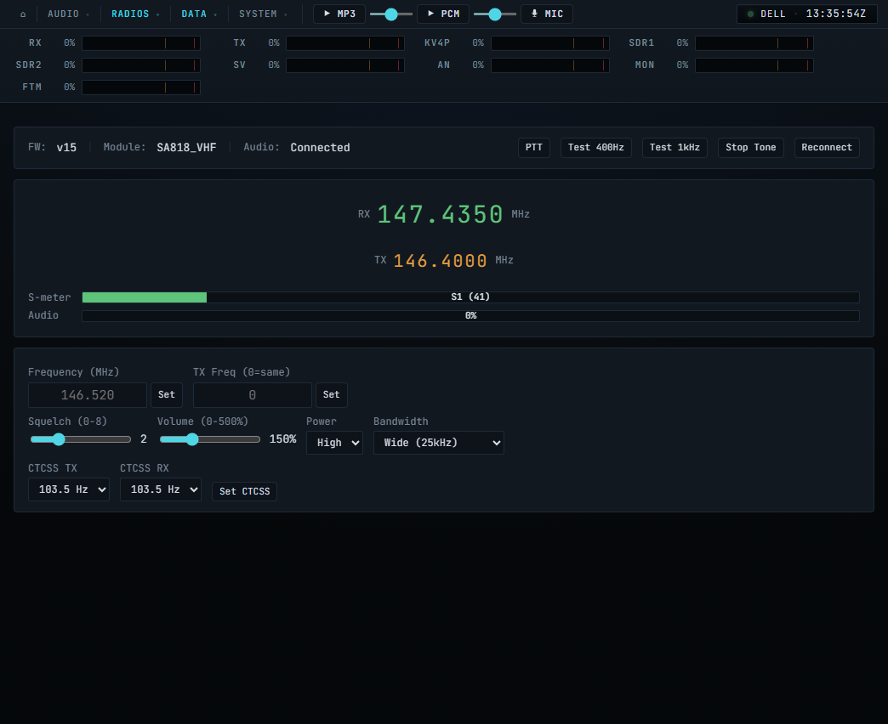 |

| SDR Control | ADS-B Tracking | Config |
|:-:|:-:|:-:|
| 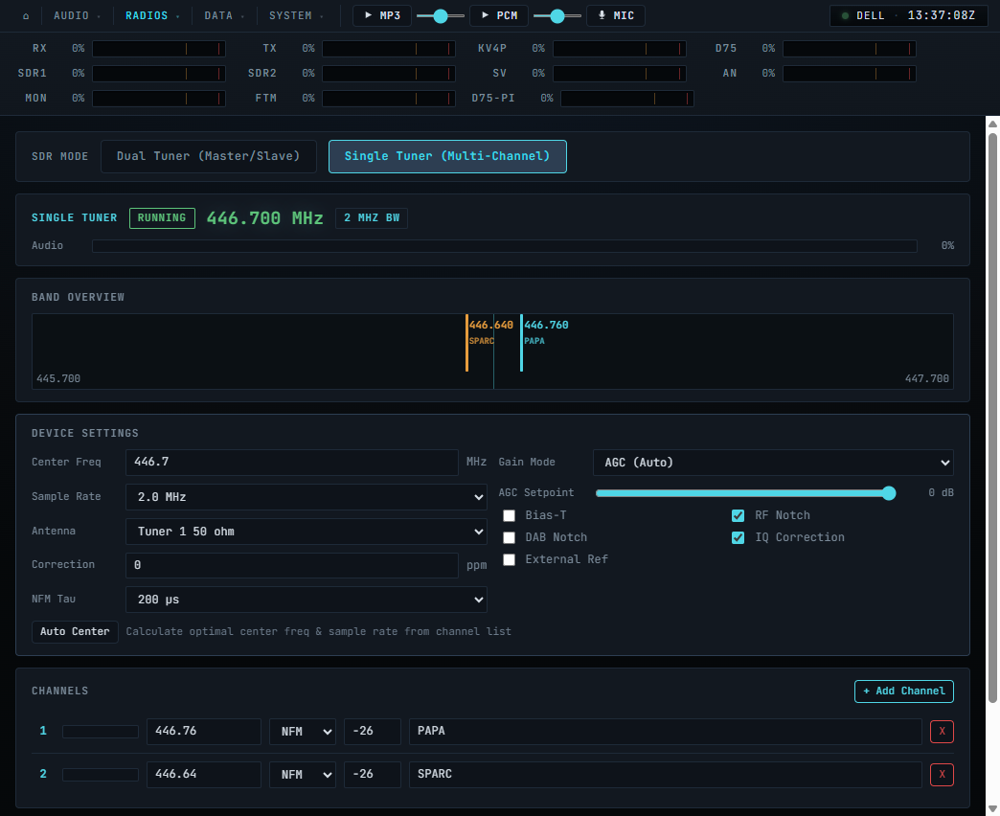 | 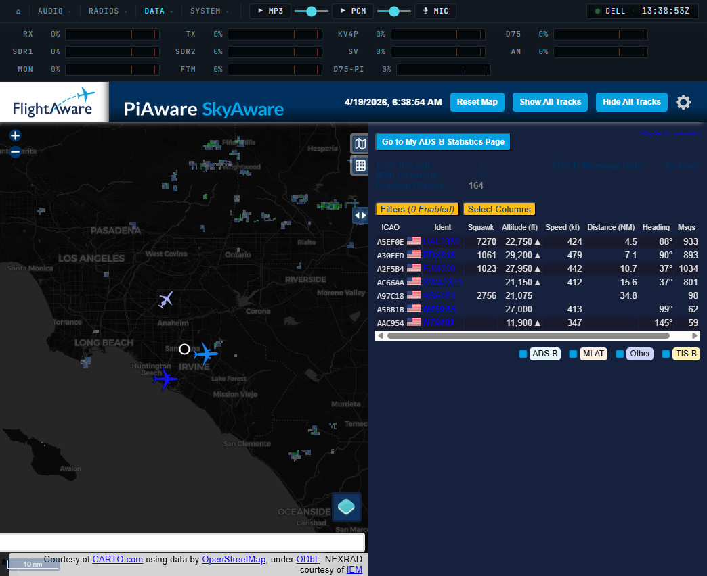 | 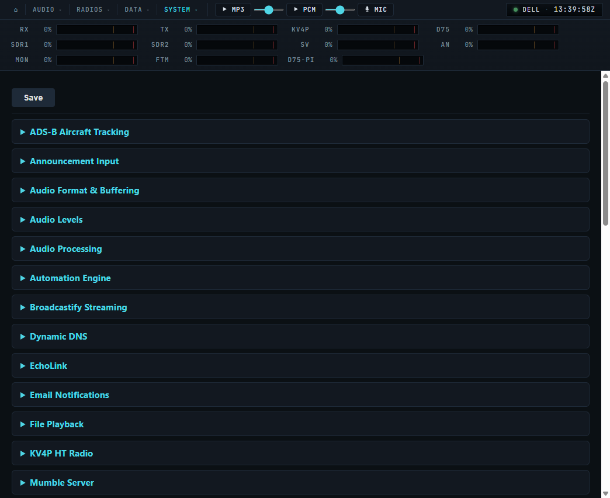 |

| Recordings | Logs |
|:-:|:-:|
| 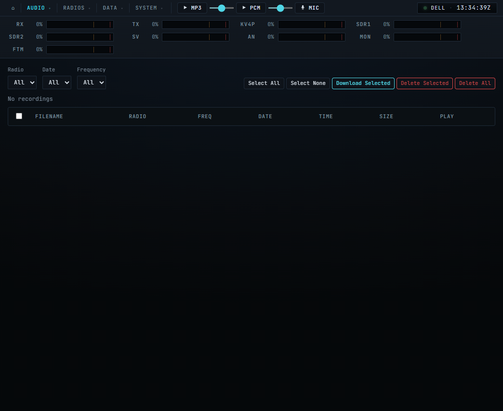 | 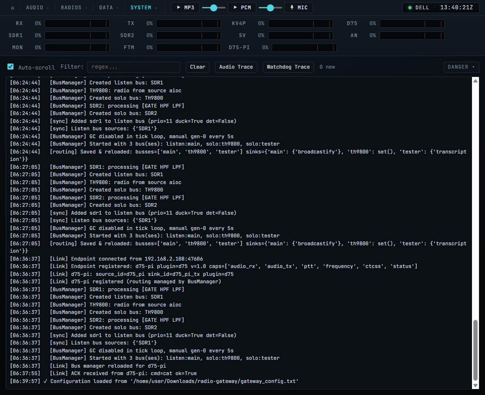 |

## Table of Contents

- [Quick Start](#quick-start)
- [Web Interface](#web-interface)
- [Audio Sources & Mixing](#audio-sources--mixing)
- [Radio Control](#radio-control)
- [SDR Receivers](#sdr-receivers)
- [ADS-B Aircraft Tracking](#ads-b-aircraft-tracking)
- [Room Monitor](#room-monitor)
- [Smart Announcements](#smart-announcements)
- [Streaming (Broadcastify)](#streaming-broadcastify)
- [MCP Server (AI Control)](#mcp-server-ai-control)
- [Telegram Bot](#telegram-bot)
- [Remote Audio Link](#remote-audio-link)
- [Windows Audio Client](#windows-audio-client)
- [Keyboard Controls](#keyboard-controls)
- [Troubleshooting](#troubleshooting)
- [Configuration Reference](#configuration-reference)
- [Audio Flow Diagram](#audio-flow-diagram)
- [Project Structure](#project-structure)
- [Changelog](#changelog)
- [License](#license)

## Quick Start

### Requirements

- Raspberry Pi 4 (or any Linux system — Debian, Ubuntu, Arch)
- Python 3.7+
- AIOC USB audio interface (for radio TX/RX)
- Mumble server access

### Installation

```bash
git clone <your-repo-url>
cd radio-gateway
bash scripts/install.sh
```

The installer handles all dependencies: system packages (Python, PortAudio, FFmpeg, HIDAPI, scipy), ALSA loopback setup, Python packages, UDEV rules, audio group membership, WirePlumber config, Mumble server, example config, and a desktop shortcut.

> **Supported:** Raspberry Pi (any model), Debian 12, Ubuntu 22.04+, Arch Linux.

> **Python 3.12+:** The installer patches the `pymumble` SSL layer automatically.

### First Run

1. Copy and edit the config:
   ```bash
   cp examples/gateway_config.txt gateway_config.txt
   ```

2. Set your Mumble server details:
   ```ini
   MUMBLE_SERVER = your.mumble.server
   MUMBLE_PORT = 64738
   MUMBLE_USERNAME = RadioGateway
   MUMBLE_PASSWORD = yourpassword
   ```

3. Start the gateway:
   ```bash
   bash start.sh
   ```
   Or run directly: `python3 radio_gateway.py`

   `start.sh` handles the full startup sequence: kills stale processes, starts Mumble GUI (if not headless), CAT server, Claude Code tmux session, CPU governor, loopback modules, AIOC USB reset, DarkIce, FFmpeg, and the gateway itself with `nice -10`.

## Web Interface

Built-in HTTP server (Python `http.server`, no Flask). Shell frame with persistent audio level bars visible on every page. Compact nav bar with inline MP3/PCM audio controls. Active page indicated by nav underline.

```ini
[web]
ENABLE_WEB_CONFIG = true
WEB_CONFIG_PORT = 8080
WEB_CONFIG_PASSWORD =        # blank = no auth
GATEWAY_NAME = My Gateway
WEB_THEME = blue             # blue, red, green, purple, amber, teal, pink
```

**Pages:**

| Path | Description |
|------|-------------|
| `/` | Config editor — INI sections as collapsible panels, Save & Restart |
| `/dashboard` | Live status — audio bars, uptime, Mumble/PTT/VAD state, system stats, Cloudflare URL |
| `/controls` | All control groups — mute/volume, processing, playback, Smart Announce, Broadcastify, PTT, TTS, System, ADS-B, Telegram |
| `/monitor` | Room monitor — streams device mic to gateway mixer, gain/VAD/level controls |
| `/radio` | TH-9800 front-panel replica — dual VFO, signal meters, all buttons, browser mic PTT |
| `/d75` | TH-D75 control — band A/B VFOs, memory channels, D-STAR, BT connect/disconnect |
| `/kv4p` | KV4P HT — frequency, CTCSS, squelch, power, S-meter |
| `/sdr` | SDR control — frequency/modulation/gain/squelch, 10-slot channel memory, dual tuner |
| `/aircraft` | ADS-B map — dark mode, NEXRAD weather, reverse-proxied dump1090-fa |
| `/recordings` | Browse, play, download, delete recorded audio; filter by source/date/frequency |
| `/logs` | Live scrolling log viewer with regex filter, Audio Trace, Watchdog Trace |

**Browser audio:** MP3 stream (shared FFmpeg encoder) and low-latency WebSocket PCM player with 200ms pre-buffer. Screen wake lock during playback.

**Cloudflare tunnel:** Free public HTTPS via `*.trycloudflare.com` — launches `cloudflared` as a subprocess, works behind NAT.

```ini
ENABLE_CLOUDFLARE_TUNNEL = true
```

## Audio Sources & Mixing

### Priority Table

```
Priority 0 (Highest) → File Playback    [PTT → Radio TX]
Priority 0 (Highest) → ANNIN            [PTT → Radio TX, audio-gated — TCP port 9601]
Priority 0 (Highest) → WebMic           [PTT → Radio TX, browser mic via CAT]
Priority 1           → Mumble RX        [PTT → Radio TX, direct path — bypasses mixer]
Priority 1           → Radio RX         [→ Mumble TX, no PTT]
Priority 2           → SDR1 Receiver    [→ Mumble TX, with ducking]
Priority 2           → SDR2 Receiver    [→ Mumble TX, with ducking]
Priority 2           → KV4P HT          [→ Mumble TX, with ducking — configurable]
Priority 3 (default) → SDRSV            [→ Mumble TX, Remote Audio Link client]
Priority 4           → EchoLink         [→ Mumble TX]
Priority 5           → Monitor          [→ Mixer only, no PTT — WebMonitorSource]
```

**Mumble RX and WebMic** bypass the mixer entirely — audio goes directly to radio TX with PTT.

### Broadcast-Style Mixing

Audio mixing is additive with a soft tanh limiter. A single source plays at full volume. When sources overlap, they are summed and compressed gracefully rather than halved. This replaces older ratio-based mixing.

### Duck Hierarchy

Radio RX (P1) ducks all P2+ sources. Within P2, sources duck each other by configurable sub-priority (`SDR_PRIORITY`, `SDR2_PRIORITY`, `KV4P_AUDIO_PRIORITY`). Each duck transition uses attack, release, and padding stages:

| Parameter | Default | Description |
|-----------|---------|-------------|
| `SIGNAL_ATTACK_TIME` | 0.15s | Continuous signal required before duck triggers (resets on silence) |
| `SIGNAL_RELEASE_TIME` | 3.0s | Continuous silence required before SDR resumes |
| `SWITCH_PADDING_TIME` | 1.0s | Silence gap inserted at each transition |

Re-duck inhibit (2.0s) prevents rapid duck cycling after un-duck.

### Audio Processing

Per-source filter chains (Radio and SDR have independent instances). Requires `scipy`.

- **VAD** — Voice Activity Detection with configurable threshold (enabled by default)
- **Noise Gate** — removes background noise below threshold
- **HPF** — high-pass filter (low-frequency rumble)
- **LPF** — low-pass filter (high-frequency hiss)
- **Notch Filter** — narrow-band rejection at configurable frequency and Q

D75 and KV4P sources have per-source Gate/HPF/LPF/Notch toggle buttons on the dashboard.

### SDR Click Suppressor

Detects and interpolates sample-to-sample jumps to eliminate subtle clicks in SDR audio.

### File Playback

10 announcement slots (keys 0-9). Supports WAV, MP3, FLAC with automatic resampling. Triggers PTT when playing. CW/Morse code via `!cw <text>`.

### Text-to-Speech

Google TTS via `!speak <text>` from Mumble chat. 9 voice accents (US, UK, AU, IN, SA, CA, IE, FR, DE). Configurable speed and volume.

### Speaker Output

Mirrors mixed audio to a local speaker/headphone. Toggle with `o` key. Independent from Mumble and streaming.

## Radio Control

### TH-9800

Full CAT control via [TH9800_CAT.py](https://github.com/ukbodypilot/TH9800_CAT) TCP server. On startup, connects, authenticates, enables USB TX control (RTS), and sends setup commands (channel, volume, power for both VFOs). Auto serial connect on startup.

Web UI (`/radio`): full front-panel replica with dual VFO display, signal meters, all radio buttons, menu/SET, hyper memories, mic keypad, browser mic PTT.

```ini
ENABLE_CAT_CONTROL = true
CAT_HOST = 127.0.0.1
CAT_PORT = 9800
CAT_LEFT_CHANNEL = 1
CAT_RIGHT_CHANNEL = 2
```

### TH-D75 (Bluetooth)

Kenwood TH-D75 D-STAR HT via Bluetooth proxy (`scripts/remote_bt_proxy.py`). Proxy ports: 9750 (CAT text), 9751 (raw 8kHz PCM audio).

- **BT TX audio** — transmit playback, TTS, and announcements through the D75 via Bluetooth SCO
- **Memory channel load** — loads channels into VFO via FO command with full tone, mode, shift, offset, and power settings
- **BT reliability** — 15s btstart retry, SM poll rate limiting with backoff, fire-and-forget PTT
- **Status** — battery level, TNC mode, beacon type from proxy

Web UI (`/d75`): band A/B VFOs, memory channels, D-STAR status, BT connect/disconnect, Up/Down buttons.

### KV4P HT

KV4P software-defined radio module (SA818/DRA818) via CP2102 USB-serial. Opus codec audio routed into the mixer.

- DRA818 uses 38 CTCSS tones (not 39 — no 69.3 Hz)
- PTT via its own serial interface (not AIOC)

Web UI (`/kv4p`): frequency, CTCSS TX/RX, squelch, volume, power, bandwidth, S-meter.

```ini
ENABLE_KV4P = true
KV4P_PORT = /dev/kv4p
TX_RADIO = kv4p
```

## SDR Receivers

Two SDR inputs via PipeWire virtual sinks (recommended) or ALSA loopback devices.

### PipeWire (Recommended)

```ini
SDR_DEVICE_NAME = pw:sdr_capture       # SDR1
SDR2_DEVICE_NAME = pw:sdr_capture2     # SDR2
```

The gateway auto-creates PipeWire sinks if missing. For persistence, the installer deploys a WirePlumber config.

### ALSA Loopback (Alternative)

```bash
sudo modprobe snd-aloop enable=1,1,1 index=4,5,6
```

Loopback pairs: SDR software writes to `hw:X,0`, gateway reads from `hw:X,1`.

### RSPduo Dual Tuner

Both RSPduo tuners run simultaneously via Master/Slave mode (mode 4 + mode 8). The obvious approach (mode 2, "Dual Tuner Independent RX") fails — it holds an exclusive device lock.

| Mode | Role | Tuner | Gateway stream |
|------|------|-------|---------------|
| 4 | Master | Tuner 1 | SDR1 → `sdr_capture` |
| 8 | Slave  | Tuner 2 | SDR2 → `sdr_capture2` |

**Start order is critical:** Master must be streaming before Slave starts. The gateway enforces this automatically.

**Required plugin:** [fventuri's SoapySDRPlay3 fork](https://github.com/fventuri/SoapySDRPlay3/tree/dual-tuner-submodes) (`dual-tuner-submodes` branch). The standard package does not expose modes 4/8.

> **Arch Linux:** Add `IgnorePkg = soapysdrplay3-git` to `/etc/pacman.conf` to prevent AUR updates from overwriting the fventuri plugin.

**Sample rate limit:** 2.0 MSps per tuner in Master/Slave mode.

### SDR Web Control

The `/sdr` page provides full SDR control: frequency with step buttons, modulation (AM/NFM), sample rate, antenna, AGC/manual gain, squelch, device options, audio filters, 10-slot channel memory. Settings persist in `sdr_channels.json`.

### SDR Rebroadcast

Routes the SDR-only mix back to Radio TX with automatic PTT (`b` key toggle). PTT holds for `SDR_REBROADCAST_PTT_HOLD` seconds (default 3.0) after signal stops. File playback takes priority. Radio RX input disabled during rebroadcast to prevent feedback.

### Loopback Watchdog

Detects stalled ALSA reads after extended runtime. Staged recovery: reopen stream, reinitialize PyAudio, reload kernel module (optional, requires sudoers).

## ADS-B Aircraft Tracking

Embedded FlightAware PiAware SkyAware map via reverse proxy. Dark mode with NEXRAD weather overlay.

- **Hardware:** RTL2838/R820T USB SDR dongle (separate from RSPduo)
- **Stack:** dump1090-fa + lighttpd on port 30080; fr24feed uploads to FlightRadar24
- **Access:** Single-port through gateway at `/aircraft`, works through Cloudflare tunnel

```ini
ENABLE_ADSB = true
ADSB_PORT = 30080
```

## Room Monitor

Stream a device microphone to the gateway mixer over WebSocket without triggering PTT. Priority 5 (lowest). Works over Cloudflare tunnel.

- **Browser:** `/monitor` page with gain control (1x-50x), VAD threshold, level meter
- **Android APK:** `tools/room-monitor.apk` (also downloadable from gateway at `/monitor-apk`). Foreground service with persistent notification, streams even when screen is locked.

```ini
ENABLE_WEB_MONITOR = true
```

## Smart Announcements

Scheduled radio announcements powered by Claude CLI. Claude searches the web, composes a natural spoken message, and the gateway broadcasts via gTTS + PTT. No API key — uses existing Claude Code auth.

1. Configure announcement slots with interval, voice, target length, and prompt
2. On each interval, `claude -p` is called with the prompt
3. Response converted to speech and broadcast on radio
4. If the radio is busy, waits up to ~8 minutes for a clear channel

```ini
ENABLE_SMART_ANNOUNCE = true
SMART_ANNOUNCE_START_TIME = 08:00
SMART_ANNOUNCE_END_TIME = 22:00

SMART_ANNOUNCE_1_PROMPT = Weather forecast for London, UK
SMART_ANNOUNCE_1_INTERVAL = 3600
SMART_ANNOUNCE_1_VOICE = 1
SMART_ANNOUNCE_1_TARGET_SECS = 20
SMART_ANNOUNCE_1_MODE = auto
```

Keyboard triggers: `[` = #1, `]` = #2, `\` = #3. Mumble: `!smart <N>`.

## Streaming (Broadcastify)

DarkIce streams mixed audio to Icecast/Broadcastify via a named pipe.

```ini
ENABLE_STREAM_OUTPUT = true
STREAM_SERVER = audio9.broadcastify.com
STREAM_PORT = 80
STREAM_MOUNT = /yourmount
STREAM_BITRATE = 16
```

Dashboard panel shows live streaming status: DarkIce state (LIVE/NO CONN/OFF), bytes sent, TCP send rate, RTT, restart counts. Start/Stop/Restart buttons.

**Setup:**
1. `sudo apt-get install darkice lame`
2. `sudo cp scripts/darkice.cfg.example /etc/darkice.cfg`
3. Edit `/etc/darkice.cfg` with your stream key
4. Use `start.sh` to launch gateway and DarkIce together

## MCP Server (AI Control)

`gateway_mcp.py` is a stdio-based MCP server with 31 tools that gives Claude (or any MCP-compatible AI) full control via the HTTP API on port 8080.

**Tools:** `gateway_status`, `sdr_status`, `cat_status`, `system_info`, `sdr_tune`, `sdr_restart`, `sdr_stop`, `radio_ptt`, `radio_tts`, `radio_cw`, `radio_ai_announce`, `radio_set_tx`, `radio_get_tx`, `radio_frequency`, `recordings_list`, `recordings_delete`, `recording_playback`, `gateway_logs`, `gateway_key`, `automation_trigger`, `audio_trace_toggle`, `telegram_reply`, `telegram_status`, `d75_status`, `d75_command`, `d75_frequency`, `kv4p_status`, `kv4p_command`, `mixer_control`, `config_read`, `process_control`

**Setup:** `.mcp.json` in project root. Enable in Claude Code: `"enableAllProjectMcpServers": true` in `.claude/settings.json`.

The MCP server is a Claude Code child process — restarting the gateway does NOT restart MCP. Use `/mcp` in Claude Code to reconnect.

### /mixer HTTP Endpoint

`POST /mixer` provides headless mixer control (no stdin needed). 7 actions: status, mute/unmute/toggle, volume, duck, boost, flag, processing. Sources: global, tx, rx, sdr1, sdr2, d75, kv4p, remote, announce, speaker.

## Telegram Bot

Control the gateway from your phone via Telegram. Text messages go through Claude Code (MCP tools). Voice notes transmit directly over radio.

```
Text:  Phone → Telegram → telegram_bot.py → tmux → Claude Code (MCP) → telegram_reply()
Voice: Phone → Telegram → telegram_bot.py → ffmpeg → port 9601 → radio TX (PTT auto)
```

**Setup:**
1. Create a bot via `@BotFather`, copy the token
2. Get your chat ID: `curl "https://api.telegram.org/bot<TOKEN>/getUpdates"`
3. Configure:
   ```ini
   [telegram]
   ENABLE_TELEGRAM = true
   TELEGRAM_BOT_TOKEN = 123456:ABC-DEF...
   TELEGRAM_CHAT_ID = 987654321
   ```
4. Start Claude Code in tmux: `tmux new-session -s claude-gateway` then `claude --dangerously-skip-permissions`
5. Enable the service: `sudo systemctl enable --now telegram-bot`

Also requires `ENABLE_ANNOUNCE_INPUT = true` for voice note transmission.

## Remote Audio Link

Links two gateway instances over TCP. The server sends mixed audio; the client receives it as source "SDRSV" into its mixer.

```
Server (sends):   REMOTE_AUDIO_ROLE = server, REMOTE_AUDIO_HOST = <client IP>
Client (receives): REMOTE_AUDIO_ROLE = client, REMOTE_AUDIO_PORT = 9600
```

Server dials out to client. Audio flows one way. Auto-reconnects on link drop. SDRSV participates in the duck/priority system — configurable priority vs local SDRs.

### Announcement Input (Port 9601)

TCP listener for pushing audio directly to radio TX. Audio-gated PTT: silence is consumed but not transmitted. Same wire format as Remote Audio Link (4-byte big-endian length + 16-bit mono PCM at 48kHz).

```ini
ENABLE_ANNOUNCE_INPUT = true
ANNOUNCE_INPUT_PORT = 9601
ANNOUNCE_INPUT_THRESHOLD = -45.0
```

## Windows Audio Client

`windows_audio_client.py` sends audio to or receives audio from the gateway over TCP.

- **Server role** (send): captures local input, streams to gateway
- **Client role** (receive): plays gateway audio on local output
- Keys: `l` = toggle live/idle, `m` = switch role, `,`/`.` = volume
- Config saved to `windows_audio_client.json`

```bash
pip install sounddevice numpy
python windows_audio_client.py [host] [port]
```

## Keyboard Controls

### Mute
| Key | Action |
|-----|--------|
| `t` | TX mute (Mumble → Radio) |
| `r` | RX mute (Radio → Mumble) |
| `m` | Global mute |
| `s` | SDR1 mute |
| `x` | SDR2 mute |
| `c` | Remote audio mute (SDRSV) |
| `a` | Announcement input mute |
| `o` | Speaker output mute |

### Audio & Processing
| Key | Action |
|-----|--------|
| `v` | Toggle VAD |
| `,`/`.` | Volume down/up |
| `n` | Toggle noise gate |
| `f` | Toggle high-pass filter |
| `g` | Toggle AGC |
| `d` | Toggle SDR1 ducking |
| `b` | Toggle SDR rebroadcast |

### Playback & PTT
| Key | Action |
|-----|--------|
| `0-9` | Play announcement file (0 = station ID) |
| `-` | Stop playback |
| `p` | Manual PTT toggle |
| `[` `]` `\` | Trigger smart announcement 1/2/3 |

### System
| Key | Action |
|-----|--------|
| `q` | Restart gateway |
| `z` | Clear console |
| `k` | Reset remote audio TCP |
| `j` | Radio power button (relay pulse) |
| `h` | Charger relay toggle |
| `l` | Send CAT config commands |
| `@` | Send status email |
| `i` | Audio trace toggle |
| `u` | Watchdog trace toggle |

### Mumble Text Commands

| Command | Description |
|---------|-------------|
| `!speak <text>` | TTS broadcast (optional voice: `!speak 2 hello`) |
| `!cw <text>` | Morse code broadcast |
| `!play <0-9>` | Play announcement slot |
| `!files` | List loaded files |
| `!stop` | Stop playback |
| `!mute` / `!unmute` | TX mute control |
| `!id` | Play station ID |
| `!smart <N>` | Trigger smart announcement |
| `!restart` | Restart gateway |
| `!status` | Show status |
| `!help` | List commands |

## Troubleshooting

### WirePlumber / PipeWire

**DarkIce "format error" or "device busy":** WirePlumber claims loopback devices and locks them to `S32_LE`. Install the exclusion rule:
```bash
cp scripts/99-disable-loopback.conf ~/.config/wireplumber/wireplumber.conf.d/
systemctl --user restart wireplumber
```

**AIOC not found by gateway:** Same fix — the exclusion rule covers both loopback and AIOC devices.

**Loopback cards at wrong hw: numbers:** Reload with `sudo modprobe -r snd-aloop && sudo modprobe snd-aloop enable=1,1,1 index=4,5,6`.

### AIOC PTT

The AIOC PTT uses USB HID (`/dev/hidraw*`). Ensure the udev rule covers both `usb` and `hidraw` subsystems:
```bash
echo 'SUBSYSTEM=="hidraw", ATTRS{idVendor}=="1209", ATTRS{idProduct}=="7388", MODE="0666", GROUP="plugdev"' \
    | sudo tee -a /etc/udev/rules.d/99-aioc.rules
sudo udevadm control --reload-rules && sudo udevadm trigger
```

### SDR Audio

- **No audio:** Check `lsmod | grep snd_aloop`, verify device with `arecord -l | grep Loopback`
- **Always silent:** Check ducking (`d` key), mute (`s`/`x` key), `SDR_AUDIO_BOOST` (try 2.0)
- **Stuttering:** Check CPU usage, try `SDR_BUFFER_MULTIPLIER = 8`
- **Silent after hours:** Watchdog should recover automatically. If `W5` appears, watchdog gave up — restart with `!restart`
- **SDR2 always ducked:** Check `SDR_PRIORITY` vs `SDR2_PRIORITY`, or set `SDR2_DUCK = false`

### PTT

- **Not activating:** Check `PTT_METHOD` matches hardware. AIOC: try `AIOC_PTT_CHANNEL` 1/2/3. Software: needs `ENABLE_CAT_CONTROL = true`.
- **Releases too quickly:** Increase `PTT_RELEASE_DELAY` (try 0.8)
- **First syllable clipped:** Increase `PTT_ANNOUNCEMENT_DELAY` (try 1.0)

### Audio Quality

- **Choppy:** Increase `AUDIO_CHUNK_SIZE` (try 4800), enable `ENABLE_STREAM_HEALTH = true`
- **Background noise:** Enable `ENABLE_NOISE_GATE = true`, adjust `VAD_THRESHOLD`
- **Low volume:** Increase `INPUT_VOLUME`, `OUTPUT_VOLUME`, or `SDR_AUDIO_BOOST`

## Configuration Reference

<details>
<summary>Full configuration reference (click to expand)</summary>

### Core Audio

```ini
AUDIO_RATE = 48000           # Sample rate (Hz)
AUDIO_CHANNELS = 1           # Mono recommended for radio
AUDIO_BITS = 16              # Bit depth
AUDIO_CHUNK_SIZE = 2400      # Buffer size (samples per 50ms chunk)
INPUT_VOLUME = 1.0           # Radio RX → Mumble volume (0.1-3.0)
OUTPUT_VOLUME = 1.0          # Mumble → Radio TX volume (0.1-3.0)
```

### Mumble

```ini
MUMBLE_SERVER = your.mumble.server
MUMBLE_PORT = 64738
MUMBLE_USERNAME = RadioGateway
MUMBLE_PASSWORD =
MUMBLE_BITRATE = 96000       # Opus encoder bitrate (bits/sec)
MUMBLE_VBR = false           # false = CBR (recommended for radio monitoring)
```

### VAD

```ini
ENABLE_VAD = true
VAD_THRESHOLD = -45          # dBFS (-50 to -20, more negative = more sensitive)
VAD_ATTACK = 0.05            # Seconds to activate
VAD_RELEASE = 1.0            # Hold time after silence
VAD_MIN_DURATION = 0.25      # Minimum transmission length
```

### PTT

Three methods: `aioc` (USB HID GPIO), `relay` (CH340 USB relay), `software` (CAT TCP command).

```ini
PTT_METHOD = aioc
AIOC_PTT_CHANNEL = 3                # GPIO channel (1, 2, or 3)
PTT_RELAY_DEVICE = /dev/relay_ptt   # For relay method
PTT_ACTIVATION_DELAY = 0.1          # Pre-PTT delay (seconds)
PTT_RELEASE_DELAY = 0.5             # Post-PTT tail (seconds)
PTT_ANNOUNCEMENT_DELAY = 0.5        # Key-up delay before audio starts
```

### SDR

Both SDRs share the same parameter set; SDR2 uses `SDR2_` prefix.

```ini
ENABLE_SDR = true
SDR_DEVICE_NAME = pw:sdr_capture    # PipeWire: pw:<sink>  |  ALSA: hw:4,1
SDR_PRIORITY = 1                    # Lower number = higher priority
SDR_DUCK = true                     # Duck when radio RX active
SDR_MIX_RATIO = 1.0                 # Volume when ducking disabled
SDR_DISPLAY_GAIN = 1.0              # Status bar sensitivity
SDR_AUDIO_BOOST = 2.0               # Volume boost (1.0-10.0)
SDR_BUFFER_MULTIPLIER = 4           # Buffer size multiplier

SDR_SIGNAL_THRESHOLD = -60.0        # dBFS for signal detection
SDR_DUCK_COOLDOWN = 3.0             # Seconds cooldown after SDR-to-SDR unduck
SDR_REBROADCAST_PTT_HOLD = 3.0      # PTT hold after SDR signal stops

# Ducking transitions
SIGNAL_ATTACK_TIME = 0.15           # Continuous signal before duck
SIGNAL_RELEASE_TIME = 3.0           # Continuous silence before resume
SWITCH_PADDING_TIME = 1.0           # Silence gap at each transition

# Watchdog
SDR_WATCHDOG_TIMEOUT = 10           # Seconds with no read before recovery
SDR_WATCHDOG_MAX_RESTARTS = 5       # Give up after this many attempts
SDR_WATCHDOG_MODPROBE = false       # Stage 3: reload snd-aloop via sudo
```

### File Playback

```ini
ENABLE_PLAYBACK = true
PLAYBACK_DIRECTORY = audio
PLAYBACK_VOLUME = 1.0
PLAYBACK_ANNOUNCEMENT_INTERVAL = 0  # Auto-play interval (0 = disabled)
CW_WPM = 20
CW_FREQUENCY = 600
CW_VOLUME = 1.0
```

File naming: `station_id.mp3` → key 0, `1_welcome.mp3` → key 1, etc.

### Text-to-Speech

```ini
ENABLE_TTS = true
ENABLE_TEXT_COMMANDS = true
TTS_VOLUME = 1.0
TTS_SPEED = 1.3             # 1.0=normal, max 3.0 (requires ffmpeg)
TTS_DEFAULT_VOICE = 1       # 1=US 2=UK 3=AU 4=IN 5=SA 6=CA 7=IE 8=FR 9=DE
PTT_TTS_DELAY = 0.5
```

### Smart Announcements

```ini
ENABLE_SMART_ANNOUNCE = false
SMART_ANNOUNCE_START_TIME = 08:00
SMART_ANNOUNCE_END_TIME = 22:00
SMART_ANNOUNCE_TOP_TEXT =
SMART_ANNOUNCE_TAIL_TEXT =

# Per-slot format: interval_secs, voice (1-9), target_secs (max 60), {prompt}
SMART_ANNOUNCE_1_PROMPT = Weather forecast for London, UK
SMART_ANNOUNCE_1_INTERVAL = 3600
SMART_ANNOUNCE_1_VOICE = 1
SMART_ANNOUNCE_1_TARGET_SECS = 20
SMART_ANNOUNCE_1_MODE = auto         # auto or manual
SMART_ANNOUNCE_1_TOP_TEXT =
SMART_ANNOUNCE_1_TAIL_TEXT =
# Up to SMART_ANNOUNCE_19
```

### Streaming

```ini
ENABLE_STREAM_OUTPUT = true
STREAM_SERVER = audio9.broadcastify.com
STREAM_PORT = 80
STREAM_PASSWORD = yourpassword
STREAM_MOUNT = /yourmount
STREAM_NAME = Radio Gateway
STREAM_BITRATE = 16
STREAM_FORMAT = mp3
```

### Audio Processing

```ini
ENABLE_NOISE_GATE = false
NOISE_GATE_THRESHOLD = -40
NOISE_GATE_ATTACK = 0.01
NOISE_GATE_RELEASE = 0.1

ENABLE_HIGHPASS_FILTER = false
HIGHPASS_CUTOFF_FREQ = 300

ENABLE_AGC = false
```

### Speaker Output

```ini
ENABLE_SPEAKER_OUTPUT = false
SPEAKER_OUTPUT_DEVICE =      # empty=default, number=index, text=name match
SPEAKER_VOLUME = 1.0
```

### TH-9800 CAT Control

```ini
ENABLE_CAT_CONTROL = false
CAT_STARTUP_COMMANDS = true
CAT_HOST = 127.0.0.1
CAT_PORT = 9800
CAT_PASSWORD =
CAT_LEFT_CHANNEL = -1       # -1 = don't change
CAT_RIGHT_CHANNEL = -1
CAT_LEFT_VOLUME = -1        # 0-100, -1 = don't change
CAT_RIGHT_VOLUME = -1
CAT_LEFT_POWER =            # L/M/H, blank = don't change
CAT_RIGHT_POWER =
```

### Remote Audio Link

```ini
REMOTE_AUDIO_ROLE = disabled         # server, client, or disabled
REMOTE_AUDIO_HOST =                  # Server: client IP. Client: blank = all
REMOTE_AUDIO_PORT = 9600
REMOTE_AUDIO_DUCK = true
REMOTE_AUDIO_PRIORITY = 3
REMOTE_AUDIO_DISPLAY_GAIN = 1.0
REMOTE_AUDIO_AUDIO_BOOST = 1.0
REMOTE_AUDIO_RECONNECT_INTERVAL = 5.0
```

### Announcement Input

```ini
ENABLE_ANNOUNCE_INPUT = false
ANNOUNCE_INPUT_PORT = 9601
ANNOUNCE_INPUT_HOST =
ANNOUNCE_INPUT_THRESHOLD = -45.0
ANNOUNCE_INPUT_VOLUME = 4.0
```

### Web UI

```ini
ENABLE_WEB_CONFIG = false
WEB_CONFIG_PORT = 8080
WEB_CONFIG_PASSWORD =
GATEWAY_NAME =
WEB_THEME = blue
ENABLE_WEB_MONITOR = false
ENABLE_CLOUDFLARE_TUNNEL = false
```

### Email Notifications

```ini
ENABLE_EMAIL = false
EMAIL_ADDRESS = user@gmail.com
EMAIL_APP_PASSWORD =         # Gmail app password (16-char)
EMAIL_RECIPIENT =            # blank = same as sender
EMAIL_ON_STARTUP = true
```

### Dynamic DNS

```ini
ENABLE_DDNS = false
DDNS_USERNAME =
DDNS_PASSWORD =
DDNS_HOSTNAME =
DDNS_UPDATE_INTERVAL = 300   # seconds (min 60)
DDNS_UPDATE_URL = https://dynupdate.no-ip.com/nic/update
```

### Relay Control

```ini
ENABLE_RELAY_RADIO = false
RELAY_RADIO_DEVICE = /dev/relay_radio
RELAY_RADIO_BAUD = 9600

ENABLE_RELAY_CHARGER = false
RELAY_CHARGER_DEVICE = /dev/relay_charger
RELAY_CHARGER_BAUD = 9600
RELAY_CHARGER_ON_TIME = 23:00
RELAY_CHARGER_OFF_TIME = 06:00
```

### EchoLink

```ini
ENABLE_ECHOLINK = false
ECHOLINK_RX_PIPE = /tmp/echolink_rx
ECHOLINK_TX_PIPE = /tmp/echolink_tx
ECHOLINK_TO_MUMBLE = true
ECHOLINK_TO_RADIO = false
RADIO_TO_ECHOLINK = true
MUMBLE_TO_ECHOLINK = false
```

### Local Mumble Server

```ini
ENABLE_MUMBLE_SERVER_1 = false
MUMBLE_SERVER_1_PORT = 64738
MUMBLE_SERVER_1_PASSWORD =
MUMBLE_SERVER_1_MAX_USERS = 10
MUMBLE_SERVER_1_MAX_BANDWIDTH = 72000
MUMBLE_SERVER_1_WELCOME = Welcome to Server 1
MUMBLE_SERVER_1_REGISTER_NAME =
MUMBLE_SERVER_1_ALLOW_HTML = true
MUMBLE_SERVER_1_OPUS_THRESHOLD = 0
MUMBLE_SERVER_1_AUTOSTART = true

# Server 2: same parameters with MUMBLE_SERVER_2_ prefix
ENABLE_MUMBLE_SERVER_2 = false
MUMBLE_SERVER_2_PORT = 64739
```

### Telegram

```ini
ENABLE_TELEGRAM = false
TELEGRAM_BOT_TOKEN =
TELEGRAM_CHAT_ID =
TELEGRAM_TMUX_SESSION = claude-gateway
```

### KV4P HT

```ini
ENABLE_KV4P = false
KV4P_PORT = /dev/kv4p
TX_RADIO = kv4p
KV4P_AUDIO_PRIORITY = 2
KV4P_AUDIO_DUCK = true
```

### ADS-B

```ini
ENABLE_ADSB = false
ADSB_PORT = 30080
```

### Advanced

```ini
ENABLE_STREAM_HEALTH = false
STREAM_RESTART_INTERVAL = 60
STREAM_RESTART_IDLE_TIME = 3
VERBOSE_LOGGING = false
STATUS_UPDATE_INTERVAL = 1.0
```

</details>

## Audio Flow Diagram

<details>
<summary>Full audio flow diagram (click to expand)</summary>

```
╔══════════════════════════════════════════════════════════════════════════════════════╗
║                         RADIO GATEWAY — AUDIO FLOW                                  ║
╚══════════════════════════════════════════════════════════════════════════════════════╝

  Direct PTT paths (bypass mixer):                                  ┌──────────────────┐
  ┌─────────────────┐  PTT audio (direct)                          │  Radio TX        │
  │  Mumble RX      │─────────────────────────────────────────────►│  AIOC USB / GPIO │
  │  (Opus VoIP)    │  Mumble users → radio TX                     │  or KV4P HT      │
  └─────────────────┘                                               │  (TX_RADIO=kv4p) │
                                                                    │                  │
  ┌─────────────────┐  PTT audio (direct)                          │  ↑ also keyed by ┤
  │  WebMic (P0)    │─────────────────────────────────────────────►│  File Playback   │
  │  Browser WS/mic │  Browser mic → radio TX via CAT PTT           │  ANNIN TCP:9601  │
  └─────────────────┘                                               └──────────────────┘
                                                                           ▲
  SOURCES                                  MIXER                            │
  ───────                       ╔══════════════════════╗                    │
                                ║                      ║   PTT audio        │
  ┌─────────────────┐           ║                      ╠────────────────────┘
  │  File Playback  │──────────►║   P R I O R I T Y    ║
  │  Priority 0     │           ║      M I X E R       ║  Radio RX  ┌──────────────────┐
  │  WAV·MP3·FLAC   │           ║                      ╠───────────►│  Mumble TX       │
  │  10 slots (0–9) │           ║  Broadcast-style     ║            │  Opus VoIP       │
  └─────────────────┘           ║  additive mixing     ║            └──────────────────┘
                                ║  with soft limiter   ║
  ┌─────────────────┐           ║                      ║  Mixed     ┌──────────────────┐
  │  Radio RX (P1)  │──────────►║  Duck hierarchy:     ╠───────────►│  Stream Output   │
  │  AIOC USB       │           ║  P1 (Radio RX)       ║            │  DarkIce /       │
  └─────────────────┘           ║    ducks P2 sources  ║            │  Broadcastify    │
                                ║    ducks P3 (SDRSV)  ║            └──────────────────┘
  ┌─────────────────┐           ║                      ║
  │  SDR1 (P2)      │──────────►║  P2 sources duck     ║  EchoLink  ┌──────────────────┐
  │  PipeWire sink  │  [DUCK]   ║  each other by       ╠───────────►│  EchoLink TX     │
  │  RSPduo Tuner 1 │           ║  config priority     ║            │  Named Pipes     │
  └─────────────────┘           ║                      ║            └──────────────────┘
                                ║  Attack/Release/     ║
  ┌─────────────────┐           ║  Padding transitions ║  TCP out   ┌──────────────────┐
  │  SDR2 (P2)      │──────────►║                      ╠───────────►│  Remote Client   │
  │  PipeWire sink  │  [DUCK]   ║  Audio Processing:   ║            │  (role=client)   │
  │  RSPduo Tuner 2 │           ║  VAD · Noise Gate    ║            └──────────────────┘
  └─────────────────┘           ║  HPF · LPF · Notch   ║
                                ╚══════════════════════╝
  ┌─────────────────┐
  │  KV4P HT (P2)   │──────────►  [enters mixer — configurable priority and ducking]
  │  SA818 / DRA818 │  [DUCK]
  └─────────────────┘

  ┌─────────────────┐
  │  SDRSV (P3)     │──────────►  [enters mixer — streamed from second gateway]
  │  Remote Audio   │  [DUCK]
  └─────────────────┘

  ┌─────────────────┐
  │  EchoLink (P4)  │──────────►  [enters mixer — TheLinkBox compatible named pipes]
  └─────────────────┘

  ┌─────────────────┐
  │  Monitor (P5)   │──────────►  [enters mixer — browser/Android mic, no PTT]
  │  WebSocket      │
  └─────────────────┘

  ┌─────────────────┐  PTT (audio-gated, bypasses mixer)
  │  ANNIN (P0)     │──────────►  Radio TX only — keyed when audio exceeds threshold
  │  TCP port 9601  │             Silence frames consumed but not transmitted.
  └─────────────────┘

  SDR REBROADCAST (toggle: b key)
  ────────────────
  When enabled, the SDR-only mix (no AIOC/PTT audio) is routed back
  to Radio TX via AIOC with automatic PTT. File playback takes priority.

  ┌─────────────────┐           ┌──────────────────┐
  │  SDR1 + SDR2    │──────────►│  Radio TX        │
  │  (SDR-only mix) │  PTT auto │  AIOC USB        │
  └─────────────────┘           └──────────────────┘

  CONNECTED SUBSYSTEMS (data / control — no audio path through mixer)
  ────────────────────
  ┌─────────────────┐  CAT serial (USB)                ┌──────────────────┐
  │  TH-9800        │◄───────────────────────────────►│  Web UI /radio   │
  │  Dual-band      │  Frequency, VFO, memory,         └──────────────────┘
  │  mobile radio   │  signal meter, PTT, RTS
  └─────────────────┘

  ┌─────────────────┐  CAT via BT proxy                ┌──────────────────┐
  │  TH-D75 HT      │◄───────────────────────────────►│  Web UI /d75     │
  │  D-STAR HT      │  Frequency, memory, GPS,         └──────────────────┘
  │  (Bluetooth)    │  band A/B, D-STAR, BT TX audio
  └─────────────────┘

  ┌─────────────────┐  USB serial (CP2102)             ┌──────────────────┐
  │  KV4P HT        │◄───────────────────────────────►│  Web UI /kv4p    │
  │  SA818/DRA818   │  Frequency, CTCSS, squelch,      └──────────────────┘
  └─────────────────┘  power, bandwidth, PTT + audio

  ┌─────────────────┐  JSON (localhost)                ┌──────────────────┐
  │  ADS-B          │────────────────────────────────►│  Web UI /aircraft│
  │  dump1090-fa    │  Aircraft positions, altitude,   └──────────────────┘
  │  RTL-SDR dongle │  squawk — dark mode + NEXRAD
  └─────────────────┘
```

</details>

## Project Structure

```
radio-gateway/
├── radio_gateway.py          # Main application (~15000+ lines)
├── gateway_mcp.py            # MCP server (31 tools, stdio)
├── smart_announce.py          # Smart announcement manager
├── cat_client.py              # D75CATClient
├── radio_automation.py        # Radio automation / tuning
├── gateway_config.txt         # Configuration (copy from examples/, gitignored)
├── start.sh                   # Full startup script (11 steps)
├── .mcp.json                  # MCP server config for Claude Code
├── examples/
│   └── gateway_config.txt     # Template configuration
├── scripts/
│   ├── install.sh             # Full installer (RPi + Debian + Arch)
│   ├── remote_bt_proxy.py     # D75 Bluetooth proxy
│   ├── darkice.cfg.example    # DarkIce config template
│   ├── 99-disable-loopback.conf  # WirePlumber exclusion rules
│   └── loopback-status        # Diagnostic: loopback card assignments
├── tools/
│   ├── telegram_bot.py        # Telegram bot (stdlib only)
│   ├── telegram-bot.service   # Systemd service for Telegram bot
│   ├── room-monitor.apk       # Android room monitor app
│   ├── room-monitor-app/      # Android app source
│   └── aioc_loopback_test.py  # AIOC loopback diagnostic
├── windows_audio_client.py    # Windows send/receive client
├── docs/
│   ├── screenshots/           # Web UI screenshots
│   ├── MANUAL.txt
│   └── LICENSE
└── audio/                     # Announcement files
    ├── station_id.mp3
    └── ...
```

## Changelog

<details>
<summary>Full changelog (click to expand)</summary>

### v1.6.0

- **Broadcastify dashboard** — DarkIce streaming status (LIVE/NO CONN/OFF), bytes sent, TCP send rate, RTT, Start/Stop/Restart buttons
- **Smart Announce live status** — step-by-step progress (Searching, Waiting, Speaking, Done/Error)
- **Playback file status** — loaded slots with filenames, playing file highlighted
- **WebSocket PCM pre-buffer** — 200ms pre-buffer eliminates stuttering
- **Audio processing fix** — scipy was not installed; PipeWireSDRSource bypassed filter chain
- **WebSocket PCM fixes** — TCP_NODELAY, per-client send queues, half-speed fix, parec replaces FFmpeg
- **Dashboard UI** — combined Playback/Smart Announce, phone-keypad layout, MP3/PCM controls

### v1.5.0

- **SDR control page** — full web-based SDR control via RTLSDR-Airband + SoapySDR
- **TH-9800 radio page** — full front-panel replica in browser
- **Systemd service** — `radio-gateway.service` with desktop shortcuts

### v1.4.0

- **Web config UI** — built-in INI editor at `/`
- **Live dashboard** — real-time status at `/dashboard`
- **INI config format** — standard `[section]` headers, backwards compatible

### v1.3.0

- **Multi-method PTT** — AIOC, Relay, Software
- **Dynamic DNS** — built-in No-IP compatible updater
- **Log timestamps** — `[HH:MM:SS]` prefix

### v1.2.0

- **Two-line status bar** — audio indicators + timers/hardware/diagnostics
- **Windows client volume control**

### v1.1.0

- **PipeWire SDR source** — virtual null sink monitor via parec
- **Gateway restart key** (`q`)
- **Desktop shortcut**

### v1.0.0

- **TH-9800 CAT Control** — full radio configuration on startup
- **CH340 relay control** — radio power button + charger schedule
- **SDR rebroadcast** — route SDR mix to radio TX
- **TTS voice selection** — 9 accents
- **CW/Morse code** — `!cw` command
- **SDR ducking improvements** — cooldown, configurable threshold
- **Audio processing vectorized** — numpy/scipy
- **SDR loopback watchdog** — staged recovery
- **AIOC pacing fix** — incremental timing eliminates dropout
- **SDR ring buffer** — bytearray replaces deque, no silent drops
- **Installer overhaul** — single `scripts/install.sh` for RPi/Debian/Arch
- **Python 3.12+ compatibility** — SSL shim for pymumble

</details>

## License

See `docs/LICENSE`.

## Credits

- pymumble: Mumble Python library
- gTTS: Google Text-to-Speech
- PyAudio: Python audio interface
