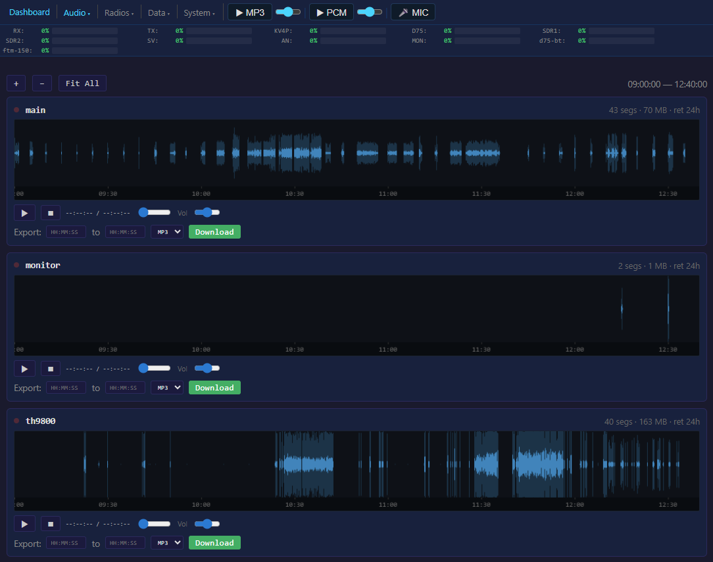
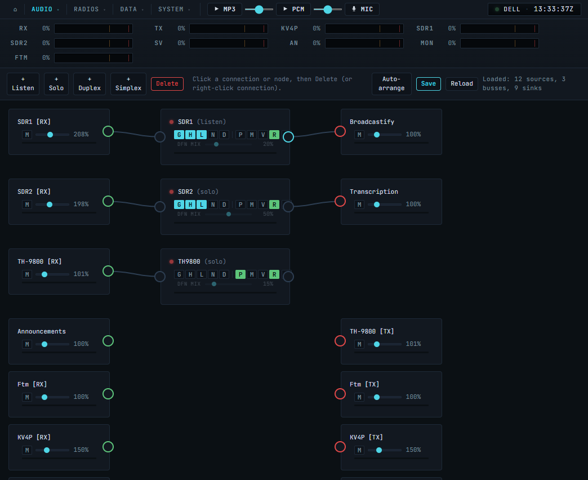
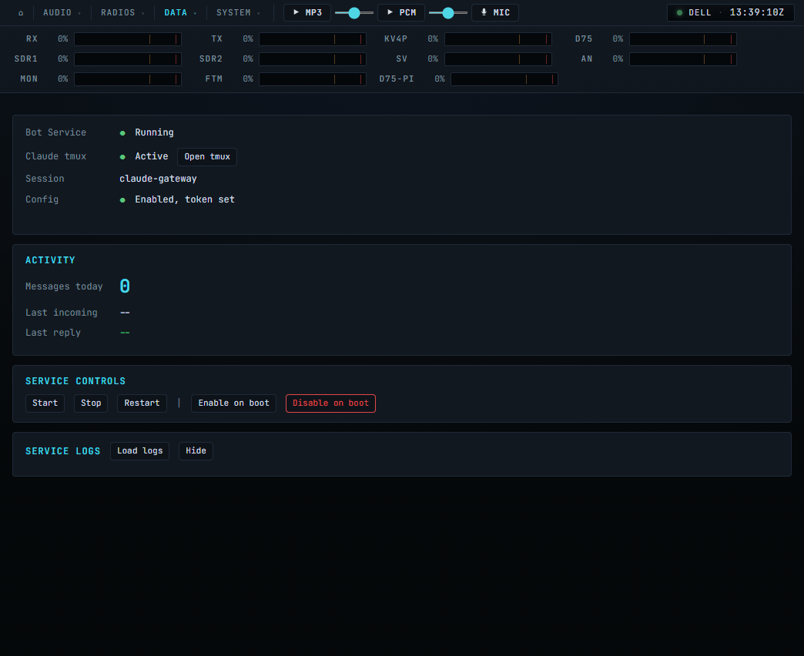
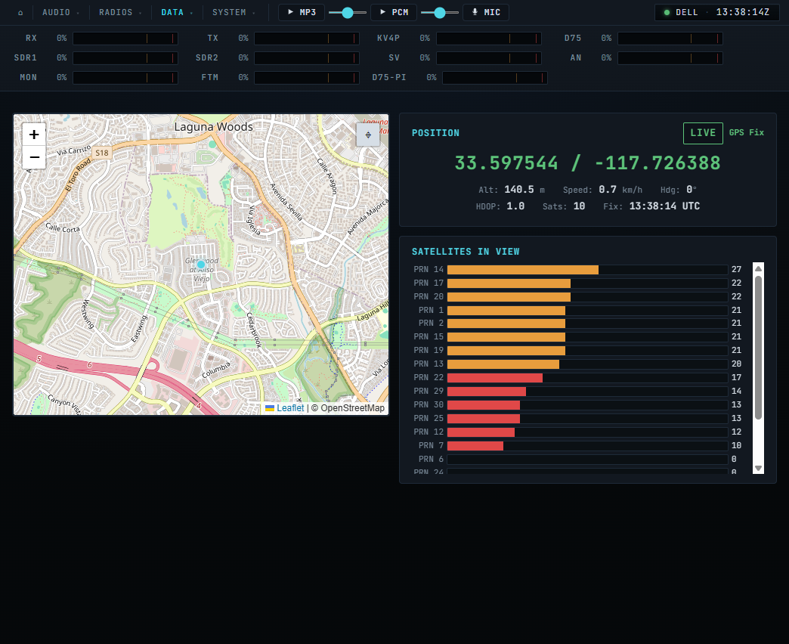
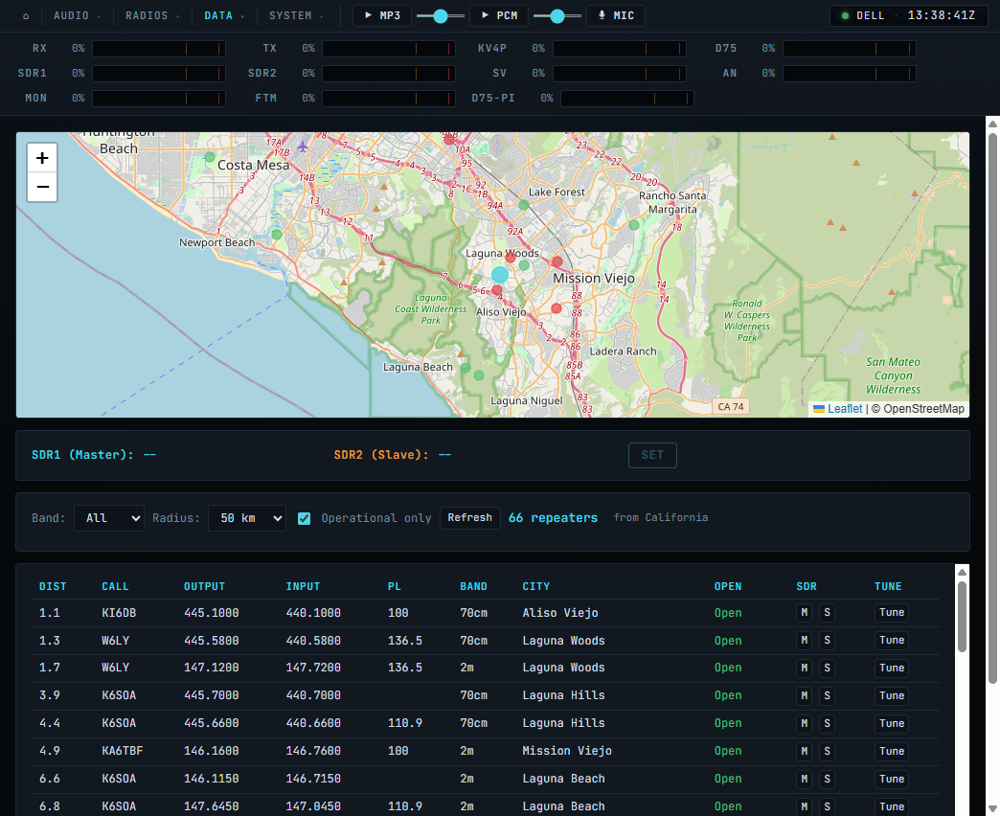
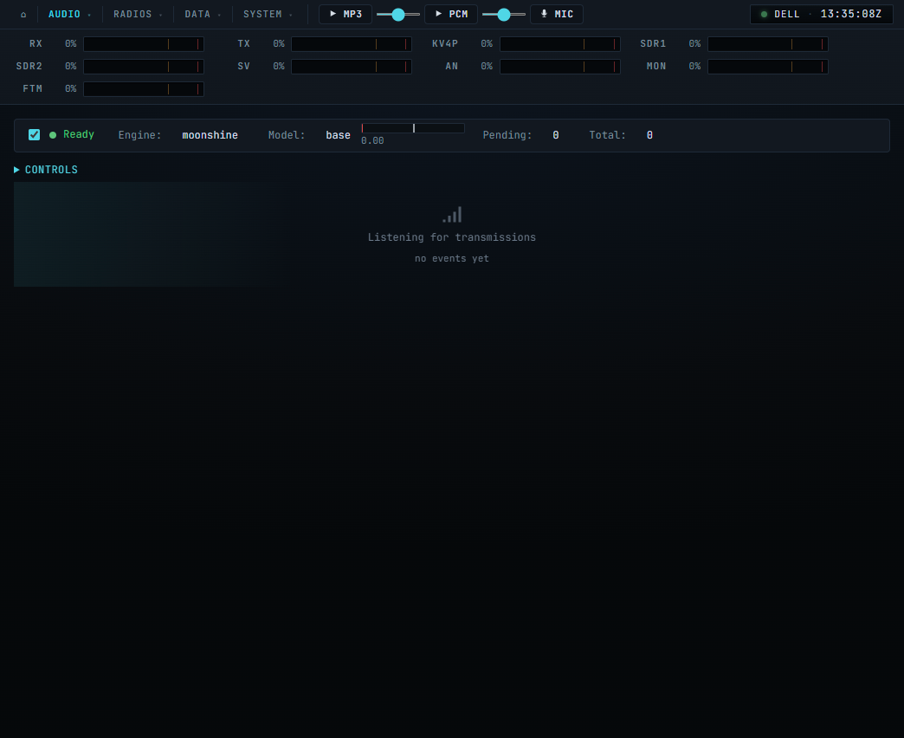
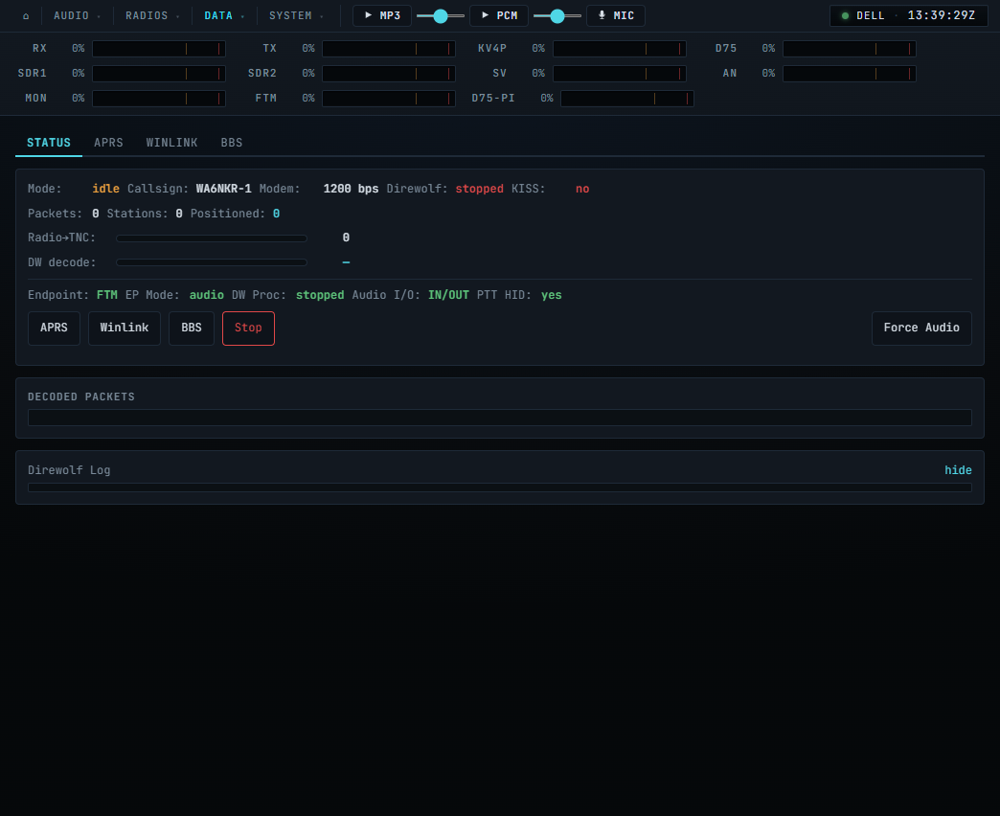

# Radio Gateway

A full-stack Linux radio gateway that bridges analog and digital two-way radios to the internet: Mumble VoIP, Broadcastify streaming, Winlink email over packet radio, APRS tracking, Telegram bot control, AI-powered announcements, and a 17-page web UI. Bus-based audio routing with a visual drag-and-drop editor, plugin-based radio support, per-stream diagnostic tracing, and 55+ MCP tools for AI control -- all from a single Python process.

**Radios:** TH-9800 (AIOC), TH-D75 (Bluetooth), KV4P (USB serial), FTM-150 (remote endpoint), RSPduo dual SDR receiver.
**Packet:** Winlink email via Direwolf TNC + Pat client. APRS decode with station mapping. BBS terminal. Gateway proximity map from Winlink CMS directory.
**Audio:** Sub-millisecond jitter bus mixer with per-stream trace diagnostics. Fire-and-forget PTT. Direct ALSA capture bypassing PipeWire.

## v3.0 Highlights

- **Unified audio engine** -- all buses (listen, solo, duplex, simplex) now run in a single BusManager thread. The main loop is a thin consumer that drains queues for SDR rebroadcast and WebSocket push. One code path for all audio.
- **Loop Recorder** -- per-bus continuous recording with visual waveform review. Enable the "R" button on any bus to record. Canvas-based waveform viewer with zoom/pan, click-to-play, drag-select, and MP3/WAV export. Configurable retention (1h to 7 days). Dashboard panel with live stats. See [docs/loop-recorder.md](docs/loop-recorder.md).
- **Plugin auto-discovery** -- drop a `.py` file in `plugins/`, add a config flag, restart. No gateway code changes needed. Template at `plugins/example_radio.py`. Full developer guide at [docs/plugin-development.md](docs/plugin-development.md).

| Loop Recorder |
|:-:|
|  |

## v2.0 Highlights

- **Bus-based routing** replaces the monolithic mixer. Four bus types (Listen, Solo, Duplex Repeater, Simplex Repeater) handle all audio flow. Sources and sinks are wired through busses -- audio only flows where you connect it.
- **Visual routing UI** built on Drawflow. Drag sources, busses, and sinks onto a canvas and wire them with click-and-drag connections. Live audio level bars on every node.
- **Plugin architecture** for all radios. TH-9800, TH-D75, KV4P, and SDR are self-contained plugins (`TH9800Plugin`, `D75Plugin`, `KV4PPlugin`, `SDRPlugin`) that register as sources and sinks in the routing system.
- **Per-bus audio processing** -- noise gate, HPF, LPF, and notch filter configurable per bus.
- **Full duplex Remote Audio** -- Windows client sends and receives simultaneously on two TCP ports.
- **Direct Icecast streaming** -- internal ffmpeg pipes directly to Icecast. No DarkIce, no ALSA loopback, no external processes.
- **Mumble as routable source/sink** -- Mumble RX and Mumble TX appear as nodes in the routing page.
- **MCP routing tools** -- AI can create busses, wire connections, mute sinks, and read levels programmatically.

## Screenshots

| Dashboard | Routing | Controls |
|:-:|:-:|:-:|
|  |  |  |

| TH-9800 | TH-9800 (full) | TH-D75 |
|:-:|:-:|:-:|
|  |  |  |

| KV4P | SDR | ADS-B |
|:-:|:-:|:-:|
|  |  |  |

| Telegram | Monitor | Recordings |
|:-:|:-:|:-:|
|  |  |  |

| GPS | Repeaters | Transcription |
|:-:|:-:|:-:|
|  |  |  |

| Packet Status | Packet APRS Map | Packet Winlink |
|:-:|:-:|:-:|
|  |  |  |

| Packet BBS | Config | Logs |
|:-:|:-:|:-:|
|  |  |  |

## Quick Start

### Requirements

- Linux system (Raspberry Pi 4, Debian, Ubuntu, Arch)
- Python 3.7+
- PipeWire (recommended) or ALSA
- FFmpeg

### Installation

```bash
git clone <your-repo-url>
cd radio-gateway
bash scripts/install.sh
```

The installer handles system packages (Python, PortAudio, FFmpeg, HIDAPI, scipy), PipeWire configuration, Python packages, UDEV rules, audio group membership, Mumble server, example config, and a desktop shortcut.

> **Supported:** Raspberry Pi (any model), Debian 12, Ubuntu 22.04+, Arch Linux.

> **Python 3.12+:** The installer patches the `pymumble` SSL layer automatically.

### First Run

1. Copy and edit the config:
   ```bash
   cp examples/gateway_config.txt gateway_config.txt
   ```

2. Set your Mumble server details:
   ```ini
   MUMBLE_SERVER = your.mumble.server
   MUMBLE_PORT = 64738
   MUMBLE_USERNAME = RadioGateway
   MUMBLE_PASSWORD = yourpassword
   ```

3. Start the gateway:
   ```bash
   python3 radio_gateway.py
   ```
   Or use the startup script: `bash start.sh` (handles Mumble, CAT server, tmux sessions, CPU governor, USB resets, and the gateway itself).

4. Open the web UI at `http://<host>:8080/dashboard`

## Web Interface

Built-in HTTP server (no Flask). Shell frame with persistent audio level bars visible on every page. Compact nav bar with inline MP3/PCM/MIC controls. 17 pages served from static HTML files in `web_pages/`.

```ini
[web]
ENABLE_WEB_CONFIG = true
WEB_CONFIG_PORT = 8080
WEB_CONFIG_PASSWORD =        # blank = no auth
GATEWAY_NAME = My Gateway
WEB_THEME = blue             # blue, red, green, purple, amber, teal, pink
```

| Page | Path | Description |
|------|------|-------------|
| Dashboard | `/dashboard` | Live status: audio bars, uptime, Mumble/PTT/VAD state, system stats |
| Routing | `/routing` | Visual drag-and-drop audio routing editor (Drawflow) |
| Controls | `/controls` | Playback, Smart Announce, TTS, system controls |
| TH-9800 | `/radio` | Front-panel replica: dual VFO, signal meters, all buttons, browser mic PTT |
| TH-D75 | `/d75` | Band A/B VFOs, memory channels, D-STAR, BT connect/disconnect |
| KV4P | `/kv4p` | Frequency, CTCSS TX/RX, squelch, volume, power, S-meter |
| SDR | `/sdr` | Frequency/modulation/gain/squelch, 10-slot channel memory, dual tuner |
| GPS | `/gps` | Live Leaflet map with DOP probability ring, satellite SNR chart, SIM/LIVE toggle |
| Repeaters | `/repeaters` | ARD repeater database with map, proximity search, MASTER/SLAVE SDR tuning |
| ADS-B | `/aircraft` | Dark mode map with NEXRAD weather, reverse-proxied dump1090-fa |
| Telegram | `/telegram` | Telegram bot status and message log |
| Monitor | `/monitor` | Room monitor: streams device mic, gain/VAD/level controls |
| Recordings | `/recordings` | Browse, play, download, delete recorded audio; filter by source/date |
| Loop Recorder | `/recorder` | Per-bus continuous recording: visual waveform, zoom/pan, click-to-play, export |
| Transcribe | `/transcribe` | Live voice-to-text with Whisper, freq-tagged output, Mumble/Telegram forwarding |
| Config | `/config` | INI editor with collapsible sections, Save & Restart |
| Packet | `/packet` | Packet radio: Direwolf TNC, APRS map, Winlink email, BBS terminal |
| Logs | `/logs` | Live scrolling log viewer with regex filter, Audio Trace, Watchdog Trace |
| Voice | `/voice` | Voice relay to Claude Code via tmux |

**Nav bar buttons:** MP3 stream toggle, PCM stream toggle, MIC (web microphone -- sends browser audio to the routing system).

**Browser audio:** MP3 stream (shared FFmpeg encoder) and low-latency WebSocket PCM player with 200ms pre-buffer. Screen wake lock during playback.

**Cloudflare tunnel:** Free public HTTPS via `*.trycloudflare.com`. Works behind NAT, no port forwarding needed.

```ini
ENABLE_CLOUDFLARE_TUNNEL = true
```

## Audio Routing

v2.0 replaces the old priority mixer with a bus-based routing system. All audio flows through busses. Sources produce audio, sinks consume it, and busses sit in between to mix, repeat, or cross-link.

### Bus Types

| Bus Type | Purpose | Audio Flow |
|----------|---------|------------|
| **Listen** | Monitor/mix multiple sources with ducking | Many sources in, many sinks out. Priority-based ducking between tiers. |
| **Solo** | Standalone control of a single radio | TX sources (mic, TTS, playback) mix into the radio; radio RX goes to sinks. |
| **Duplex Repeater** | Full duplex cross-link between two radios | A's RX feeds B's TX and B's RX feeds A's TX simultaneously. |
| **Simplex Repeater** | Half-duplex store-and-forward | One side receives and buffers; when signal drops, the buffer plays out on the other side's TX. |

### Routing UI

Open `/routing` in the web UI. The page shows a canvas with three column types:

- **Sources** (left) -- radio RX, SDR, Mumble RX, Room Monitor, Remote Audio, etc.
- **Busses** (center) -- create busses by type, each with its own processing chain.
- **Sinks** (right) -- Mumble TX, Icecast stream, speaker, Remote Audio TX, radio TX, etc.

To wire a connection, drag from a source's output port to a bus's input port, or from a bus's output port to a sink's input port. Audio only flows through established connections.

Each node shows a live audio level bar. Sources and sinks have inline mute and gain controls. Busses have mute toggles and show red level bars when muted.


### Per-Bus Processing

Each bus has its own audio processing chain, toggled independently:

- **Noise Gate** -- removes background noise below threshold
- **HPF** -- high-pass filter (cuts low-frequency rumble)
- **LPF** -- low-pass filter (cuts high-frequency hiss)
- **Notch Filter** -- narrow-band rejection at configurable frequency

### Per-Bus Streaming

Each bus can independently enable:
- **PCM** -- low-latency WebSocket stream
- **MP3** -- compressed stream for browser playback
- **VAD** -- voice activity detection gating

### Speaker Mode

The speaker output has three modes to prevent feedback:
- **Virtual** -- PipeWire virtual sink (prevents feedback loops)
- **Auto** -- selects the best available output
- **Real** -- direct hardware output

## Radio Plugins

All radios are self-contained plugins that register as sources and sinks in the routing system.

### TH-9800

Full CAT control via [TH9800_CAT.py](https://github.com/ukbodypilot/TH9800_CAT) TCP server. AIOC USB audio interface with HID PTT.

- Dual VFO with independent frequency, channel, volume, and power control
- Signal meters, all front-panel buttons replicated in the web UI
- Browser mic PTT via the radio page
- Hyper memories and mic keypad

```ini
ENABLE_CAT_CONTROL = true
CAT_HOST = 127.0.0.1
CAT_PORT = 9800
```


### TH-D75

Kenwood TH-D75 D-STAR HT via Bluetooth proxy (`scripts/remote_bt_proxy.py`). Proxy ports: 9750 (CAT text), 9751 (raw 8kHz PCM audio).

- Bluetooth TX audio -- transmit playback, TTS, and announcements through the D75
- Memory channel load with full tone, mode, shift, offset, and power settings
- Band A/B VFO control, D-STAR status, BT connect/disconnect
- Battery level and TNC mode from proxy

```ini
ENABLE_D75 = true
D75_CAT_HOST = 127.0.0.1
D75_CAT_PORT = 9750
```


### KV4P

KV4P software-defined radio module (SA818/DRA818) via CP2102 USB-serial. Opus codec audio.

- DRA818 uses 38 CTCSS tones (not 39 -- no 69.3 Hz)
- PTT via its own serial interface
- Frequency, CTCSS TX/RX, squelch, volume, power, bandwidth, S-meter

```ini
ENABLE_KV4P = true
KV4P_PORT = /dev/kv4p
```


### SDR (RSPduo Dual Tuner)

Two simultaneous SDR receivers via RTLSDR-Airband + SoapySDR Master/Slave mode. Audio captured through PipeWire virtual sinks.

- RSPduo runs both tuners via Master (mode 4) + Slave (mode 8) -- NOT mode 2
- Start order is critical: Master must stream before Slave starts (gateway enforces this)
- Requires [fventuri's SoapySDRPlay3 fork](https://github.com/fventuri/SoapySDRPlay3/tree/dual-tuner-submodes) (`dual-tuner-submodes` branch)
- 2.0 MSps per tuner limit in Master/Slave mode
- 10-slot channel memory persisted in `sdr_channels.json`
- Full web control: frequency, modulation (AM/NFM), sample rate, antenna, AGC/manual gain, squelch

```ini
ENABLE_SDR = true
SDR_DEVICE_NAME = pw:sdr_capture
SDR2_DEVICE_NAME = pw:sdr_capture2
```


## Audio Sources and Sinks

These appear as nodes in the routing page. Wire them to busses to create your audio paths.

### Sources

| Source | Description |
|--------|-------------|
| TH-9800 RX | Radio receive audio via AIOC USB |
| TH-D75 RX | D-STAR HT receive via Bluetooth |
| KV4P RX | Software-defined HT via USB serial |
| SDR1 / SDR2 | RSPduo dual tuner via PipeWire |
| Mumble RX | Incoming Mumble VoIP audio |
| Room Monitor | Browser or Android mic via WebSocket |
| Remote Audio RX | Audio from Windows client (TCP port 9600) |
| Web Mic | Browser microphone from nav bar button |
| File Playback | WAV/MP3/FLAC from announcement slots |
| Announce Input | External audio via TCP port 9601 |
| EchoLink | EchoLink audio via named pipes |
| Gateway Link | Remote endpoint audio (per-endpoint sources) |

### Sinks

| Sink | Description |
|------|-------------|
| TH-9800 TX | Radio transmit with PTT |
| TH-D75 TX | D-STAR HT transmit via Bluetooth |
| KV4P TX | Software-defined HT transmit |
| Mumble TX | Outgoing Mumble VoIP |
| Icecast Stream | Direct ffmpeg pipe to Icecast/Broadcastify |
| Speaker | Local audio output (Virtual/Auto/Real mode) |
| Remote Audio TX | Audio to Windows client (TCP port 9602) |
| EchoLink TX | EchoLink output via named pipes |

## Streaming

### Broadcastify / Icecast

v2.0 streams directly to Icecast using an internal ffmpeg process -- no DarkIce, no ALSA loopback devices, no external configuration files. The Icecast stream appears as a sink in the routing page; wire any bus output to it.

```ini
ENABLE_STREAM_OUTPUT = true
STREAM_SERVER = audio9.broadcastify.com
STREAM_PORT = 80
STREAM_MOUNT = /yourmount
STREAM_BITRATE = 16
```

The dashboard shows live streaming status: connection state, bytes sent, TCP send rate, RTT. Start/Stop/Restart controls available on the controls page.

### Browser Audio

Two browser audio modes, toggled from the nav bar:

- **MP3** -- shared FFmpeg encoder, works everywhere
- **PCM** -- low-latency WebSocket stream with 200ms pre-buffer

## Remote Audio

### Full Duplex (v2.0)

The Windows audio client (`windows_audio_client.py`) operates in full duplex -- sending and receiving audio simultaneously over two TCP connections:

| Port | Direction | Purpose |
|------|-----------|---------|
| 9600 | Client to Gateway | TX audio (microphone) |
| 9602 | Gateway to Client | RX audio (speaker) |

The client uses callback-based audio streams for WDM-KS compatibility. Both directions appear as routable source/sink nodes in the routing page.

```bash
pip install sounddevice numpy
python windows_audio_client.py [host]
```

Config saved to `windows_audio_client.json`.

### Gateway Link

Connects remote radios to the gateway over TCP with duplex audio and structured commands. Any number of endpoints connect simultaneously, each with its own source in the routing system.

```
Endpoint (Pi + AIOC + radio)     Gateway
  link_endpoint.py          <TCP>  GatewayLinkServer
  +-- AIOCPlugin                    +-- LinkAudioSource per endpoint
  |   +-- audio in/out              +-- per-endpoint controls
  |   +-- HID PTT                   +-- mDNS publish (_radiogateway._tcp)
  +-- mDNS discover
```

Features: plugin architecture (`RadioPlugin` base class, `AudioPlugin`, `AIOCPlugin`), mDNS auto-discovery, per-endpoint PTT/gain/mute, JSON commands with ACK, cable-pull resilience, 60s PTT safety timeout.

```bash
# Auto-discover gateway on LAN:
python3 tools/link_endpoint.py --name pi-aioc --plugin aioc

# Manual server:
python3 tools/link_endpoint.py --server 192.168.2.140:9700 --name pi-aioc --plugin aioc
```

```ini
[link]
ENABLE_GATEWAY_LINK = true
LINK_PORT = 9700
```

## Packet Radio / Winlink

Packet radio via Direwolf TNC on the FTM-150 link endpoint. The endpoint switches between audio mode (normal radio RX/TX) and data mode (Direwolf owns the AIOC for packet decode/encode). APRS decode and Winlink email are both supported.

### Architecture

```
Gateway                          Pi Endpoint (192.168.2.121)
  packet_radio.py                  AIOCPlugin (gateway_link.py)
  +-- KISS TCP client                +-- audio/data mode switch
  +-- APRS decoder                   +-- Direwolf TNC subprocess
  +-- Pat CLI (compose/connect)      +-- CM108 PTT via HID GPIO
  +-- Web UI (packet.html)           +-- AGW port 8010, KISS port 8001
```

### Winlink Email

Compose and receive email over VHF packet radio through Winlink CMS gateways. Uses Pat (getpat.io) as the B2F protocol engine, controlled via CLI from the gateway's web UI.

- **Compose** -- To, CC, Subject, Body form. Messages queued locally via `pat compose`.
- **Connect & Sync** -- Connects to a Winlink RMS gateway via `pat connect ax25+agwpe:///CALLSIGN`. Sends queued outbound, receives inbound. Live connection log shows B2F protocol exchange in real-time.
- **Inbox / Outbox / Sent** -- Reads Pat's local mailbox. Click to view full message.
- **Tested gateway:** KM6RTE-12 on 144.970 MHz (Loma Ridge, Orange County, CA) at 1200 baud.

```ini
[packet]
ENABLE_PACKET = true
PACKET_CALLSIGN = YOURCALL
PACKET_SSID = 1
PACKET_MODEM = 1200
PACKET_REMOTE_TNC = 192.168.2.121
```

Pat config (with Winlink password) lives at `~/.config/pat/config.json` -- not in the repo.

### APRS

Decodes all standard APRS position formats (uncompressed, compressed, MIC-E, timestamped), weather reports, status messages, objects, and telemetry. Digipeater path extraction with relay lines on the map.

### Packet Web Page

`/packet` with four tabs: **Status** (Direwolf log, KISS state, packet count), **APRS** (Leaflet map with station markers and relay paths), **Winlink** (compose, inbox, connect & sync), **BBS** (terminal -- planned).

## MCP Server

`gateway_mcp.py` is a stdio-based MCP server with 44+ tools that gives Claude (or any MCP-compatible AI) full control of the gateway via its HTTP API.

### Tool Categories

| Category | Tools | What They Do |
|----------|-------|-------------|
| **Status** | `gateway_status`, `sdr_status`, `cat_status`, `system_info`, `d75_status`, `kv4p_status`, `telegram_status` | Read current state of any subsystem |
| **Radio Control** | `radio_ptt`, `radio_tts`, `radio_cw`, `radio_ai_announce`, `radio_set_tx`, `radio_get_tx`, `radio_frequency`, `d75_command`, `d75_frequency`, `kv4p_command` | Key radios, speak, send CW, tune frequencies |
| **SDR** | `sdr_tune`, `sdr_restart`, `sdr_stop` | Control SDR receivers |
| **Routing** | `routing_status`, `routing_levels`, `routing_connect`, `routing_disconnect`, `bus_create`, `bus_delete`, `bus_mute`, `sink_mute`, `bus_toggle_processing`, `set_gain` | Wire audio paths, create/delete busses, mute/unmute, adjust gains |
| **Automation** | `automation_status`, `automation_history`, `automation_reload`, `automation_trigger` | Inspect and trigger scheduled automation tasks |
| **Recordings** | `recordings_list`, `recordings_delete`, `recording_playback` | Browse and manage recorded audio |
| **System** | `gateway_logs`, `gateway_key`, `audio_trace_toggle`, `config_read`, `process_control` | Logs, diagnostics, config, process management |
| **Telegram** | `telegram_reply`, `telegram_status` | Send replies through the Telegram bot |
| **Mixer** | `mixer_control` | Legacy mixer controls |

### Setup

The MCP config lives in `.mcp.json` in the project root. Enable in Claude Code settings:

```json
{ "enableAllProjectMcpServers": true }
```

The MCP server runs as a Claude Code child process -- restarting the gateway does NOT restart MCP.

## Telegram Bot

Control the gateway from your phone. Text messages route through Claude Code with MCP tools. Voice notes transmit directly over radio.

```
Text:  Phone -> Telegram -> telegram_bot.py -> tmux -> Claude Code (MCP) -> telegram_reply()
Voice: Phone -> Telegram -> telegram_bot.py -> ffmpeg -> port 9601 -> radio TX (PTT auto)
```

Setup:
1. Create a bot via `@BotFather`, copy the token
2. Get your chat ID: `curl "https://api.telegram.org/bot<TOKEN>/getUpdates"`
3. Configure:
   ```ini
   [telegram]
   ENABLE_TELEGRAM = true
   TELEGRAM_BOT_TOKEN = 123456:ABC-DEF...
   TELEGRAM_CHAT_ID = 987654321
   ```
4. Start Claude Code in tmux: `tmux new-session -s claude-gateway` then `claude --dangerously-skip-permissions`
5. Enable the service: `sudo systemctl enable --now telegram-bot`


## Smart Announcements

Scheduled radio announcements powered by Claude CLI. Claude searches the web, composes a natural spoken message, and the gateway broadcasts via Edge TTS + PTT. No API key needed -- uses existing Claude Code auth.

1. Configure announcement slots with interval, voice, target length, and prompt
2. On each interval, `claude -p` is called with the prompt
3. Response converted to speech via Edge TTS and broadcast on radio
4. If the radio is busy, waits up to ~8 minutes for a clear channel

```ini
ENABLE_SMART_ANNOUNCE = true
SMART_ANNOUNCE_START_TIME = 08:00
SMART_ANNOUNCE_END_TIME = 22:00

SMART_ANNOUNCE_1_PROMPT = Weather forecast for London, UK
SMART_ANNOUNCE_1_INTERVAL = 3600
SMART_ANNOUNCE_1_VOICE = 1
SMART_ANNOUNCE_1_TARGET_SECS = 20
SMART_ANNOUNCE_1_MODE = auto
```

Up to 19 announcement slots. Trigger manually via the controls page or MCP tools.

## Room Monitor

Stream a device microphone to the gateway over WebSocket. Works as a source in the routing system -- wire it to any bus.

- **Browser:** `/monitor` page with gain control (1x-50x), VAD threshold, level meter
- **Android APK:** `tools/room-monitor.apk` (also downloadable from the gateway at `/monitor-apk`). Foreground service with persistent notification, streams even with screen locked.

Works through Cloudflare tunnel.

```ini
ENABLE_WEB_MONITOR = true
```


## ADS-B Tracking

Embedded FlightAware SkyAware map via reverse proxy. Dark mode with NEXRAD weather overlay.

- **Hardware:** RTL2838/R820T USB SDR dongle (separate from RSPduo)
- **Stack:** dump1090-fa + lighttpd on port 30080; fr24feed uploads to FlightRadar24
- **Access:** Single-port through gateway at `/aircraft`, works through Cloudflare tunnel

```ini
ENABLE_ADSB = true
ADSB_PORT = 30080
```


## GPS Receiver

USB serial GPS module (VK-162 or any NMEA device) with a built-in simulation mode for testing without hardware.

- Live Leaflet/OpenStreetMap with pulsing position dot and DOP-based probability ring (color-coded by accuracy)
- Satellite signal strength bar chart (PRN, elevation, azimuth, SNR)
- Movement trail tracking
- **SIM/LIVE toggle** -- switch between real hardware and simulated position without gateway restart
- Simulation mode outputs fake data at a configurable position (default DM13do, Santa Ana CA)
- GPS position feeds the repeater database for proximity queries

```ini
ENABLE_GPS = true
GPS_PORT = /dev/ttyACM1    # or 'simulate' for fake data
GPS_BAUD = 9600
```


## Repeater Database

Nearby amateur radio repeaters from the [Amateur Repeater Directory](https://github.com/Amateur-Repeater-Directory/ARD-RepeaterList), filtered by GPS position.

- Downloads per-state JSON files, caches locally for 24h, auto-refreshes on position change
- State detection from GPS coordinates (includes adjacent states for border coverage)
- Leaflet map with color-coded markers (green=2m, red=70cm, yellow=other)
- Filterable table: band, radius (10-200km), operational status
- **MASTER/SLAVE SDR tuning** -- assign repeaters to SDR1 and SDR2, then SET tunes both with a single restart
- **KV4P Tune** button sets frequency + CTCSS tone on the KV4P HT
- MCP tools: `nearby_repeaters`, `repeater_info`, `repeater_tune`, `repeater_refresh`

```ini
ENABLE_REPEATER_DB = true
REPEATER_RADIUS_KM = 50
```


## Transcription

Live voice-to-text using OpenAI Whisper (local, no cloud API). Transcriptions are tagged with the source frequency so you know which radio/channel produced each line.

- Two modes: **Chunked** (transcribe after each transmission) and **Streaming** (rolling buffer, partial results)
- VAD-gated: only transcribes when signal is present
- Frequency tagging: output prefixed with `[446.760/462.550]` showing which radio/SDR tuner the audio came from
- Forward to Mumble chat and/or Telegram
- Configurable: model size, language, VAD threshold, hold time, audio boost

```ini
ENABLE_TRANSCRIPTION = true
TRANSCRIBE_MODE = streaming
TRANSCRIBE_MODEL = base
TRANSCRIBE_LANGUAGE = en
```


## Gateway Link

See the [Gateway Link documentation](docs/gateway_link.md) for the full protocol spec, plugin development guide, and roadmap.

## Other Features

### Text-to-Speech

Google TTS via `!speak <text>` from Mumble chat. 9 voice accents (US, UK, AU, IN, SA, CA, IE, FR, DE). Configurable speed and volume.

```ini
ENABLE_TTS = true
TTS_DEFAULT_VOICE = 1       # 1=US 2=UK 3=AU 4=IN 5=SA 6=CA 7=IE 8=FR 9=DE
TTS_SPEED = 1.3
```

### Text-to-CW

Morse code broadcast via `!cw <text>` from Mumble. Configurable WPM, frequency, and volume.

### File Playback

10 announcement slots with soundboard. Supports WAV, MP3, FLAC with automatic resampling. File naming: `station_id.mp3` for slot 0, `1_welcome.mp3` for slot 1, etc.

### EchoLink

TheLinkBox-compatible named pipe interface.

```ini
ENABLE_ECHOLINK = false
ECHOLINK_RX_PIPE = /tmp/echolink_rx
ECHOLINK_TX_PIPE = /tmp/echolink_tx
```

### Embedded Mumble Server

Run one or two Mumble servers directly from the gateway. No external murmurd needed.

```ini
ENABLE_MUMBLE_SERVER_1 = true
MUMBLE_SERVER_1_PORT = 64738
MUMBLE_SERVER_1_PASSWORD = yourpassword
```

### Voice Relay

The `/voice` page provides a web-based voice interface to Claude Code running in a tmux session. Start/stop session controls, speech-to-text input.

### Automation Engine

Scheduled tasks with configurable triggers. Manage via the MCP tools (`automation_status`, `automation_history`, `automation_reload`, `automation_trigger`).

### Dynamic DNS

Built-in No-IP compatible updater.

```ini
ENABLE_DDNS = true
DDNS_HOSTNAME = your.ddns.net
DDNS_UPDATE_INTERVAL = 300
```

### Email Notifications

Gmail notifications on startup, errors, and events.

```ini
ENABLE_EMAIL = true
EMAIL_ADDRESS = user@gmail.com
EMAIL_APP_PASSWORD = xxxx-xxxx-xxxx-xxxx
```

## Configuration

All settings live in `gateway_config.txt` (INI format with `[section]` headers). Copy the template from `examples/gateway_config.txt` and edit to suit your setup.

The web Config page (`/`) provides a live editor with collapsible sections and Save & Restart.

Key sections: `[mumble]`, `[audio]`, `[ptt]`, `[sdr]`, `[web]`, `[cat]`, `[d75]`, `[kv4p]`, `[streaming]`, `[smart_announce]`, `[telegram]`, `[adsb]`, `[link]`, `[remote_audio]`, `[email]`, `[ddns]`, `[echolink]`, `[relay]`, `[automation]`, `[gps]`, `[repeaters]`, `[transcription]`.

> **Security:** `gateway_config.txt` is in `.gitignore` -- it contains stream keys and passwords. Never commit it.

## Project Structure

```
radio-gateway/
+-- radio_gateway.py           # Entry point
+-- gateway_core.py            # RadioGateway class, main loop, audio setup
+-- gateway_mcp.py             # MCP server (55+ tools, stdio)
+-- web_server.py              # WebConfigServer, Handler dispatch, config layout
+-- web_routes_get.py          # GET route handlers (core endpoints)
+-- web_routes_post.py         # POST route handlers
+-- web_routes_stream.py       # WebSocket + MP3 streaming handlers
+-- web_routes_loop.py         # Loop recorder API handlers
+-- web_routes_packet.py       # Packet radio + Winlink API handlers
+-- text_commands.py           # Mumble chat commands, key dispatch, TTS
+-- audio_trace.py             # Audio pipeline debug trace
+-- stream_stats.py            # Broadcastify/Icecast stats
+-- audio_bus.py               # Bus system (Listen, Solo, Duplex, Simplex)
+-- bus_manager.py             # Bus lifecycle and routing manager
+-- audio_sources.py           # Audio source classes
+-- ptt.py                     # PTT control (relay, GPIO)
+-- transcriber.py             # Whisper voice-to-text (streaming + chunked)
+-- th9800_plugin.py           # TH-9800 radio plugin
+-- kv4p_plugin.py             # KV4P HT radio plugin
+-- sdr_plugin.py              # RSPduo dual tuner plugin
+-- repeater_manager.py        # ARD repeater database, GPS proximity
+-- smart_announce.py          # AI announcement engine
+-- radio_automation.py        # Automation engine
+-- gateway_link.py            # Gateway Link protocol
+-- loop_recorder.py           # Per-bus continuous recording + waveform
+-- plugin_loader.py           # Auto-discovers plugins from plugins/
+-- ddns_updater.py            # Dynamic DNS updater
+-- email_notifier.py          # Gmail SMTP notifications
+-- cloudflare_tunnel.py       # Cloudflare quick tunnel manager
+-- mumble_server.py           # Local Mumble server manager
+-- usbip_manager.py           # USB/IP remote device manager
+-- gps_manager.py             # GPS receiver (serial NMEA + simulate)
+-- gateway_config.txt         # Configuration (gitignored)
+-- web_pages/                 # Static HTML pages (20 files)
|   +-- dashboard.html, routing.html, controls.html
|   +-- radio.html, d75.html, kv4p.html, sdr.html
|   +-- gps.html, repeaters.html, aircraft.html
|   +-- telegram.html, monitor.html, recordings.html
|   +-- transcribe.html, logs.html, voice.html, config.html
|   +-- recorder.html, packet.html
|   +-- shell.html, common.css, common.js
+-- plugins/
|   +-- example_radio.py       # Template for external radio plugins
+-- tools/
|   +-- telegram_bot.py        # Telegram bot (systemd service)
|   +-- link_endpoint.py       # Gateway Link endpoint
|   +-- room-monitor.apk       # Android room monitor app
+-- docs/
|   +-- screenshots/           # Web UI screenshots (18 images)
|   +-- gateway_link.md        # Gateway Link protocol spec
|   +-- loop-recorder.md       # Loop Recorder user guide
|   +-- plugin-development.md  # Plugin developer guide
+-- scripts/
|   +-- install.sh             # Full installer (RPi + Debian + Arch)
|   +-- remote_bt_proxy.py     # D75 Bluetooth proxy
```
+-- audio/                     # Announcement files
    +-- station_id.mp3
```

## License

See `docs/LICENSE`.
