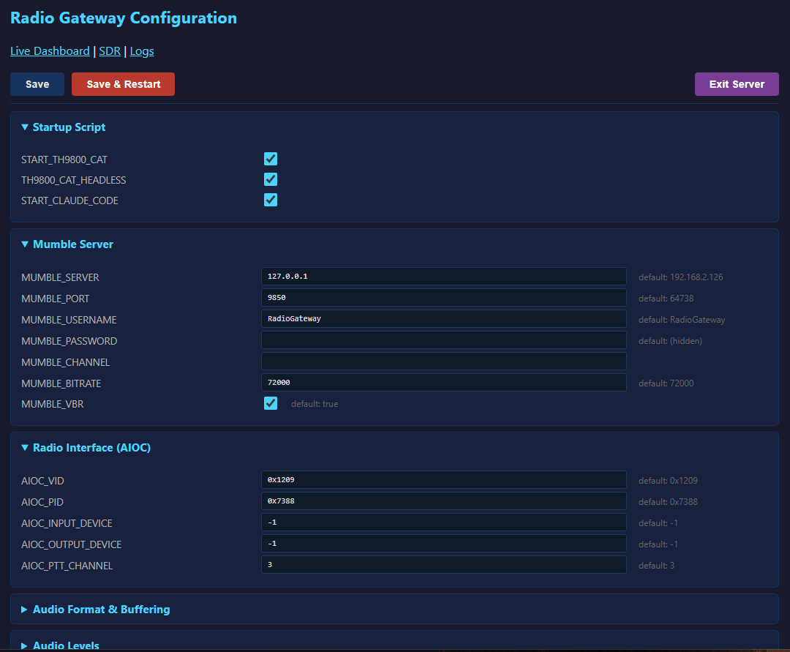
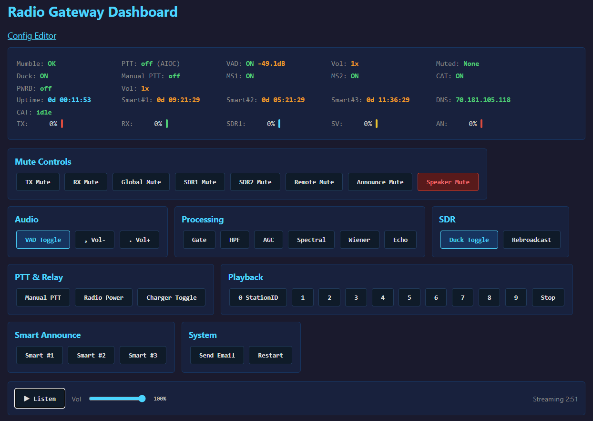
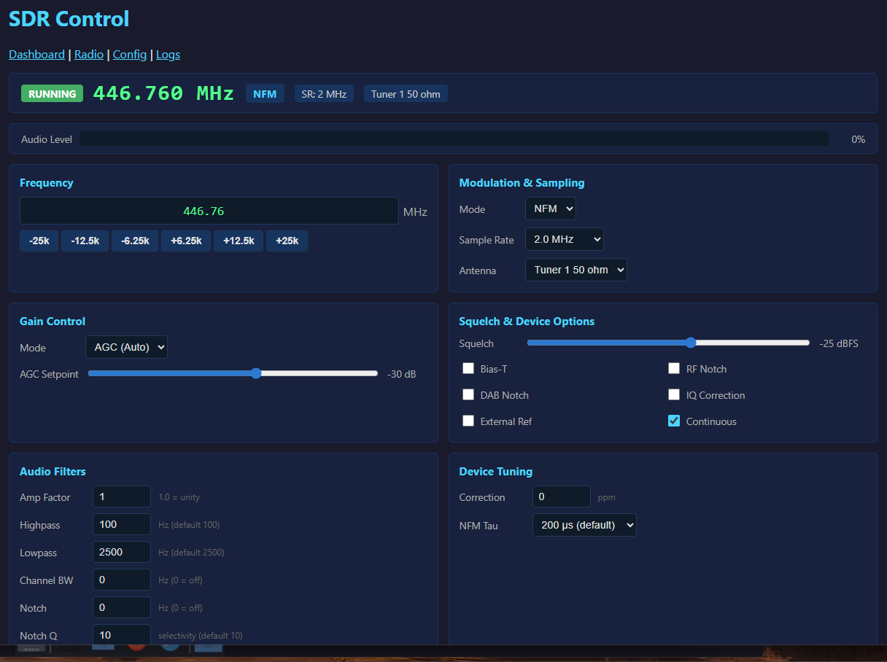
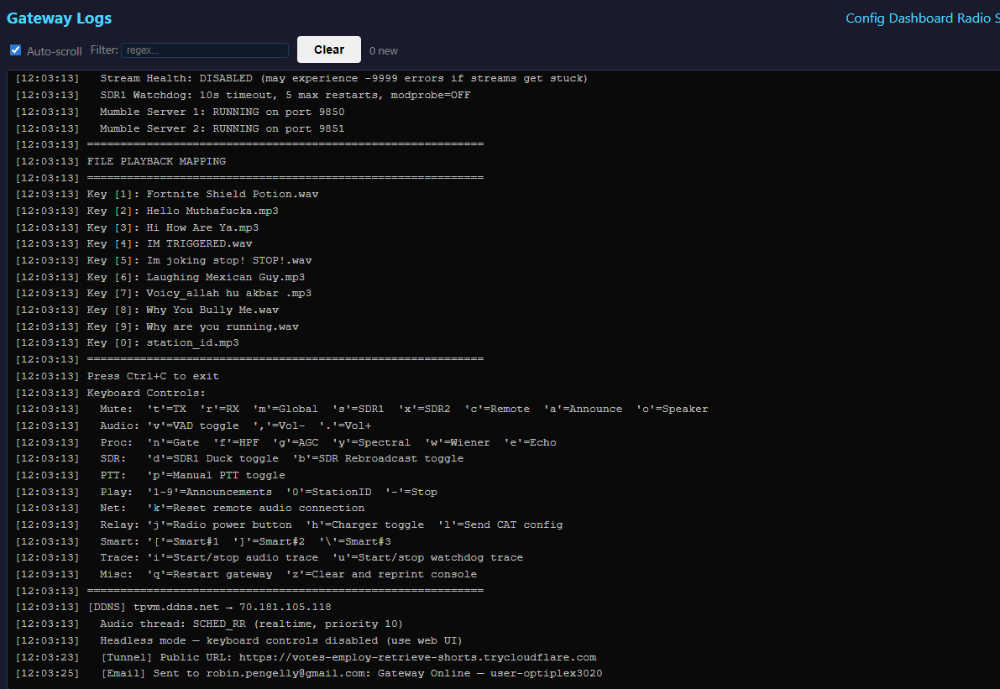
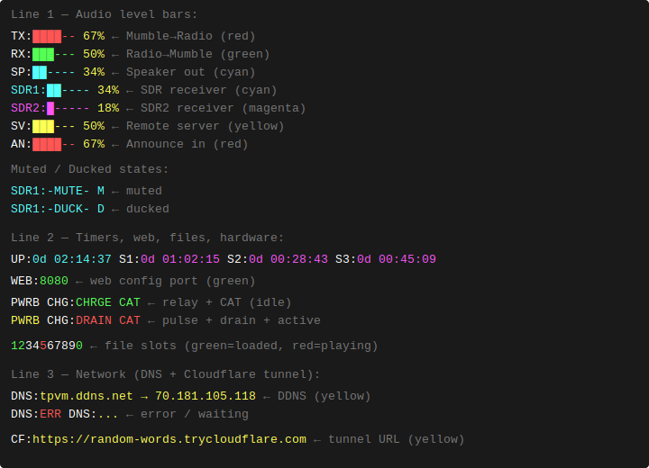

# Radio Gateway

A multi-source radio audio gateway with Mumble VoIP bridging, SDR integration, AI-powered announcements, CAT radio control, real-time audio processing, and streaming. Ham radio & GMRS gateway and repeater — bridges two-way radios to Mumble, Broadcastify, and the internet. AIOC USB, RSPduo dual SDR, TH-9800/D75/KV4P CAT control, AI announcements, ADS-B tracking, MCP server for AI control, live web dashboard. Raspberry Pi & Linux. 

```
╔══════════════════════════════════════════════════════════════════════════════════════╗
║                         RADIO GATEWAY — AUDIO FLOW                                  ║
╚══════════════════════════════════════════════════════════════════════════════════════╝

  Direct PTT paths (bypass mixer):                                  ┌──────────────────┐
  ┌─────────────────┐  PTT audio (direct)                          │  Radio TX        │
  │  Mumble RX      │─────────────────────────────────────────────►│  AIOC USB / GPIO │
  │  (Opus VoIP)    │  Mumble users → radio TX                     │  or KV4P HT      │
  └─────────────────┘                                               │  (TX_RADIO=kv4p) │
                                                                    │                  │
  ┌─────────────────┐  PTT audio (direct)                          │  ↑ also keyed by ┤
  │  WebMic (P0)    │─────────────────────────────────────────────►│  File Playback   │
  │  Browser WS/mic │  Browser mic → radio TX via CAT PTT           │  ANNIN TCP:9601  │
  └─────────────────┘                                               └──────────────────┘
                                                                            ▲
  SOURCES                                  MIXER                            │
  ───────                       ╔══════════════════════╗                    │
                                ║                      ║   PTT audio        │
  ┌─────────────────┐           ║                      ╠────────────────────┘
  │  File Playback  │──────────►║   P R I O R I T Y    ║
  │  Priority 0     │           ║      M I X E R       ║  Radio RX  ┌──────────────────┐
  │  WAV·MP3·FLAC   │           ║                      ╠───────────►│  Mumble TX       │
  │  10 slots (0–9) │           ║  Priority-based      ║            │  Opus VoIP       │
  └─────────────────┘           ║  source selection    ║            └──────────────────┘
                                ║                      ║
  ┌─────────────────┐           ║  Duck hierarchy:     ║  Mixed     ┌──────────────────┐
  │  Radio RX (P1)  │──────────►║  P1 (Radio RX)       ╠───────────►│  Stream Output   │
  │  AIOC USB       │           ║    ducks P2 sources  ║            │  DarkIce /       │
  └─────────────────┘           ║    ducks P3 (SDRSV)  ║            │  Broadcastify    │
                                ║                      ║            └──────────────────┘
  ┌─────────────────┐           ║  P2 sources duck     ║
  │  SDR1 (P2)      │──────────►║  each other by       ║  EchoLink  ┌──────────────────┐
  │  PipeWire sink  │  [DUCK]   ║  config priority     ╠───────────►│  EchoLink TX     │
  │  RSPduo Tuner 1 │           ║                      ║            │  Named Pipes     │
  │  ■ cyan bar     │           ║  Attack/Release/     ║            └──────────────────┘
  └─────────────────┘           ║  Padding transitions ║
                                ║                      ║  TCP out   ┌──────────────────┐
  ┌─────────────────┐           ║  Audio Processing:   ╠───────────►│  Remote Client   │
  │  SDR2 (P2)      │──────────►║  VAD · Noise Gate    ║            │  (role=client)   │
  │  PipeWire sink  │  [DUCK]   ║  HPF · LPF · Notch   ║            └──────────────────┘
  │  RSPduo Tuner 2 │           ╚══════════════════════╝
  │  ■ magenta bar  │
  └─────────────────┘           Duck priority order:
                                  Radio RX > SDR1 (P2) > SDR2 (P2) > KV4P (P2) > SDRSV (P3)
  ┌─────────────────┐
  │  KV4P HT (P2)   │──────────►  [enters mixer — configurable priority and ducking]
  │  SA818 / DRA818 │  [DUCK]     KV4P_AUDIO_PRIORITY, KV4P_AUDIO_DUCK
  │  USB-serial     │
  └─────────────────┘             Each duck transition uses attack / release / padding:
                                    [source active] → silence gap → [audio switches]
  ┌─────────────────┐               [source silent] → silence gap → [audio restores]
  │  SDRSV (P3)     │──────────►  [enters mixer — streamed from second gateway (role=server)]
  │  Remote Audio   │  [DUCK]
  │  TCP (role=cl.) │  ■ green
  └─────────────────┘

  ┌─────────────────┐
  │  EchoLink (P4)  │──────────►  [enters mixer — TheLinkBox compatible named pipes]
  │  Named Pipes    │
  └─────────────────┘

  ┌─────────────────┐  PTT (audio-gated, bypasses mixer)
  │  ANNIN (P0)     │──────────►  Radio TX only — keyed when audio exceeds threshold
  │  TCP port 9601  │             Silence frames consumed but not transmitted.
  │  ■ red bar      │             PTT held for PTT_RELEASE_DELAY after audio stops.
  └─────────────────┘

  SDR REBROADCAST (toggle: b key)
  ────────────────
  When enabled, the SDR-only mix (no AIOC/PTT audio) is routed back
  to Radio TX via AIOC with automatic PTT. PTT holds for 3s after
  SDR signal stops. File playback takes priority over rebroadcast.

  ┌─────────────────┐           ┌──────────────────┐
  │  SDR1 + SDR2    │──────────►│  Radio TX        │
  │  (SDR-only mix) │  PTT auto │  AIOC USB        │
  └─────────────────┘           └──────────────────┘

  CONNECTED SUBSYSTEMS (data / control — no audio path through mixer)
  ────────────────────
  ┌─────────────────┐  CAT serial (USB)                ┌──────────────────┐
  │  TH-9800        │◄───────────────────────────────►│  Web UI /radio   │
  │  Dual-band      │  Frequency, VFO, memory,         └──────────────────┘
  │  mobile radio   │  signal meter, PTT, RTS
  └─────────────────┘

  ┌─────────────────┐  CAT serial (USB)                ┌──────────────────┐
  │  TH-D75 HT      │◄───────────────────────────────►│  Web UI /d75     │
  │  D-STAR HT      │  Frequency, memory, GPS,         └──────────────────┘
  │  (optional)     │  band A/B, D-STAR routing
  └─────────────────┘

  ┌─────────────────┐  USB serial (CP2102)             ┌──────────────────┐
  │  KV4P HT        │◄───────────────────────────────►│  Web UI /kv4p    │
  │  SA818/DRA818   │  Frequency, CTCSS, squelch,      └──────────────────┘
  │  radio module   │  power, bandwidth, PTT
  └─────────────────┘  (also feeds audio into mixer — see SOURCES above)

  ┌─────────────────┐  JSON (localhost)                ┌──────────────────┐
  │  ADS-B          │────────────────────────────────►│  Web UI /aircraft│
  │  dump1090-fa    │  Aircraft positions, altitude,   └──────────────────┘
  │  RTL-SDR dongle │  squawk, speed, heading
  └─────────────────┘  (reverse-proxied through gateway on single port)
```

## Table of Contents

- [Features](#features)
- [Quick Start](#quick-start)
- [SDR Integration](#sdr-integration)
- [Remote Audio Link](#remote-audio-link)
- [Keyboard Controls](#keyboard-controls)
- [Status Bar](#status-bar)
- [Architecture](#architecture)
- [Configuration Reference](#configuration-reference)
- [Windows Audio Client](#windows-audio-client)
- [Troubleshooting](#troubleshooting)
- [Advanced Features](#advanced-features)

## Features

### Core Functionality
- **Bidirectional Audio Bridge**: Seamless communication between Mumble VoIP and radio
- **Multi-Source Audio Mixing**: Simultaneous mixing of 5 audio sources with priority control
- **Auto-PTT Control**: Automatic push-to-talk with configurable delays and tail
- **Voice Activity Detection (VAD)**: Smart audio gate prevents noise transmission (enabled by default)
- **Real-Time Audio Processing**: Noise gate, HPF, LPF, notch filter
- **Live Status Display**: Real-time bars showing TX/RX/SDR levels with color coding
- **Smart Announcements**: AI-powered scheduled broadcasts with pluggable backend (Google AI scrape, DuckDuckGo+Ollama, Claude, or Gemini)
- **Local Mumble Server**: Run up to 2 managed mumble-server instances on the same machine
- **Cloudflare Tunnel**: Free public HTTPS access via `*.trycloudflare.com` — no port forwarding or domain needed
- **Email Notifications**: Gmail SMTP alerts with gateway status and tunnel URL on startup or on demand
- **Browser Audio Player**: Listen to gateway audio live from the dashboard — MP3 stream and low-latency WebSocket PCM player with pre-buffering
- **Broadcastify Dashboard**: Live streaming status, DarkIce process control (start/stop/restart), and TCP connection stats (bytes sent, send rate, RTT)

### Audio Sources (Priority-Based Mixing)

```
Priority 0 (Highest) → File Playback    [PTT → Radio TX]
Priority 0 (Highest) → ANNIN            [PTT → Radio TX, audio-gated — TCP port 9601]
Priority 0 (Highest) → WebMic           [PTT → Radio TX, browser microphone via CAT]
Priority 1           → Mumble RX        [PTT → Radio TX, direct path — bypasses mixer]
Priority 1           → Radio RX         [→ Mumble TX, no PTT]
Priority 2           → SDR1 Receiver    [→ Mumble TX, with ducking]
Priority 2           → SDR2 Receiver    [→ Mumble TX, with ducking]
Priority 2           → KV4P HT          [→ Mumble TX, with ducking — configurable]
Priority 3 (default) → SDRSV            [→ Mumble TX, Remote Audio Link client]
Priority 4 (Lowest)  → EchoLink         [→ Mumble TX]
```

#### 1. **File Playback** (Priority 0, PTT enabled)
   - 10 announcement slots (keys 1-9 + Station ID on 0)
   - WAV, MP3, FLAC support with automatic resampling
   - Volume normalization and per-file controls
   - **CW / Morse code**: `!cw <text>` generates Morse audio (`CW_WPM`, `CW_FREQUENCY`, `CW_VOLUME`)
   - **Triggers PTT** when playing; Radio RX still forwarded to Mumble

#### 2. **Radio RX** (Priority 1)
   - AIOC USB audio interface
   - GPIO PTT control
   - Automatic audio processing pipeline
   - Independent mute control

#### 3. **SDR1 Receiver** (Priority 2, with ducking)
   - PipeWire sink (`pw:sdr_capture` via parec) or ALSA loopback device input
   - Typically RSPduo Tuner 1 via rtl_airband + SoapySDR
   - Independent volume, mute, and duck controls
   - Real-time level display (cyan bar)
   - Ducked by Radio RX and higher-priority sources

#### 4. **SDR2 Receiver** (Priority 2, with ducking)
   - PipeWire sink (`pw:sdr_capture2` via parec) or ALSA loopback device input
   - Typically RSPduo Tuner 2 via rtl_airband + SoapySDR (Master/Slave mode)
   - Same controls as SDR1 but independent (`x` to mute)
   - Real-time level display (magenta bar)
   - Priority-based ducking vs SDR1 (configurable)

#### 5. **Mumble RX** (Priority 1, PTT enabled — direct path)
   - Audio from Mumble users is captured via a callback, **bypassing the mixer**
   - Immediately keys PTT and transmits through the AIOC to the radio
   - Output volume controlled by `OUTPUT_VOLUME`
   - Suppressed when TX is muted (`t` key) or manual PTT mode is active
   - This is the primary gateway path: **Mumble users speak → radio transmits**

#### 6. **Remote Audio Link / SDRSV** (Priority 3, configurable)
   - Links two gateway instances over TCP — one sends, one receives
   - **Server** (`role=server`): dials out to the client and streams mixed audio (radio RX + SDR)
   - **Client** (`role=client`): listens for the server, receives audio as source "SDRSV" into the mixer
   - Participates fully in the duck/priority system — configurable priority vs SDR1/SDR2
   - Status bar: server shows `SV:[yellow]`, client shows `CL:[green]`
   - `c` key mutes/unmutes SDRSV on the client

#### 7. **Network Announcement Input / ANNIN** (Priority 0, PTT enabled)
   - Listens on TCP port 9601 for inbound connections
   - Same wire format as Remote Audio Link (4-byte big-endian length header + 16-bit mono PCM)
   - **Audio-gated PTT**: silence frames are consumed but discarded; PTT fires only when audio exceeds `ANNOUNCE_INPUT_THRESHOLD`
   - Stream can stay connected between announcements without keying the radio
   - PTT released after `PTT_RELEASE_DELAY` once audio stops
   - Status bar: `AN:[red bar]` when enabled
   - No AIOC required to listen; if AIOC is absent, audio is received but PTT is silently skipped

#### 8. **EchoLink** (Priority 4)
   - Named pipe integration
   - TheLinkBox compatible
   - Optional routing to/from Mumble and Radio

### SDR Audio Ducking

The SDR source features **audio ducking** to prevent interference with primary communications:

**Ducking Enabled (default):**
```
┌─────────────────────────────────────────┐
│ Radio RX active                         │
│ ├─ Radio audio → Mumble ✓              │
│ └─ SDR audio   → DUCKED (silenced)     │
└─────────────────────────────────────────┘

┌─────────────────────────────────────────┐
│ No other audio active                   │
│ └─ SDR audio   → Mumble ✓              │
└─────────────────────────────────────────┘
```

**Ducking Disabled (mixing mode):**
```
┌─────────────────────────────────────────┐
│ Radio RX + SDR both active              │
│ ├─ Radio audio → Mumble (50% mix)      │
│ └─ SDR audio   → Mumble (50% mix)      │
└─────────────────────────────────────────┘
```

**Controls:**
- Press `d` to toggle SDR1 ducking on/off at runtime
- Config: `SDR_DUCK = true` / `SDR2_DUCK = true` (default)
- Status indicator: `[D]` flag when SDR1 ducking enabled

### Dual SDR with Priority Ducking

Two SDR inputs can run simultaneously with configurable priority:

```
┌────────────────────────────────────────────────────────────────┐
│  PRIORITY HIERARCHY                                            │
│                                                                │
│  1. Radio RX (AIOC)   ← top priority, ducks all P2+ sources   │
│  2. SDR1              ← ducks SDR2/KV4P when SDR1 has signal  │
│  2. SDR2              ← ducked by Radio RX and SDR1           │
│  2. KV4P HT audio    ← same level as SDR, priority configurable│
│  3. SDRSV             ← ducked by Radio RX, SDR1, SDR2, KV4P  │
│  4. EchoLink          ← lowest priority                        │
└────────────────────────────────────────────────────────────────┘
```

**Example use cases:**
- **Scanner + web SDR**: SDR1 = local scanner (priority 1), SDR2 = websdr.org feed (priority 2) — scanner ducks the web SDR when active
- **Two frequencies**: Monitor VHF and UHF simultaneously; higher-priority channel interrupts the other
- **Remote + local**: Local SDR1 takes priority over a remote SDR2 pipe

**Configuration:**
```ini
ENABLE_SDR  = true      # SDR1 enabled
ENABLE_SDR2 = true      # SDR2 enabled

SDR_PRIORITY  = 1       # SDR1: higher priority (ducks SDR2)
SDR2_PRIORITY = 2       # SDR2: lower priority (ducked by SDR1)

SDR_DUCK  = true        # SDR1: ducked by radio RX
SDR2_DUCK = true        # SDR2: ducked by radio RX and SDR1
```

**Status bar during dual SDR operation:**
```
SDR1:███---  45%  SDR2:-DUCK- D      ← SDR2 ducked by SDR1
SDR1:-DUCK- D     SDR2:-DUCK- D      ← both ducked by radio RX
SDR1:███---  45%  SDR2:██----  30%   ← both playing (mixed)
```
*(The bar is always 6 characters wide; `-DUCK-` and `-MUTE-` replace the filled bar in their respective states.)*

### SDR Rebroadcast

Routes the SDR-only audio mix (no AIOC/PTT audio) back to Radio TX via the AIOC device with automatic PTT control. Useful for rebroadcasting scanner or SDR audio on a local repeater.

- **Toggle**: `b` key enables/disables rebroadcast
- **PTT hold**: PTT stays keyed for `SDR_REBROADCAST_PTT_HOLD` seconds (default 3.0) after SDR signal stops, bridging brief gaps in the SDR stream
- **Priority**: File playback (priority 0) takes priority — rebroadcast pauses while announcements play
- **Feedback prevention**: Radio RX input is automatically disabled while rebroadcast PTT is active to prevent a ducking feedback loop

**Status bar colors** (SDR1/SDR2 labels):
- **White** — rebroadcast off (normal operation)
- **Green** — rebroadcast on, idle (no SDR signal)
- **Red** — rebroadcast on, actively sending to radio TX

**PTT indicator**: `PTT:B-ON` (cyan) when rebroadcast PTT is active.

**Configuration:**
```ini
SDR_REBROADCAST_PTT_HOLD = 3.0  # Seconds PTT holds after SDR signal stops
```

### Source Switching — Attack, Release & Transition Padding

SDR ducking transitions use a three-stage gate to avoid jarring cuts.
**Note:** These timers apply only to SDR ducking (Radio RX signal detection).
File playback is deterministic — PTT fires immediately when a file starts,
with no attack delay, and the `PTT_ANNOUNCEMENT_DELAY` window handles key-up timing separately.

```
┌──────────────────────────────────────────────────────────┐
│  ATTACK: radio signal must be CONTINUOUSLY present for   │
│  SIGNAL_ATTACK_TIME before the SDR is ducked.            │
│  Any silence resets the timer — transient noise can      │
│  never trigger a duck.                                   │
├──────────────────────────────────────────────────────────┤
│  TRANSITION (duck-out):                                  │
│  [SDR playing] → [silence gap] → [radio takes over]     │
│                   SWITCH_PADDING_TIME                    │
├──────────────────────────────────────────────────────────┤
│  RELEASE: radio must be continuously silent for          │
│  SIGNAL_RELEASE_TIME before the SDR resumes.             │
│  Brief pauses in speech don't un-duck prematurely.       │
├──────────────────────────────────────────────────────────┤
│  TRANSITION (duck-in):                                   │
│  [radio ends] → [silence gap] → [SDR resumes]           │
│                 SWITCH_PADDING_TIME                      │
└──────────────────────────────────────────────────────────┘
```

**Configuration:**
```ini
SIGNAL_ATTACK_TIME  = 0.5   # seconds of continuous signal before duck
SIGNAL_RELEASE_TIME = 2.0   # seconds of silence before SDR resumes
SWITCH_PADDING_TIME = 1.0   # silence gap inserted at each transition
```

### Text-to-Speech

Google TTS (gTTS) integration — Mumble users send a text message to trigger speech on the radio.

**Commands:**
- `!speak <text>` — speak using default voice
- `!speak <voice#> <text>` — speak using a specific voice (1-9)

**Voice table:**

| # | Accent | # | Accent |
|---|--------|---|--------|
| 1 | US English (default) | 6 | Canadian English |
| 2 | British English | 7 | Irish English |
| 3 | Australian English | 8 | French |
| 4 | Indian English | 9 | German |
| 5 | South African English | | |

**Details:**
- Automatic MP3 generation with format validation
- Rate limiting detection (gTTS throttles after many requests)
- HTML tags stripped from Mumble messages before TTS processing
- Configurable volume boost and PTT delay before speech starts
- Adjustable speech speed via `TTS_SPEED` (requires ffmpeg)
- Default voice set via `TTS_DEFAULT_VOICE` (1-9)

### Audio Processing
Per-source processing chains — Radio and SDR sources have independent filter instances with separate state and toggle controls. Requires `scipy` (installed automatically by the installer).

- **VAD**: Voice Activity Detection with configurable threshold (enabled by default)
- **Noise Gate**: Removes background noise below threshold
- **HPF**: High-pass filter (removes low-frequency rumble)
- **LPF**: Low-pass filter (removes high-frequency hiss)
- **Notch Filter**: Narrow-band rejection at configurable frequency and Q

Dashboard: separate "Radio Processing" and "SDR Processing" button groups toggle each filter independently per source.

### Streaming
- **Darkice Integration**: Stream to Icecast server
- **Broadcastify Support**: Live scanner feed
- Mixed audio output via named pipe
- Configurable bitrate and format

### Speaker Output (Local Monitoring)
- Mirrors the mixed audio output to a local speaker/headphone device in real-time
- The `SP:[bar]` reflects the actual audio being sent to the speaker (mixed RX + SDR + PTT), not just the AIOC RX level — so the bar stays live regardless of RX mute state
- Configurable device (by name, index, or empty for system default)
- Independent mute toggle (`o` key) — does not affect Mumble or streaming
- Volume control via `SPEAKER_VOLUME`
- Status bar shows `SP:[bar]` level when enabled; decays to 0 when no audio is playing
- WirePlumber exclusion automatically applied for USB audio devices (e.g. C-Media)

### Relay Control (CH340 USB Relays)
Two optional CH340 USB relay modules for hardware control:

- **Radio Power Button** (`j` key): Simulates a momentary power-button press — relay closes for 0.5 seconds then opens. Since the relay acts as a button press, the gateway does not track radio on/off state.
- **Charger Schedule** (`h` key): Automatically switches a charger relay on/off based on a configurable time window (e.g. 23:00–06:00 for overnight charging). Handles overnight time wrap. Press `h` to manually override — the relay stays in the manual state until the next scheduled transition, then automatic control resumes.

**Status bar (line 2):**
- `PWRB` — white when idle, yellow during the 0.5s button pulse
- `CHG:CHRGE` / `CHG:DRAIN` — green/red showing current charger relay state (`*` suffix when manually overridden)

**Setup:** Persistent `/dev/relay_radio` and `/dev/relay_charger` symlinks via udev rules — see `scripts/99-relay-udev.rules` for the template.

**Configuration:**
```ini
ENABLE_RELAY_RADIO = false
RELAY_RADIO_DEVICE = /dev/relay_radio
RELAY_RADIO_BAUD = 9600

ENABLE_RELAY_CHARGER = false
RELAY_CHARGER_DEVICE = /dev/relay_charger
RELAY_CHARGER_BAUD = 9600
RELAY_CHARGER_ON_TIME = 23:00
RELAY_CHARGER_OFF_TIME = 06:00
```

**Requires:** `pip3 install pyserial`

### Smart Announcements (AI-Powered)

Scheduled radio announcements with a pluggable AI backend. The gateway searches for live data, an AI composes a natural spoken message, and the gateway broadcasts it via gTTS.

**AI Backends:**
- **`google-scrape`** (default) — Free, no API key needed. Drives the user's real Firefox browser via `xdotool` to perform a Google search, clicks AI Mode, and extracts the AI Overview text. Optionally feeds the result through Ollama for speech formatting. Requires Firefox running and logged into Google on the desktop (`DISPLAY=:0`), plus `xdotool` and `xclip`.
- **`duckduckgo`** — Free, no API key needed. Uses DuckDuckGo web search for live data + Ollama local LLM for natural speech composition. Falls back to formatted search snippets if Ollama is not installed.
- **`claude`** — Anthropic Claude API with built-in web search. Requires API key and credits.
- **`gemini`** — Google Gemini API with Google Search grounding. Requires API key.

**How it works:**
1. Configure one or more announcement entries with an interval, voice, target length, and a prompt
2. On each interval, the backend searches for live data and composes a spoken message within the word limit
3. The text is converted to speech via gTTS and broadcast on radio via AIOC PTT
4. If the radio is busy (VAD active or playback running), the announcement waits up to ~8 minutes for a clear channel
5. Manual triggers (keyboard/Mumble) ignore the time window restriction

**Keyboard shortcuts:**
- `[` = Trigger smart announcement #1 immediately
- `]` = Trigger smart announcement #2 immediately
- `\` = Trigger smart announcement #3 immediately

**Mumble command:** `!smart` lists configured announcements; `!smart <N>` triggers one manually.

**Example announcements:**
```ini
# Hourly weather update (15 seconds, US English voice)
SMART_ANNOUNCE_1 = 3600, 1, 15, {Give a brief weather update for London, UK including temperature and conditions}

# Time check every 30 minutes (10 seconds, US English)
SMART_ANNOUNCE_2 = 1800, 1, 10, {What is the current UTC time and date, spoken naturally}

# News headlines every 2 hours (20 seconds, British English)
SMART_ANNOUNCE_3 = 7200, 2, 20, {Summarize the top 2 breaking news headlines from the UK}
```

**Configuration:**
```ini
ENABLE_SMART_ANNOUNCE = true

# AI Backend — choose: google-scrape (free), duckduckgo (free), claude, or gemini
SMART_ANNOUNCE_AI_BACKEND = google-scrape

# Ollama model for google-scrape/duckduckgo backends (blank = auto-detect)
SMART_ANNOUNCE_OLLAMA_MODEL = llama3.2:1b
SMART_ANNOUNCE_OLLAMA_TEMPERATURE = 0.5
SMART_ANNOUNCE_OLLAMA_TOP_P = 0.5

# Claude API key (used when AI_BACKEND = claude)
SMART_ANNOUNCE_API_KEY =

# Gemini API key (used when AI_BACKEND = gemini)
SMART_ANNOUNCE_GEMINI_API_KEY =

# Time window (HH:MM, 24-hour). Blank = no restriction. Handles overnight wrap.
SMART_ANNOUNCE_START_TIME = 08:00
SMART_ANNOUNCE_END_TIME = 22:00

SMART_ANNOUNCE_1 = interval_secs, voice, target_secs, {prompt text}
# Up to 19 entries (SMART_ANNOUNCE_1 through SMART_ANNOUNCE_19)
```

**Google-scrape backend setup (free):**
```bash
sudo pacman -S xdotool xclip   # or: sudo apt install xdotool xclip
# Open Firefox, log into Google, and keep it running on the desktop
# Optional: install Ollama to reformat AI Overview text for speech
curl -fsSL https://ollama.com/install.sh | sh
ollama pull llama3.2:3b
```

**DuckDuckGo backend setup (free):**
```bash
pip3 install ddgs --break-system-packages
# Optional: install Ollama for natural speech composition
curl -fsSL https://ollama.com/install.sh | sh
ollama pull llama3.2:3b    # or llama3.2:1b on Raspberry Pi
```

**Requires:** `xdotool` + `xclip` for google-scrape, `ddgs` for duckduckgo (all handled by `scripts/install.sh`). Claude/Gemini backends require their respective API keys.

### Dynamic DNS (No-IP)

Built-in DDNS updater that keeps a hostname pointed at the machine's current public IP. Uses the No-IP update protocol (also compatible with DynDNS and other providers that use the same API).

A background thread sends an update every `DDNS_UPDATE_INTERVAL` seconds (default 300 / 5 minutes, minimum 60). Logs the IP on first update and whenever it changes; silent otherwise.

```ini
ENABLE_DDNS = true
DDNS_USERNAME = user@example.com
DDNS_PASSWORD = secret
DDNS_HOSTNAME = myhost.ddns.net
DDNS_UPDATE_INTERVAL = 300
DDNS_UPDATE_URL = https://dynupdate.no-ip.com/nic/update
```

| Setting | Description |
|---------|-------------|
| `ENABLE_DDNS` | Enable the DDNS updater (`true` / `false`) |
| `DDNS_USERNAME` | No-IP account username or email |
| `DDNS_PASSWORD` | No-IP account password |
| `DDNS_HOSTNAME` | Hostname to update (e.g. `myhost.ddns.net`) |
| `DDNS_UPDATE_INTERVAL` | Seconds between updates (default 300, minimum 60) |
| `DDNS_UPDATE_URL` | Update API endpoint (default: No-IP) |

### Web Configuration UI & Live Dashboard

A built-in web interface for editing gateway config and monitoring live status from any browser. Runs Python's built-in HTTP server on a daemon thread — no extra dependencies.

```ini
[web]
ENABLE_WEB_CONFIG = true
WEB_CONFIG_PORT = 8080
WEB_CONFIG_PASSWORD =
GATEWAY_NAME = My Gateway
WEB_THEME = blue
```

| Setting | Description |
|---------|-------------|
| `ENABLE_WEB_CONFIG` | Enable the web config editor (`true` / `false`) |
| `WEB_CONFIG_PORT` | HTTP port to listen on (default `8080`) |
| `WEB_CONFIG_PASSWORD` | Basic auth password (user: `admin`). Blank = no auth |
| `GATEWAY_NAME` | Display name shown at top of dashboard and in browser tab (blank = none) |
| `WEB_THEME` | Dashboard color theme: `blue` (default), `red`, `green`, `purple`, `amber`, `teal`, `pink` |

**Config Editor** (`http://<gateway-ip>:8080/`):
- Settings grouped by INI section with collapsible panels
- Sensitive fields (passwords, API keys) shown as password inputs
- **Save** button writes changes to `gateway_config.txt` (preserves comments)
- **Save & Restart** button saves and restarts the gateway for changes to take effect
- 7 dark color themes with consistent accent colors across all pages


*Configuration editor with collapsible sections grouped alphabetically, Save & Restart, and Exit Server controls.*

**Live Dashboard** (`http://<gateway-ip>:8080/dashboard`):
- Real-time gateway status updated every second via JSON polling
- Audio level bars for all sources (TX, RX, SP, SDR1, SDR2, SV/CL, AN) — same order as console
- Uptime timer and smart announcement countdowns
- Mumble connection, PTT, VAD, volume, processing flags, mute states
- DDNS, charger, CAT control indicators
- Remote key control buttons — same keyboard shortcuts available via clickable buttons
- Auto-reconnects when gateway restarts (no manual refresh needed)
- Fixed-width grid layout — bars and values don't shift when levels change
- Gateway name displayed at top of dashboard for multi-gateway setups
- Configurable color theme applied consistently across all pages (dashboard, config, radio, SDR, logs)
- **Audio player** — listen to the gateway's mixed audio output live in the browser:
  - **MP3 stream** — shared FFmpeg encoder, play/stop button, volume slider, elapsed timer
  - **Low-latency WebSocket PCM** — AudioWorklet-based player with 200ms pre-buffer for smooth playback
- **Broadcastify controls** — DarkIce process status and start/stop/restart buttons. Live TCP stats: bytes sent, send rate, RTT, connection age, restart counts
- **Smart Announce status** — separated into its own box with 3 trigger buttons and live step-by-step progress (Searching, Waiting for radio, Speaking, Done/Error)
- **Playback file status** — shows all loaded audio slots with filenames, highlights currently playing file
- **System status box** — CPU usage, load average, RAM, swap, disk, network, temperatures, IPs (polled every 2 seconds)
- **Text to Speech** — text entry field, 9-voice selector, send button with status line (gTTS)
- **Screen Wake Lock** — prevents device sleep during WebSocket PCM playback
- **Toast notifications** — real-time error/warning popups (top-right, auto-dismiss) for PTT failures, playback errors, CAT disconnection, and radio non-response
- **Responsive layout** — control buttons wrap on narrow/mobile screens instead of overflowing off-screen


*Live dashboard showing gateway status, audio level bars, system info, mute/processing/playback controls, and the browser audio player.*

**TH-9800 Radio Control** (`http://<gateway-ip>:8080/radio`):
- Full front-panel replica of the TH-9800 dual-band radio in the browser
- Dual VFO display with channel, signal meter, volume/squelch sliders
- All radio buttons: ENC, DEC, TX, PREF, SKIP, DCS, MUTE, LOW, V/M, HM, SCN
- Menu/SET controls, hyper memories (A-F), mic keypad, mic P1-P4 and UP/DN
- PTT toggle button, TCP/Serial connect/disconnect, RTS control
- Browser microphone PTT (MIC PTT button)


*TH-9800 radio control page with dual VFO display, signal meters, full button panel, and browser microphone PTT.*

**TH-D75 Radio Control** (`http://<gateway-ip>:8080/d75`):
- Full control page for the Kenwood TH-D75 dual-band D-STAR HT
- GPS status, D-STAR call routing, band A / band B VFO display
- Memory channel browser, squelch, volume, bandwidth, and power controls
- Serial connect/disconnect, baud rate selector, GPS NMEA passthrough


*TH-D75 control page showing band A/B VFOs, memory channels, and D-STAR status.*

**KV4P HT Control** (`http://<gateway-ip>:8080/kv4p` — shown on dashboard nav when enabled):
- Control page for the KV4P HT software-defined ham radio module (SA818/DRA818)
- Live RX frequency display with S-meter and audio level bar
- Frequency / TX offset, squelch, volume, power, bandwidth (wide/narrow)
- CTCSS TX and RX tone selectors, PTT button, test tone buttons
- Firmware version and module type displayed; Reconnect button


*KV4P HT control page showing 146.400 MHz receive with S-meter, CTCSS, and all radio parameters.*

**SDR Control** (`http://<gateway-ip>:8080/sdr`):
- Full SDR receiver control via RTLSDR-Airband + SoapySDR
- Live status bar: process state, frequency, modulation, sample rate, antenna
- Live audio level bar updated every second
- Frequency input with step buttons (6.25k, 12.5k, 25k)
- Modulation (AM/NFM), sample rate (200 kHz — 10.66 MHz), antenna selection
- Gain control: AGC with setpoint or manual RFGR/IFGR sliders
- Squelch threshold (dBFS), device options (Bias-T, RF/DAB notch, IQ correction, external ref)
- Audio filters: amp factor, highpass/lowpass, channel bandwidth, notch filter with Q
- Device tuning: frequency correction (ppm), NFM deemphasis tau
- 10-slot channel memory with 1-press recall, save with name, delete
- Settings persist across gateway restarts


*SDR control page — RSPduo dual tuner with Tuner 1 (446.750 MHz NFM) and Tuner 2 (446.640 MHz NFM) running simultaneously.*

**ADS-B Aircraft Tracking** (`http://<gateway-ip>:8080/aircraft` — when `ENABLE_ADSB = true`):
- Embedded FlightAware PiAware SkyAware map via lighttpd reverse proxy
- Live aircraft positions, altitude, speed, heading, and squawk from dump1090-fa
- Single-port access through the gateway's Cloudflare tunnel — no extra port forwarding needed
- Dashboard panel showing aircraft count, message rate, and service health


*ADS-B tracking page showing live aircraft over the Los Angeles area via PiAware SkyAware.*

**Recording Manager** (`http://<gateway-ip>:8080/recordings`):
- Browse, play, download, and delete recorded audio files
- Filter by radio source, date, and frequency
- Bulk select with Select All / Select None; Download Selected or Delete Selected
- In-browser playback for any recording


*Recording manager with radio/date/frequency filters and bulk download/delete controls.*

**Gateway Logs** (`http://<gateway-ip>:8080/logs`):
- Live scrolling log viewer with auto-scroll toggle
- Regex filter for searching log output
- Clear button and new-line counter
- Audio Trace and Watchdog Trace buttons


*Live log viewer with regex filter, clear, Audio Trace, and Watchdog Trace controls.*

### Cloudflare Tunnel

Free public HTTPS access to the web dashboard without port forwarding or a domain name. Launches `cloudflared` as a subprocess — the tunnel connects outbound so it works behind NAT and ISP port blocking.

```ini
[web]
ENABLE_CLOUDFLARE_TUNNEL = true
```

| Setting | Description |
|---------|-------------|
| `ENABLE_CLOUDFLARE_TUNNEL` | Launch a Cloudflare quick tunnel on startup (`true` / `false`) |

The tunnel assigns a random `https://random-words.trycloudflare.com` URL each time the gateway starts. The URL is printed at startup, shown on status bar line 3, and included in the startup email (if email is enabled).

**Requires:** `cloudflared` (`sudo pacman -S cloudflared` or `sudo apt install cloudflared`).

**Status bar (line 3):** `CF:https://....trycloudflare.com` in yellow.

### Email Notifications

Send gateway status emails via Gmail SMTP. Emails include the Cloudflare tunnel URL (clickable), local dashboard URL, Mumble server info, and DDNS hostname.

```ini
[web]
ENABLE_EMAIL = true
EMAIL_ADDRESS = user@gmail.com
EMAIL_APP_PASSWORD = xxxx xxxx xxxx xxxx
EMAIL_RECIPIENT = user@gmail.com
EMAIL_ON_STARTUP = true
```

| Setting | Description |
|---------|-------------|
| `ENABLE_EMAIL` | Enable email notifications (`true` / `false`) |
| `EMAIL_ADDRESS` | Gmail address (sender) |
| `EMAIL_APP_PASSWORD` | Gmail app password (16-char, not your regular password) |
| `EMAIL_RECIPIENT` | Recipient address (blank = same as sender) |
| `EMAIL_ON_STARTUP` | Send status email automatically on startup (`true` / `false`) |

**Requires:** A Gmail App Password — Google Account → Security → 2-Step Verification → App passwords.

**Keyboard:** `@` sends a status email on demand.

### TH-9800 CAT Control

Connects to the [TH9800_CAT.py](https://github.com/ukbodypilot/TH9800_CAT) TCP server to configure a TYT TH-9800 radio on gateway startup. Sets channel, volume, and power level for both VFOs independently.

**How it works:**
1. TH9800_CAT.py runs on the same machine, connected to the radio via USB serial (FT232R)
2. TH9800_CAT.py exposes a TCP server (default port 9800) for remote control
3. On startup, the gateway connects, authenticates, enables USB TX control (RTS), then sends setup commands (if `CAT_STARTUP_COMMANDS = true`; set to `false` to connect without sending setup commands)
4. Setup commands run with RTS in USB-controlled mode and restore the previous RTS state afterwards
5. If the radio is in VFO mode, the gateway automatically presses V/M to switch to channel mode before setting the channel
6. Channel is set by stepping the per-VFO dial until the target channel is reached
5. Volume is set by stepping from the default level (25) to the target level
6. Power is set by cycling the LOW button (L/M/H) until the target is reached

**Status bar (line 2):**
- `CAT` — white when enabled but not connected, green when connected and idle, red when actively sending/receiving data (holds red for at least 1 second for visibility)

**TH9800_CAT.py setup:**

The TH9800_CAT installer (`install.sh`) creates a systemd service (`th9800-cat.service`) that runs the CAT server in headless mode. The gateway's `start.sh` automatically starts/stops this service based on `ENABLE_CAT_CONTROL`. To install:
```bash
cd ~/Downloads/TH9800_CAT
./install.sh   # installs venv, deps, and th9800-cat.service
```

Set `auto_start_server=true` in the TH9800_CAT.py `config.txt`:
```ini
host=0.0.0.0
port=9800
password=
auto_start_server=true
```

**Gateway configuration:**
```ini
ENABLE_CAT_CONTROL = true
CAT_HOST = 127.0.0.1
CAT_PORT = 9800
CAT_PASSWORD =

# Channel setup (-1 = don't change)
CAT_LEFT_CHANNEL = 1
CAT_RIGHT_CHANNEL = 2

# Volume (0-100, -1 = don't change)
CAT_LEFT_VOLUME = 62
CAT_RIGHT_VOLUME = 0

# Power level (L=Low, M=Medium, H=High, blank = don't change)
CAT_LEFT_POWER = L
CAT_RIGHT_POWER = L
```

**Debug log:** All CAT packet parsing and command details are written to `cat_debug.log` in the gateway directory.

**Requires:** TH9800_CAT.py running with TCP server enabled and serial connected to the radio.

### Local Mumble Server

Run one or two local mumble-server (murmurd) instances managed by the gateway. Each instance gets its own config file, SQLite database, and systemd service — fully independent of any default `mumble-server.service`.

**How it works:**
1. On gateway startup, if `ENABLE_MUMBLE_SERVER_1` (or `_2`) is `true`, the gateway:
   - Writes `/etc/mumble-server-gw1.ini` (or `gw2`) with your configured parameters
   - Creates a systemd service `mumble-server-gw1.service` (runs as `mumble-server` user)
   - Starts the service (if `AUTOSTART = true`)
   - Monitors health every ~10 seconds
2. On gateway exit, the mumble-server instances **keep running** (managed by systemd). Users stay connected between gateway restarts.

**Status bar (line 2):**
- `MS1` / `MS2` — white when configured but not yet checked, green when running, red on error

**Configuration:**
```ini
# -------- Mumble Server 1 --------
ENABLE_MUMBLE_SERVER_1 = true
MUMBLE_SERVER_1_PORT = 64738
MUMBLE_SERVER_1_PASSWORD =           # Empty = no password required
MUMBLE_SERVER_1_MAX_USERS = 10
MUMBLE_SERVER_1_MAX_BANDWIDTH = 72000  # bits/sec per user (72000 = good Opus quality)
MUMBLE_SERVER_1_WELCOME = Welcome to Radio Gateway Server 1
MUMBLE_SERVER_1_REGISTER_NAME =      # Empty = private server (not listed publicly)
MUMBLE_SERVER_1_ALLOW_HTML = true
MUMBLE_SERVER_1_OPUS_THRESHOLD = 0   # 0 = always use Opus codec
MUMBLE_SERVER_1_AUTOSTART = true     # false = write config but don't start

# -------- Mumble Server 2 --------
ENABLE_MUMBLE_SERVER_2 = false
MUMBLE_SERVER_2_PORT = 64739         # Must be different from Server 1
# ... same parameters as Server 1 ...
```

**Use cases:**
- **Self-contained gateway**: Run the Mumble server on the same Pi as the gateway — no external server needed
- **Two servers**: One public (with password) for general users, one private for admin/control
- **Portable deployment**: Take a Pi + radio to the field with everything built in

**Requires:** `sudo apt-get install mumble-server` (handled by `scripts/install.sh`)

## Quick Start

### Requirements
- Raspberry Pi 4 (or similar Linux system)
- Python 3.7+
- AIOC USB audio interface
- Mumble server access

### Installation

```bash
# Clone repository
git clone <your-repo-url>
cd radio-gateway

# Run the installer (handles all dependencies automatically)
bash scripts/install.sh
```

The installer handles:
- System packages (Python, PortAudio, FFmpeg, HIDAPI, etc.)
- ALSA loopback module (`snd-aloop`) pinned to `hw:4`, `hw:5`, `hw:6`
- Python packages (`hid`, `numpy`, `scipy`, `pyaudio`, `soundfile`, `resampy`, `psutil`, `gtts`, `pyserial`, `pymumble-py3`)
- UDEV rules for AIOC USB audio + HID (PTT control)
- Audio group membership and realtime scheduling limits
- Darkice + WirePlumber configuration (if applicable)
- Mumble server (`mumble-server` / `murmur`) for local server instances
- Example `gateway_config.txt`
- Desktop shortcut (auto-detects terminal emulator)

> **Supported platforms:** Raspberry Pi (any model), Debian 12, Ubuntu 22.04+, any Debian-based Linux, Arch Linux.

> **Python 3.12+ note:** The installer patches the `pymumble` SSL layer automatically. No manual fix required.

**Manual installation (alternative):**

```bash
sudo apt-get install -y python3 python3-pip portaudio19-dev libsndfile1 \
    libhidapi-libusb0 libhidapi-dev ffmpeg
# Install Python packages (pymumble-py3 preferred; falls back to pymumble)
pip3 install pymumble-py3 hid pyaudio soundfile resampy gtts psutil --break-system-packages
```

### Basic Configuration

Edit `gateway_config.txt`:

```ini
# Mumble Server
MUMBLE_SERVER = your.mumble.server
MUMBLE_PORT = 64738
MUMBLE_USERNAME = RadioGateway
MUMBLE_PASSWORD = yourpassword

# Radio Interface (AIOC)
AIOC_INPUT_DEVICE =    # Auto-detected
AIOC_OUTPUT_DEVICE =   # Auto-detected
AIOC_PTT_CHANNEL = 3

# Enable features (these are the defaults)
ENABLE_VAD = true      # Voice Activity Detection
ENABLE_TTS = true      # Text-to-Speech
ENABLE_SDR = true      # SDR1 receiver
SDR_DUCK = true        # SDR1 ducking (silence when higher priority audio active)

# Optional second SDR receiver
ENABLE_SDR2 = false    # SDR2 disabled by default
SDR2_DEVICE_NAME = hw:5,1
SDR2_PRIORITY = 2      # Ducked by SDR1 and radio RX

# Optional local speaker monitoring (press 'o' to toggle mute at runtime)
ENABLE_SPEAKER_OUTPUT = false
SPEAKER_OUTPUT_DEVICE =    # Empty = system default; or device name/index
SPEAKER_VOLUME = 1.0
```

## SDR Integration

### Setup ALSA Loopback

The gateway supports two SDR audio input methods:

| Method | Config prefix | Latency | Notes |
|--------|--------------|---------|-------|
| **PipeWire virtual sink** | `pw:sink_name` | Low, continuous | Recommended on desktops with PipeWire |
| **ALSA loopback** | `hw:N,1` | 200ms blobs | Works everywhere, no PipeWire needed |

### PipeWire Virtual Sink (recommended)

On PipeWire systems, SDR audio is routed through a virtual null sink. The gateway reads from the sink's monitor via parec (native PipeWire), giving a continuous low-jitter stream with no blob boundaries.

```ini
SDR_DEVICE_NAME = pw:sdr_capture       # PipeWire sink for SDR1
SDR2_DEVICE_NAME = pw:sdr_capture2     # PipeWire sink for SDR2
```

**Auto-creation:** The gateway automatically creates the PipeWire sink if it doesn't exist at startup. For persistence across reboots, install a WirePlumber config:

```bash
mkdir -p ~/.config/wireplumber/wireplumber.conf.d
cat > ~/.config/wireplumber/wireplumber.conf.d/90-sdr-capture-sink.conf << 'EOF'
monitor.alsa.rules = []
context.objects = [
  {
    factory = adapter
    args = {
      factory.name = support.null-audio-sink
      node.name = sdr_capture
      node.description = "SDR Capture Sink"
      media.class = Audio/Sink
      object.linger = true
      audio.position = [ FL FR ]
    }
  }
  {
    factory = adapter
    args = {
      factory.name = support.null-audio-sink
      node.name = sdr_capture2
      node.description = "SDR2 Capture Sink"
      media.class = Audio/Sink
      object.linger = true
      audio.position = [ FL FR ]
    }
  }
]
EOF
systemctl --user restart wireplumber
```

> The installer creates this config automatically.

Then route your SDR app's audio output to "SDR Capture Sink" (or "SDR2 Capture Sink") in pavucontrol or your SDR app's audio settings.

### ALSA Loopback (alternative)

ALSA loopback devices pipe audio from SDR software into the gateway without PipeWire.

```bash
# Load loopback module (pinned to hw:4, hw:5, hw:6)
sudo modprobe snd-aloop enable=1,1,1 index=4,5,6

# Make permanent
echo "options snd-aloop enable=1,1,1 index=4,5,6" | sudo tee /etc/modprobe.d/snd-aloop.conf
echo "snd-aloop" | sudo tee -a /etc/modules

# Verify
aplay -l | grep Loopback
```

> The installer (`scripts/install.sh`) does all of this automatically.

### Loopback Device Pairing

ALSA loopback devices work in **pairs**. For dual SDR you need two separate loopback card numbers:

```
┌──────────────────────────────────────────────┐
│  ALSA Loopback Device Pairing                │
├──────────────────────────────────────────────┤
│  hw:X,0 (playback) ↔ hw:X,1 (capture)       │
│                                              │
│  SDR1 software → hw:4,0                     │
│  Gateway SDR1  ← hw:4,1                     │
│                                              │
│  SDR2 software → hw:5,0  (different card)   │
│  Gateway SDR2  ← hw:5,1                     │
│                                              │
│  (installer pins loopback cards to hw:4,5,6) │
└──────────────────────────────────────────────┘
```

To get three loopback cards pinned to fixed device numbers, use `enable=1,1,1 index=4,5,6`:
```bash
# Write config first so the setting survives reboots
echo "options snd-aloop enable=1,1,1 index=4,5,6" | sudo tee /etc/modprobe.d/snd-aloop.conf
echo "snd-aloop" | sudo tee -a /etc/modules

# Stop audio services that may hold the module, then reload
sudo systemctl stop pipewire wireplumber pulseaudio 2>/dev/null || true
sudo modprobe -r snd-aloop 2>/dev/null; sudo modprobe snd-aloop enable=1,1,1 index=4,5,6
```

> **Note:** `numlids=N` is a Raspberry Pi-only kernel parameter and is silently ignored on standard Debian/Ubuntu. Use `enable=1,1,1` instead — it works on all platforms.

> **Pinned card numbers:** `index=4,5,6` ensures the loopback cards always appear at `hw:4`, `hw:5`, `hw:6` regardless of how many other audio cards are present. The installer applies this automatically.

### Configuration

```ini
# SDR1 (cyan bar)
ENABLE_SDR = true
SDR_DEVICE_NAME = pw:sdr_capture  # PipeWire: pw:<sink_name>  |  ALSA: hw:4,1
SDR_PRIORITY = 1           # Higher priority (ducks SDR2)
SDR_DUCK = true            # Ducked by radio RX
SDR_MIX_RATIO = 1.0
SDR_DISPLAY_GAIN = 1.0
SDR_AUDIO_BOOST = 2.0
SDR_BUFFER_MULTIPLIER = 8

# SDR2 (magenta bar) — disabled by default
ENABLE_SDR2 = false
SDR2_DEVICE_NAME = pw:sdr_capture2  # PipeWire: pw:<sink_name>  |  ALSA: hw:5,1
SDR2_PRIORITY = 2          # Lower priority (ducked by SDR1)
SDR2_DUCK = true           # Ducked by radio RX and SDR1
SDR2_MIX_RATIO = 1.0
SDR2_DISPLAY_GAIN = 1.0
SDR2_AUDIO_BOOST = 2.0
SDR2_BUFFER_MULTIPLIER = 8
```

### Testing SDR Audio

```bash
# Test SDR input
python3 test_sdr_loopback.py

# Test loopback pairing
python3 test_loopback_bidirectional.py
```

### RSPduo Dual Simultaneous Tuner

The gateway supports running both tuners of an SDRplay RSPduo **simultaneously** — Tuner 1 feeding SDR1 and Tuner 2 feeding SDR2 — each receiving a completely different frequency at the same time. This is handled automatically by the `RTLAirbandManager` class using RTLSDR-Airband + SoapySDR.

#### Why the obvious approach (Mode 2) doesn't work

The RSPduo API exposes a "Dual Tuner Independent RX" mode (mode 2). It looks right but fails for multi-process use: mode 2 opens the entire RSPduo and holds an exclusive device lock. A second rtl_airband process attempting to open the device gets "device not found". The gateway needs one rtl_airband process per audio stream, so mode 2 is a dead end.

#### The working approach: Master / Slave (mode 4 + mode 8)

The SDRplay API provides a Master/Slave split where two separate processes each open one tuner:

| Mode | Role | Tuner | Gateway stream |
|------|------|-------|---------------|
| 4 | Master | Tuner 1 | SDR1 → `sdr_capture` |
| 8 | Slave  | Tuner 2 | SDR2 → `sdr_capture2` |

The Master process opens the hardware and establishes the device context. The Slave process then attaches alongside it. Both processes run independently — one per audio sink.

#### Required plugin: fventuri SoapySDRPlay3

The standard `soapysdrplay3` package (AUR, apt) does **not** expose `rspduo_mode=4` or `rspduo_mode=8`. You need [fventuri's fork](https://github.com/fventuri/SoapySDRPlay3/tree/dual-tuner-submodes), specifically the `dual-tuner-submodes` branch. The gateway installer builds and installs this automatically.

> **Arch Linux:** The AUR package `soapysdrplay3-git` will overwrite the fventuri plugin on the next `pacman -Syu`. To prevent this, add `IgnorePkg = soapysdrplay3-git` to `/etc/pacman.conf`. The installer places the plugin in `/opt/soapy-fventuri/` and replaces the system copy in-place rather than installing to `/usr/local/lib/` — this avoids SoapySDR's "duplicate entry" error when both locations contain a `libsdrPlaySupport.so`.

#### Startup sequence (order is critical)

The Slave device only appears in SoapySDR's device enumeration **after the Master is already running and streaming**. Starting them simultaneously or Slave-first will fail with "device not found". The gateway enforces the correct sequence automatically:

```
1. Kill any existing rtl_airband processes (SIGKILL — ignores SIGTERM)
2. Restart sdrplay.service (SIGKILL + fresh start; wait 5s for daemon to be ready)
3. Start rtl_airband with rspduo_mode=4 (Master → Tuner 1)
4. Poll pgrep for up to 5s to confirm Master is alive
5. Wait 3 seconds — Master needs time to open the RSPduo fully
6. Start rtl_airband with rspduo_mode=8 (Slave → Tuner 2)
7. Verify two rtl_airband processes are running
```

#### Sample rate limit

In Master/Slave mode both tuners share the RSPduo's ADC clock. The maximum reliable sample rate per tuner is **2.0 MSps**. The gateway caps this automatically — requesting higher rates causes one or both processes to fail at startup or produce corrupted audio.

#### Configuration

```ini
[sdr]
ENABLE_SDR  = true
ENABLE_SDR2 = true

SDR_DEVICE_NAME  = pw:sdr_capture   # SDR1 — Tuner 1 (Master)
SDR2_DEVICE_NAME = pw:sdr_capture2  # SDR2 — Tuner 2 (Slave)
```

The SDR web page (`/sdr`) generates the rtl_airband config files automatically and manages the Master/Slave startup sequence. Settings (frequency, modulation, squelch, etc.) for both tuners persist in `sdr_channels.json`.

#### Verifying dual-tuner support is active

```bash
# Should show rspduo_mode=4 and rspduo_mode=8 in the device list
SoapySDRUtil --find | grep rspduo_mode

# After starting SDR1, the Slave device should also appear:
SoapySDRUtil --find="driver=sdrplay,rspduo_mode=8"
```

If only modes 1 and 2 appear, the fventuri plugin is not loaded. Check which `libsdrPlaySupport.so` is active:
```bash
SoapySDRUtil --check=sdrplay
```

> See also: [rspduo-airband](https://github.com/ukbodypilot/rspduo-airband) — a standalone tool that packages this same Master/Slave approach as a simple Python script, useful outside the gateway context.

## Keyboard Controls

Press keys during operation to control the gateway:

### Mute Controls
- `t` = TX Mute (Mumble → Radio)
- `r` = RX Mute (Radio → Mumble)
- `m` = Global Mute (mutes all audio)
- `s` = SDR1 Mute
- `x` = SDR2 Mute
- `c` = Remote Audio Mute (SDRSV — client mode only)
- `a` = Announcement Input Mute (ANNIN)
- `o` = Speaker Output Mute

### Audio Controls
- `v` = Toggle VAD on/off
- `,` = Volume Down (Radio → Mumble)
- `.` = Volume Up (Radio → Mumble)

### Processing Controls
- `n` = Toggle Noise Gate
- `f` = Toggle High-Pass Filter
- `g` = Toggle AGC

### SDR Controls
- `d` = Toggle SDR1 Ducking (duck vs. mix mode)
- `b` = Toggle SDR Rebroadcast (route mixed SDR audio to AIOC radio TX with PTT)

### PTT
- `p` = Manual PTT Toggle (override auto-PTT)

### File Playback
- `1-9` = Play announcement files (pressing a new button stops the current file and plays the new one)
- `0` = Play Station ID
- `-` = Stop playback

### Network
- `k` = Reset remote audio TCP connection (force reconnect to Windows client)

### Relay / CAT Control
- `j` = Radio power button (momentary pulse — relay ON 0.5s then OFF)
- `h` = Charger relay manual toggle (overrides schedule until next timed transition)
- `l` = Send CAT configuration commands to radio (works even if CAT_STARTUP_COMMANDS = false)

### Smart Announcements
- `[` = Trigger smart announcement #1
- `]` = Trigger smart announcement #2
- `\` = Trigger smart announcement #3

### Diagnostics
- `i` = Start/stop audio trace recording (writes to `tools/audio_trace.txt`)
- `u` = Start/stop watchdog trace (writes to `tools/watchdog_trace.txt`)

### Misc
- `q` = Restart gateway (clean shutdown + re-exec; reloads `gateway_config.txt`)
- `z` = Clear console and reprint banner

### Email
- `@` = Send status email (gateway info + tunnel URL)

## Status Bar


The status bar uses up to three lines fixed at the bottom of the terminal. Log messages scroll above so all lines are always visible.

**Line 1** — audio indicators. **Line 2** — timers, file slots, hardware, diagnostics. **Line 3** — network (DNS, Cloudflare tunnel).

### Line 1 — Status Indicators

| Indicator | Meaning |
|-----------|---------|
| **✓/⚠/✗** | Audio capture active/idle/stopped |
| **M:✓/✗** | Mumble connected/disconnected |
| **PTT:ON/--** | Push-to-talk active/inactive |
| **PTT:M-ON** | Manual PTT mode active |
| **PTT:B-ON** | SDR Rebroadcast PTT active (cyan) |
| **VAD:✗** | VAD disabled (red X) |
| **VAD:🔊** | VAD active (green speaker) |
| **VAD:--** | VAD silent (gray) |
| **-48dB** | Current VAD level (when enabled) |

### Line 1 — Audio Level Bars

Bars appear in this order on line 1: TX → RX → SP → SDR1 → SDR2 → SV or CL → AN

| Bar | Color | Meaning |
|-----|-------|---------|
| **TX:[bar]** | Red | Mumble → Radio (radio TX) |
| **RX:[bar]** | Green | Radio → Mumble (radio RX) |
| **SP:[bar]** | Cyan | Speaker output audio level — tracks actual mixed output, not just radio RX (if enabled) |
| **SDR1:[bar]** | Cyan | SDR1 receiver audio level (white=normal, green=rebroadcast idle, red=rebroadcast sending) |
| **SDR2:[bar]** | Magenta | SDR2 receiver audio level (label color changes with rebroadcast like SDR1) |
| **SV:[bar]** | Yellow | Remote Audio Link — server mode: audio level being sent to remote client |
| **CL:[bar]** | Green | Remote Audio Link — client mode: audio level received from remote server (SDRSV) |
| **AN:[bar]** | Red | Announcement Input — audio level from TCP port 9601 (only shown when `ENABLE_ANNOUNCE_INPUT = true`; shows 0 when no client connected) |

**Bar States:**



**All bars have fixed width** (11 visible characters: 6-char bar + space + 4-char suffix) to prevent line length changes.

### Line 2 — Timers

| Indicator | Format | Meaning |
|-----------|--------|---------|
| **UP:Xd HH:MM:SS** | Cyan | Gateway uptime (days + hours:minutes:seconds) |
| **S1:Xd HH:MM:SS** | Magenta | Countdown to next Smart Announcement #1 |
| **S2:Xd HH:MM:SS** | Magenta | Countdown to next Smart Announcement #2 |
| **S3:Xd HH:MM:SS** | Magenta | Countdown to next Smart Announcement #3 |

All timers use fixed-width `Xd HH:MM:SS` format (e.g. `0d 02:14:37`).

### Line 2 — Web Config

| Indicator | Color | Meaning |
|-----------|-------|---------|
| **WEB:8080** | Green | Web config UI active on port 8080 |

Only shown when `ENABLE_WEB_CONFIG = true`.

### Line 2 — File Status (0-9)
- **Green number** = File loaded
- **Red number** = File currently playing
- **White number** = No file assigned

### Line 2 — Hardware Indicators

| Indicator | Color | Meaning |
|-----------|-------|---------|
| **PWRB** | White/Yellow | Radio power button relay — white when idle, yellow during 0.5s pulse (only shown when `ENABLE_RELAY_RADIO = true`) |
| **CHG:CHRGE/DRAIN** | Green/Red | Charger relay — green when charging, red when draining; `*` suffix indicates manual override active (only shown when `ENABLE_RELAY_CHARGER = true`) |
| **CAT** | White/Green/Red | TH-9800 CAT control — white when enabled but not connected, green when connected idle, red when active (only shown when `ENABLE_CAT_CONTROL = true`) |
| **MS1** | White/Green/Red | Mumble Server 1 — white when configured, green when running, red on error (only shown when `ENABLE_MUMBLE_SERVER_1 = true`) |
| **MS2** | White/Green/Red | Mumble Server 2 — white when configured, green when running, red on error (only shown when `ENABLE_MUMBLE_SERVER_2 = true`) |

### Line 2 — Processing Flags

Flags appear in yellow brackets: `[N,F,G,D]`

| Flag | Meaning |
|------|---------|
| **N** | Noise Gate enabled |
| **F** | High-Pass Filter enabled |
| **G** | AGC enabled |
| **D** | SDR Ducking enabled |
| **X** | Stream Health DISABLED |

### Line 2 — Diagnostics

| Indicator | Meaning |
|-----------|---------|
| **Vol:1.0x** | RX volume multiplier |
| **R:5** | Stream restart count (only if >0) |
| **S:2** | DarkIce restart count (only if >0) |
| **W2** | SDR watchdog recovery count (only if >0; appended directly after SDR bar on line 1, no colon) |

### Line 3 — Dynamic DNS

| Indicator | Color | Meaning |
|-----------|-------|---------|
| **DNS:hostname → IP** | Yellow | DDNS updated successfully (shows hostname and current public IP) |
| **DNS:ERR** | Red | Last DDNS update failed |
| **DNS:...** | Yellow | Waiting for first update |

Only shown when `ENABLE_DDNS = true`.

### Line 3 — Cloudflare Tunnel

| Indicator | Color | Meaning |
|-----------|-------|---------|
| **CF:https://...** | Yellow | Full Cloudflare tunnel URL (clickable in some terminals) |
| **CF:starting...** | Yellow | Tunnel connecting |

Only shown when `ENABLE_CLOUDFLARE_TUNNEL = true`.

Line 3 only appears when at least one of DDNS or Cloudflare Tunnel is enabled.

## Audio Level Calculation

All bars (TX, RX, SDR) use the same RMS calculation method:

```python
# Calculate RMS (Root Mean Square)
RMS = sqrt(sum(samples²) / count)

# Convert to dB
dB = 20 * log10(RMS / 32767)

# Map -60dB to 0dB → 0-100%
Level = (dB + 60) * (100/60)
```

**Smoothing:**
- **Fast attack**: Immediate response on level increase
- **Slow decay**: `new_level = old * 0.7 + current * 0.3`

This creates responsive bars that show peaks immediately but decay smoothly.

## Architecture

### Audio Flow Diagram

```
┌──────────────────────────────────────────────────────────────────┐
│                         AUDIO INPUTS                              │
├──────────────────────────────────────────────────────────────────┤
│  Priority 0:  File Playback (10 slots) ────────┐                 │
│  Priority 0:  ANNIN (TCP port 9601)    ────────┤                 │
│  Priority 1:  Radio RX (AIOC)          ────────┼──→ MIXER        │
│  Priority 2:  SDR1 (PipeWire/ALSA)     ────────┤                 │
│  Priority 2:  SDR2 (PipeWire/ALSA)     ────────┤                 │
│  Priority 2:  KV4P HT audio            ────────┤                 │
│  Priority 3:  SDRSV (Remote Audio TCP) ────────┤                 │
│  Priority 4:  EchoLink (Named Pipes)   ────────┘                 │
│                                                                   │
│  Mumble RX ───────────────────────────────────→ Radio TX (PTT)   │
│  WebMic (browser) ────────────────────────────→ Radio TX (PTT)   │
│             (direct paths — bypass mixer entirely)                │
└──────────────────────────────────────────────────────────────────┘
                                                  │
                                                  ↓
┌──────────────────────────────────────────────────────────────────┐
│                      AUDIO PROCESSING                             │
├──────────────────────────────────────────────────────────────────┤
│  • Voice Activity Detection (VAD)                                │
│  • Noise Gate                                                    │
│  • High-Pass Filter (HPF)                                        │
│  • Low-Pass Filter (LPF)                                         │
│  • Notch Filter                                                  │
└──────────────────────────────────────────────────────────────────┘
                                                  │
                                                  ↓
┌──────────────────────────────────────────────────────────────────┐
│                        AUDIO OUTPUTS                              │
├──────────────────────────────────────────────────────────────────┤
│  ├─→ Radio TX (AIOC / KV4P HT + Auto-PTT)                       │
│  ├─→ Mumble TX (Opus VoIP)                                       │
│  ├─→ DarkIce Stream (Icecast / Broadcastify)                     │
│  ├─→ Remote Client TCP (role=server → client machine)            │
│  ├─→ Speaker Output (local monitoring, optional)                 │
│  └─→ EchoLink TX (if enabled)                                    │
└──────────────────────────────────────────────────────────────────┘
```

### Priority System

When multiple sources provide audio simultaneously:

```
Mumble RX / WebMic (direct paths — bypass mixer entirely):
  ├─ Mumble RX: audio captured via callback, PTT keyed immediately
  ├─ WebMic: browser mic via WebSocket /ws_mic → radio TX via CAT PTT
  ├─ Written directly to radio TX (AIOC or KV4P)
  └─ Suppressed only when TX muted or manual PTT mode active

Priority 0 (File Playback, ANNIN):
  ├─ Triggers PTT → audio sent to Radio TX
  ├─ ANNIN (TCP 9601): audio-gated — silence frames discarded, PTT fires only on real audio
  ├─ Concurrent Radio RX still forwarded to Mumble
  └─ Highest priority within mixer

Priority 1 (Radio RX / AIOC):
  ├─ Radio RX → Mumble TX (and stream if enabled)
  ├─ Ducks all P2+ sources when active
  └─ Forwarded to all listeners

Priority 2 (SDR1, SDR2, KV4P HT):
  ├─ DUCKED when Priority 0 or 1 active (default)
  ├─ OR mixed at SDR_MIX_RATIO (if ducking disabled)
  ├─ P2 sources can also duck each other by sub-priority configuration
  └─ Goes to Mumble TX only

Priority 3 (SDRSV — Remote Audio Link client):
  ├─ DUCKED by all higher-priority sources (default)
  └─ Goes to Mumble TX only

Priority 4 (EchoLink):
  └─ Lowest priority, goes to Mumble TX only
```

### SDR Ducking Logic

```
┌─────────────────────────────────────────────────────────────┐
│              SDR Ducking Decision Tree (per SDR)             │
└─────────────────────────────────────────────────────────────┘

Is this SDR enabled?
  └─ NO  → not in mix
  └─ YES ↓

Is this SDR muted (s/x key)?
  └─ YES → stream drained silently, not in mix
  └─ NO  ↓

Is SDR ducking enabled (SDR_DUCK / SDR2_DUCK)?
  └─ NO  → always mixed at SDR_MIX_RATIO
  └─ YES ↓

Is Radio RX (AIOC) active? [after attack/release/padding]
  └─ YES → ducked
  └─ NO  ↓

Is a higher-priority SDR active (lower priority number)?
  └─ YES → ducked
  └─ NO  → passes through normally
```

Both SDRs go through the same pipeline independently, so SDR1 can be playing while SDR2 is ducked, or vice versa.

### SDR Loopback Watchdog

After extended runtime, the `snd-aloop` kernel module can get stuck — reads block forever or throw `IOError` on every attempt. The watchdog detects this and recovers automatically.

**Recovery stages** (tried in order until one succeeds):

| Stage | Action | Notes |
|-------|--------|-------|
| 1 | Reopen ALSA stream | 200ms settle time |
| 2 | Reinitialize PyAudio entirely | 500ms settle time |
| 3 | Reload `snd-aloop` kernel module | Requires `SDR_WATCHDOG_MODPROBE = true` + sudoers entry |

**Configuration:**
```ini
SDR_WATCHDOG_TIMEOUT     = 10      # seconds with no successful read → recovery
SDR_WATCHDOG_MAX_RESTARTS = 5      # give up after this many total attempts
SDR_WATCHDOG_MODPROBE    = false   # enable stage 3 (kernel module reload)

# Same settings for SDR2 with SDR2_ prefix
SDR2_WATCHDOG_TIMEOUT     = 10
SDR2_WATCHDOG_MAX_RESTARTS = 5
SDR2_WATCHDOG_MODPROBE    = false
```

**Stage 3 sudoers setup** (only needed if `SDR_WATCHDOG_MODPROBE = true`):
```bash
# Add to /etc/sudoers.d/gateway-loopback (use visudo)
<user> ALL=(ALL) NOPASSWD: /sbin/modprobe -r snd-aloop, /sbin/modprobe snd-aloop
```

**Status bar:** `W<N>` appears after the SDR bar when N watchdog recoveries have occurred. If all stages fail and `MAX_RESTARTS` is reached, the SDR goes silent — use `!restart` or Ctrl+C to recover manually.

## Remote Audio Link

The Remote Audio Link connects two gateway instances over TCP so one machine's audio feeds into the other's mixer. This is useful for:

- **Primary + secondary gateway**: Primary has AIOC + radio + Mumble. Secondary has only SDR or no radio. Secondary (client) receives the primary's radio RX as a mixer source alongside its own SDR.
- **Remote monitoring**: Listen to a gateway's radio RX on any machine on the LAN/VPN without needing a full Mumble setup.
- **Multi-site relay**: Two gateways at different sites; one sends its mixed audio to the other for rebroadcast.

### Connection Model

```
  SERVER machine                              CLIENT machine
  REMOTE_AUDIO_ROLE = server                  REMOTE_AUDIO_ROLE = client
  REMOTE_AUDIO_HOST = <client IP>             REMOTE_AUDIO_HOST = '' (all interfaces)
  REMOTE_AUDIO_PORT = 9600                    REMOTE_AUDIO_PORT = 9600

  ┌────────────────────────────┐              ┌────────────────────────────┐
  │  Radio RX (AIOC)           │              │  Local SDR1/SDR2           │
  │  SDR mix                   │              │                            │
  │  File playback             │    TCP       │  SDRSV source (remote)     │
  │                            │  ─────────► │  feeds into local mixer    │
  │  RemoteAudioServer         │  port 9600   │  RemoteAudioSource         │
  │  SV:[yellow bar]           │              │  CL:[green bar]            │
  │                            │              │  'c' to mute/unmute        │
  └────────────────────────────┘              └────────────────────────────┘

  Server dials OUT to client.  Client listens for inbound connection.
  Audio flows one way only: server → client.
  Server probes the connection every 0.5s and auto-reconnects if the link drops.
  Press 'k' to force-reset the connection from either side.
```

> **Note:** The naming is from the audio perspective. The "server" is the audio *source* (it initiates the TCP connection and pushes audio). The "client" is the audio *sink* (it accepts the connection and receives audio into its mixer). This is the reverse of a typical client-server model.

### Priority and Ducking on the Client

The SDRSV source participates in the duck system with `REMOTE_AUDIO_PRIORITY` controlling its rank:

```
Default (REMOTE_AUDIO_PRIORITY = 3):
  Radio RX > SDR1 (P=1) > SDR2 (P=2) > SDRSV (P=3)
  → SDRSV is ducked by radio RX, SDR1, and SDR2

To let SDRSV take priority over SDR1/SDR2 (REMOTE_AUDIO_PRIORITY = 0):
  Radio RX > SDRSV (P=0) > SDR1 (P=1) > SDR2 (P=2)
  → SDRSV ducks the local SDRs when it has audio
```

`REMOTE_AUDIO_DUCK = true` (default) means SDRSV is silenced when any higher-priority source is active.
Set `REMOTE_AUDIO_DUCK = false` to always mix SDRSV at full volume regardless of other sources.

### Configuration

```ini
# ── Server machine (sends audio) ─────────────────────
REMOTE_AUDIO_ROLE = server
REMOTE_AUDIO_HOST = 192.168.1.50  # IP of the client machine
REMOTE_AUDIO_PORT = 9600

# ── Client machine (receives audio into mixer) ────────
REMOTE_AUDIO_ROLE = client
REMOTE_AUDIO_HOST =               # Leave blank to listen on all interfaces
REMOTE_AUDIO_PORT = 9600
REMOTE_AUDIO_DUCK = true          # Duck SDRSV when higher-priority sources are active
REMOTE_AUDIO_PRIORITY = 3         # sdr_priority (0=highest; ducks SDR1/SDR2 if < their priority)
REMOTE_AUDIO_DISPLAY_GAIN = 1.0   # Status bar sensitivity
REMOTE_AUDIO_AUDIO_BOOST = 1.0    # Volume boost for received audio
REMOTE_AUDIO_RECONNECT_INTERVAL = 5.0  # Seconds between reconnect attempts (server only)
```

### Firewall

The client machine must accept inbound TCP on `REMOTE_AUDIO_PORT` (default 9600):
```bash
sudo ufw allow 9600/tcp
```

## Announcement Input (Port 9601)

The Announcement Input lets any TCP client push audio directly to the radio transmitter without going through the mixer or Mumble. The gateway listens on port 9601; when a client connects and sends audio above the silence threshold, PTT is activated and the audio is routed to the radio.

### Connection Model

```
  Sender (any machine)                  Gateway
  ────────────────────                  ───────
                                        ANNOUNCE_INPUT_PORT = 9601
                                        ANNOUNCE_INPUT_HOST = (blank = all)

  Sender connects OUT ── TCP 9601 ──►  Gateway accepts inbound

  Audio flows one way: sender → gateway → radio TX.
  PTT fires only when audio exceeds ANNOUNCE_INPUT_THRESHOLD.
  Connection can stay up between announcements — silence is discarded.
```

### Wire Format

Same as Remote Audio Link: 4-byte big-endian length header followed by raw 16-bit signed mono PCM at the configured sample rate (`AUDIO_RATE`, default 48000 Hz).

```python
import struct, socket

sock = socket.create_connection(("gateway-ip", 9601))
while playing:
    pcm = get_next_chunk()   # bytes, 16-bit mono 48kHz
    sock.sendall(struct.pack(">I", len(pcm)) + pcm)
```

### PTT Behaviour

```
┌──────────────────────────────────────────────────────────┐
│  Client connected, sending silence                        │
│  → chunks consumed and discarded, radio stays unkeyed    │
├──────────────────────────────────────────────────────────┤
│  Audio level rises above ANNOUNCE_INPUT_THRESHOLD        │
│  → PTT activated (PTT_ANNOUNCEMENT_DELAY applies)        │
│  → audio routed to radio TX at full volume               │
├──────────────────────────────────────────────────────────┤
│  Audio drops below threshold / client disconnects        │
│  → PTT held for PTT_RELEASE_DELAY seconds then released  │
└──────────────────────────────────────────────────────────┘
```

### Configuration

```ini
ENABLE_ANNOUNCE_INPUT = false          # Enable the listener (default off)
ANNOUNCE_INPUT_PORT = 9601             # TCP port
ANNOUNCE_INPUT_HOST =                  # Bind address (blank = all interfaces)
ANNOUNCE_INPUT_THRESHOLD = -45.0       # dBFS below which frames are treated as silence
ANNOUNCE_INPUT_VOLUME = 4.0            # Volume multiplier for announcement audio (clipped to int16)
```

### Status Bar

`AN:[red bar]` appears at the end of line 1 (after the Remote Audio Link bar) when `ENABLE_ANNOUNCE_INPUT = true`. The bar shows the live audio level when a client is connected and sending audio; it shows `0%` when no client is connected.

### Firewall

```bash
sudo ufw allow 9601/tcp
```

## Telegram Bot — Phone Control

Control the gateway from your phone using plain English via Telegram. Messages are injected into a running Claude Code tmux session which uses the gateway MCP tools to act on requests. Claude replies via the `telegram_reply()` MCP tool, which sends the response directly back to Telegram.

```
You (phone) → Telegram → telegram_bot.py → tmux send-keys → Claude Code session
                                                                  ↓ (MCP tools)
You (phone) ← Telegram ← telegram_reply() MCP tool ←←←←←←←←←← gateway
```

**Example interactions:**

> *"What frequency is SDR1 on?"*
> *"Tune SDR2 to 162.550 MHz NFM"*
> *"Is anyone transmitting on the radio?"*
> *"Play announcement slot 3"*
> *"What's the CPU temperature?"*
> *"Restart the SDR"*

Claude maintains full context across the session — follow-up questions work naturally.

### How It Works

- `tools/telegram_bot.py` polls Telegram using long-polling (30s timeout — near-zero CPU when idle)
- When a message arrives it is injected into the Claude Code tmux session as if typed at the keyboard
- Claude processes the request using the gateway MCP tools, then calls `telegram_reply()` when done
- `telegram_reply()` is an MCP tool that sends the response directly to Telegram
- **Zero idle cost** — the bot sleeps in the Telegram long-poll; Claude Code is only active when a message arrives

### Setup

**Step 1 — Create a Telegram bot**

Open Telegram, message `@BotFather`, send `/newbot`, follow the prompts. Copy the token it gives you.

**Step 2 — Get your chat ID**

Send any message to your new bot, then check:
```bash
curl "https://api.telegram.org/bot<YOUR_TOKEN>/getUpdates"
# Look for "chat":{"id": <number>} — that is your TELEGRAM_CHAT_ID
```

**Step 3 — Configure**

```ini
[telegram]
ENABLE_TELEGRAM = true
TELEGRAM_BOT_TOKEN = 123456:ABC-DEF...
TELEGRAM_CHAT_ID = 987654321
TELEGRAM_TMUX_SESSION = claude-gateway
```

**Step 4 — Start Claude Code in a named tmux session**

```bash
tmux new-session -s claude-gateway
claude
# (Claude Code is now running inside tmux — you can attach/detach normally)
```

**Step 5 — Enable the systemd service**

```bash
sudo cp tools/telegram-bot.service /etc/systemd/system/
sudo systemctl enable --now telegram-bot
sudo systemctl status telegram-bot
```

Or run manually for testing:
```bash
python3 tools/telegram_bot.py
```

### Architecture Notes

**Why tmux?**  Running Claude Code in tmux keeps the full conversation context alive across messages. Each Telegram message is appended to the existing session — Claude remembers what was said earlier in the conversation, which makes follow-up questions work naturally.

**Why not `claude -p`?**  `claude -p` (non-interactive) spawns a fresh session per message — no context between messages. The tmux approach is a persistent session.

**The `telegram_reply()` tool**  is the completion signal. Claude is instructed to call it when done. This avoids any ambiguity about when Claude has finished — the tool firing means the response is sent. Claude naturally won't call it mid-thought because it models it as "send this to the user."

**Security**  Only messages from `TELEGRAM_CHAT_ID` are accepted. All others get an "Unauthorized" reply. The bot token should be kept in `gateway_config.txt` (gitignored).

### Dashboard

When `ENABLE_TELEGRAM = true`, a **Telegram Bot** panel appears on the dashboard showing:
- Bot process status (running / offline)
- Claude tmux session status (active / not found)
- Messages received today
- Timestamp of last inbound message and last reply
- Last message text preview

### Configuration

| Setting | Default | Description |
|---------|---------|-------------|
| `ENABLE_TELEGRAM` | `false` | Enable the Telegram bot |
| `TELEGRAM_BOT_TOKEN` | — | Token from @BotFather |
| `TELEGRAM_CHAT_ID` | — | Your Telegram chat ID (only source accepted) |
| `TELEGRAM_TMUX_SESSION` | `claude-gateway` | Name of the tmux session running Claude Code |
| `TELEGRAM_STATUS_FILE` | `/tmp/tg_status.json` | Status file path (read by dashboard) |
| `TELEGRAM_PROMPT_SUFFIX` | *(see config)* | Instruction appended to every injected message |

## Windows Audio Client

`windows_audio_client.py` is a standalone client that either sends audio to the gateway or receives audio from it, depending on the selected role.

### Roles

| Role | Direction | Description |
|------|-----------|-------------|
| **server** | Send | Captures from a local input device and sends to the gateway over TCP. Client connects out to the gateway port. |
| **client** | Receive | Listens on a TCP port for the gateway's `RemoteAudioServer` to connect in and push audio. Plays received audio on a local output device. |

> **Note:** Role names are consistent with the gateway's `REMOTE_AUDIO_ROLE`. The Windows client in **server** role pairs with a gateway in **client** role (and vice versa).

### Setup

```bash
pip install sounddevice numpy
python windows_audio_client.py [host] [port]
```

On first run the script prompts for:
1. **Role** — server (send audio) or client (receive audio)
2. **Operating mode** *(server role only)* — SDR input source (port 9600) or Announcement source (port 9601)
3. **Audio device** — input device (server role) or output device (client role)
4. **Host/port** — gateway host to connect to (server) or port to listen on (client)

Selections are saved to `windows_audio_client.json` for subsequent runs.
Each role stores its own settings independently:

| Config Key | Role | Description |
|------------|------|-------------|
| `role` | both | Last selected role (`server` or `client`) |
| `server_mode` | server | `sdr` or `announce` |
| `server_device_name` | server | Input device name |
| `server_host` | server | Gateway host/IP |
| `server_port` | server | Gateway port |
| `client_device_name` | client | Output device name |
| `client_port` | client | Listen port |

### Keyboard Controls

| Key | Role | Action |
|-----|------|--------|
| `l` | server | Toggle LIVE/IDLE — LIVE sends real audio (red), IDLE sends silence (green) |
| `l` | client | Toggle LIVE/MUTE — LIVE plays received audio (red), MUTE discards it (yellow) |
| `m` | any | Switch between server and client roles at runtime |
| `,` / `<` | any | Volume down 5% (0-100% scale, default 100%) |
| `.` / `>` | any | Volume up 5% |

Server role starts in IDLE mode. Client role starts in LIVE mode.
Volume percentage and a ceiling marker `|` are shown on the status bar. Client mode scales output audio by the selected volume.
Each role has its own saved settings (devices, host/port) in the config file.

### Connection Examples

**Send audio to gateway** (Windows client = server, gateway = client):
```
Windows:  python windows_audio_client.py 192.168.1.10 9600
          Role: server, Mode: SDR input source

Gateway:  REMOTE_AUDIO_ROLE = client
          REMOTE_AUDIO_PORT = 9600
```

**Receive audio from gateway** (Windows client = client, gateway = server):
```
Windows:  python windows_audio_client.py
          Role: client, Listen port: 9600

Gateway:  REMOTE_AUDIO_ROLE = server
          REMOTE_AUDIO_HOST = <windows_client_ip>
          REMOTE_AUDIO_PORT = 9600
```

### Wire Format

Same length-prefixed PCM as the Remote Audio Link:
- 48000 Hz, mono, 16-bit signed little-endian PCM
- 2400 frames per chunk (4800 bytes)
- Each chunk prefixed with a 4-byte big-endian uint32 length

## Configuration Reference

### Core Audio Settings

```ini
AUDIO_RATE = 48000           # Sample rate (Hz) - 48kHz recommended
AUDIO_CHANNELS = 1           # Mono (1) recommended for radio
AUDIO_BITS = 16              # Bit depth - standard
AUDIO_CHUNK_SIZE = 2400      # Buffer size (samples per 50ms chunk)
                             # The AIOC input stream uses 8× this internally
                             # (400ms PortAudio callback period) to absorb USB
                             # timing jitter without exposing it to the main loop
                             # Larger = more stable, more latency

INPUT_VOLUME = 1.0           # Radio RX → Mumble volume (0.1 - 3.0)
OUTPUT_VOLUME = 1.0          # Mumble → Radio TX volume (0.1 - 3.0)
```

### Mumble Quality Settings

```ini
# Opus encoder outgoing bitrate (bits/second)
# Applied via set_bandwidth() on connection. Previous versions never applied
# this — the library defaulted to 50kbps regardless of the config value.
# 40000 = good  |  72000 = high  |  96000 = maximum (recommended)
MUMBLE_BITRATE = 96000

# Variable Bit Rate — Opus adapts bitrate to content
# true = lower bitrate during silence, higher during speech
# false = constant bitrate (more predictable; recommended for radio monitoring)
MUMBLE_VBR = false
```

> **Note:** The Opus encoder is also configured at startup with `complexity=10` (maximum quality, negligible CPU cost for mono voice) and `signal=voice` (voice-specific psychoacoustic tuning). These are not config file options — they are always applied.

### VAD (Voice Activity Detection) Settings

```ini
ENABLE_VAD = true            # Enable VAD (default: true)
VAD_THRESHOLD = -45          # Threshold in dBFS (-50 to -20)
                             # More negative = more sensitive
VAD_ATTACK = 0.05            # How fast to activate (seconds)
VAD_RELEASE = 1.0            # Hold time after silence (seconds)
VAD_MIN_DURATION = 0.25      # Minimum transmission length (seconds)
```

### PTT (Push-to-Talk) Settings

Three PTT methods are available:

| Method | Config Value | Description |
|--------|-------------|-------------|
| **AIOC** | `aioc` (default) | AIOC USB HID GPIO — direct hardware PTT via composite USB device |
| **Relay** | `relay` | CH340 USB relay module — separate relay dedicated to PTT control |
| **Software** | `software` | CAT TCP command — sends `!rts` to TH9800_CAT.py for software PTT |

Status bar shows the active method: `PTT:` (AIOC), `PTTR:` (relay), `PTTS:` (software).

```ini
PTT_METHOD = aioc                # 'aioc', 'relay', or 'software'

# AIOC PTT settings (PTT_METHOD = aioc)
AIOC_PTT_CHANNEL = 3            # GPIO channel (1, 2, or 3)

# Relay PTT settings (PTT_METHOD = relay)
PTT_RELAY_DEVICE = /dev/relay_ptt  # CH340 USB relay device
PTT_RELAY_BAUD = 9600              # Relay baud rate

# Software PTT (PTT_METHOD = software)
# Uses existing CAT connection (CAT_HOST, CAT_PORT) — requires ENABLE_CAT_CONTROL = true

PTT_ACTIVATION_DELAY = 0.1   # Pre-PTT delay (seconds) — squelch tail settle time
PTT_RELEASE_DELAY = 0.5      # Post-PTT tail (seconds)

# Announcement / file playback PTT key-up delay
# After PTT is keyed, audio is held for this many seconds while the radio
# transmitter fully activates.  File position does not advance during this
# window, so no audio is lost.
PTT_ANNOUNCEMENT_DELAY = 0.5 # seconds (default 0.5 — increase if first syllable is clipped)
```

### SDR Integration Settings

Both SDR inputs share the same set of parameters; SDR2 uses the `SDR2_` prefix.

```ini
# ── SDR1 (cyan bar) ──────────────────────────────────
ENABLE_SDR = true                # Enable SDR1
SDR_DEVICE_NAME = pw:sdr_capture  # PipeWire: pw:<sink_name>  |  ALSA: hw:4,1
SDR_PRIORITY = 1                 # Duck priority (lower = higher priority)
SDR_DUCK = true                  # Duck when radio RX or higher-priority SDR active
SDR_MIX_RATIO = 1.0              # Volume when ducking disabled (0.0-1.0)
SDR_DISPLAY_GAIN = 1.0           # Status bar sensitivity (1.0-10.0)
SDR_AUDIO_BOOST = 2.0            # Actual volume boost (1.0-10.0; default 2.0)
SDR_BUFFER_MULTIPLIER = 4        # Buffer size multiplier (4=recommended, 8=extra stability)

# ── SDR2 (magenta bar) ───────────────────────────────
ENABLE_SDR2 = false              # Enable SDR2 (disabled by default)
SDR2_DEVICE_NAME = pw:sdr_capture2  # PipeWire: pw:<sink_name>  |  ALSA: hw:5,1
SDR2_PRIORITY = 2                # Higher number = lower priority (ducked by SDR1)
SDR2_DUCK = true                 # Duck when radio RX or SDR1 active
SDR2_MIX_RATIO = 1.0
SDR2_DISPLAY_GAIN = 1.0
SDR2_AUDIO_BOOST = 2.0           # Actual volume boost (1.0-10.0; default 2.0)
SDR2_BUFFER_MULTIPLIER = 4

# ── SDR Signal & Ducking ─────────────────────────────
SDR_SIGNAL_THRESHOLD = -60.0     # dBFS threshold for SDR signal detection (default -60)
SDR_DUCK_COOLDOWN = 3.0          # Seconds of symmetric cooldown after SDR-to-SDR unduck (default 3.0)
SDR_REBROADCAST_PTT_HOLD = 3.0   # Seconds PTT holds after SDR signal stops during rebroadcast (default 3.0)

# ── Watchdog (both SDRs) ──────────────────────────────
# Detects stalled ALSA reads after extended runtime; attempts staged recovery.
SDR_WATCHDOG_TIMEOUT      = 10    # Seconds with no read before recovery fires
SDR_WATCHDOG_MAX_RESTARTS = 5     # Give up after this many total attempts
SDR_WATCHDOG_MODPROBE     = false # Enable stage 3: reload snd-aloop via sudo

SDR2_WATCHDOG_TIMEOUT      = 10
SDR2_WATCHDOG_MAX_RESTARTS = 5
SDR2_WATCHDOG_MODPROBE     = false
```

**Priority rules:**
- Radio RX (AIOC) always ducks **all** SDRs, regardless of priority settings
- Between SDRs: lower `SDR_PRIORITY` number ducks the higher number
- Set both to the same priority to mix them equally with no inter-SDR ducking

### Source Switching Settings

```ini
# Attack: continuous signal required before a duck switch is triggered.
# Any silence resets this timer — prevents transient noises causing a switch.
SIGNAL_ATTACK_TIME = 0.15        # seconds (default 0.15)

# Release: continuous silence required before SDR resumes after a duck.
# Prevents SDR popping back on during natural speech pauses.
SIGNAL_RELEASE_TIME = 3.0        # seconds (default 3.0)

# Padding: silence inserted at each transition (duck-out AND duck-in).
# Creates a clean audible break so changeovers are never jarring.
#   duck-out: [SDR] → silence → [radio takes over]
#   duck-in:  [radio ends] → silence → [SDR resumes]
SWITCH_PADDING_TIME = 1.0        # seconds (default 1.0)
```

### File Playback Settings

```ini
ENABLE_PLAYBACK = true               # Enable file playback
PLAYBACK_DIRECTORY = audio           # Directory for audio files
PLAYBACK_ANNOUNCEMENT_INTERVAL = 0   # Auto-play interval (0 = disabled)
PLAYBACK_VOLUME = 1.0                # Volume multiplier (1.0 = normal, >1.0 boosts)
                                     # Audio is clipped to int16 range — safe to set above 1.0
                                     # Values above ~3.0 will distort before getting louder

CW_WPM = 20                          # Morse code words per minute (standard PARIS timing)
CW_FREQUENCY = 600                   # CW tone frequency in Hz (typical range: 400–900 Hz)
CW_VOLUME = 1.0                      # CW PCM volume before WAV write; PLAYBACK_VOLUME also applies

PTT_ANNOUNCEMENT_DELAY = 0.5         # Seconds after PTT key-up before audio starts
                                     # Radio TX must be keyed before audio begins
                                     # File position held during this window (no audio lost)
```

**File Naming:**
- Station ID: `station_id.mp3` or `station_id.wav` → Key 0
- Announcements: `1_welcome.mp3` → Key 1, `2_emergency.wav` → Key 2, etc.
- Auto-assigned alphabetically if no number prefix

### Text-to-Speech Settings

```ini
ENABLE_TTS = true            # Enable TTS (requires gtts)
ENABLE_TEXT_COMMANDS = true  # Allow Mumble text commands
TTS_VOLUME = 1.0             # TTS volume boost (1.0-3.0)
TTS_SPEED = 1.3              # Speech speed (1.0=normal, 1.3=faster, max 3.0, requires ffmpeg)
TTS_DEFAULT_VOICE = 1        # Default voice (1=US 2=UK 3=AU 4=IN 5=SA 6=CA 7=IE 8=FR 9=DE)
PTT_TTS_DELAY = 0.5          # Silence padding before TTS (seconds)
```

### Smart Announcement Settings

```ini
ENABLE_SMART_ANNOUNCE = false              # Enable AI-powered scheduled announcements

# AI Backend — google-scrape (free), duckduckgo (free), claude, or gemini
# google-scrape: drives real Firefox via xdotool, scrapes Google AI Overview
SMART_ANNOUNCE_AI_BACKEND = google-scrape
SMART_ANNOUNCE_OLLAMA_MODEL = llama3.2:1b  # Ollama model for google-scrape/duckduckgo
SMART_ANNOUNCE_OLLAMA_TEMPERATURE = 0.5    # 0.0=focused, 1.0=creative
SMART_ANNOUNCE_OLLAMA_TOP_P = 0.5          # Nucleus sampling (0.0-1.0)
SMART_ANNOUNCE_API_KEY =                   # Claude API key (used when backend = claude)
SMART_ANNOUNCE_GEMINI_API_KEY =            # Gemini API key (used when backend = gemini)

# Time window — only play between these times (system clock, 24-hour HH:MM)
# Leave blank for no restriction. Handles overnight wrap (e.g. 22:00 to 06:00).
# Manual triggers (keyboard/Mumble) always ignore the time window.
SMART_ANNOUNCE_START_TIME = 08:00          # Earliest time for scheduled announcements
SMART_ANNOUNCE_END_TIME = 22:00            # Latest time for scheduled announcements

# Optional text spoken before/after each announcement (leave blank for none)
SMART_ANNOUNCE_TOP_TEXT =                  # e.g. "This is an automated announcement."
SMART_ANNOUNCE_TAIL_TEXT =                 # e.g. "End of announcement."

# Entry format: interval_secs, voice (1-9), target_secs (max 60), {prompt text}
SMART_ANNOUNCE_1 = 3600, 1, 15, {Give a brief weather update for London, UK}
SMART_ANNOUNCE_2 = 1800, 1, 10, {What is the current UTC time and date}
# Up to SMART_ANNOUNCE_19
```

**Parameters per entry:**
- `interval_secs` — how often to announce (e.g. 3600 = hourly)
- `voice` — gTTS voice number (1=US, 2=British, 3=Australian, 4=Indian, 5=SA, 6=Canadian, 7=Irish, 8=French, 9=German)
- `target_secs` — target speech length in seconds (max 60, ~2.5 words/second)
- `{prompt text}` — instructions for the AI (anything inside braces, can include punctuation)

**Google-scrape backend (default, free):** drives your real Firefox via xdotool, scrapes Google AI Overview. Install Ollama for best results: `curl -fsSL https://ollama.com/install.sh | sh && ollama pull llama3.2:1b`

### Audio Processing Settings

```ini
# Noise Gate
ENABLE_NOISE_GATE = false
NOISE_GATE_THRESHOLD = -40        # dBFS threshold
NOISE_GATE_ATTACK = 0.01          # Attack time (seconds)
NOISE_GATE_RELEASE = 0.1          # Release time (seconds)

# High-Pass Filter
ENABLE_HIGHPASS_FILTER = false
HIGHPASS_CUTOFF_FREQ = 300        # Hz (300 = good for voice)

# AGC
ENABLE_AGC = false

```

### Streaming Settings

```ini
ENABLE_STREAM_OUTPUT = true       # Enable Broadcastify/Icecast
STREAM_SERVER = audio9.broadcastify.com
STREAM_PORT = 80
STREAM_PASSWORD = yourpassword
STREAM_MOUNT = /yourmount
STREAM_NAME = Radio Gateway
STREAM_BITRATE = 16               # kbps (16 typical for scanner)
STREAM_FORMAT = mp3               # mp3 or ogg
```

### Speaker Output Settings

```ini
# Enable local speaker/headphone monitoring of radio RX audio
ENABLE_SPEAKER_OUTPUT = false

# Output device selection:
#   empty  = system default output
#   number = PyAudio device index
#   text   = substring match on device name (e.g. "C-Media", "USB Audio")
SPEAKER_OUTPUT_DEVICE =

# Speaker volume multiplier (1.0 = unity gain)
SPEAKER_VOLUME = 1.0
```

Toggle speaker mute at runtime with the `o` key. The `SP:[bar]` indicator
appears on line 1 of the status bar when speaker output is enabled.

### Remote Audio Link Settings

```ini
REMOTE_AUDIO_ROLE = disabled          # 'server', 'client', or 'disabled'
REMOTE_AUDIO_HOST =                   # Server: client IP. Client: bind addr (blank = all)
REMOTE_AUDIO_PORT = 9600              # TCP port (must match on both ends)
REMOTE_AUDIO_DUCK = true              # Client: duck SDRSV when higher-priority sources active
REMOTE_AUDIO_PRIORITY = 3            # Client: sdr_priority for ducking (0 = highest)
REMOTE_AUDIO_DISPLAY_GAIN = 1.0      # Client: status bar sensitivity
REMOTE_AUDIO_AUDIO_BOOST = 1.0       # Client: volume boost for received audio
REMOTE_AUDIO_RECONNECT_INTERVAL = 5.0 # Server: seconds between reconnect attempts
```

### Announcement Input Settings

```ini
# Enable inbound TCP listener on port 9601 for radio announcements.
# Audio arriving on this port is PTT-gated to the radio.
ENABLE_ANNOUNCE_INPUT = false

# TCP port to listen on (sender connects here)
ANNOUNCE_INPUT_PORT = 9601

# Bind address (blank = all interfaces)
ANNOUNCE_INPUT_HOST =

# dBFS threshold — frames below this level are treated as silence and
# do not trigger PTT.  Allows the connection to stay up between
# announcements without keying the radio.
# Range: -60 (very sensitive) to -20 (loud signals only)
ANNOUNCE_INPUT_THRESHOLD = -45.0

# Volume multiplier applied to incoming announcement audio before
# routing to radio TX.  Higher values make announcements louder.
ANNOUNCE_INPUT_VOLUME = 4.0
```

**How it works:**
1. Client connects to the gateway on port 9601 and streams length-prefixed 16-bit mono PCM (same format as Remote Audio Link)
2. Each incoming chunk is level-checked against `ANNOUNCE_INPUT_THRESHOLD`
3. Below threshold → chunk is consumed (queue drained) but not transmitted; PTT stays unkeyed
4. Above threshold → PTT activated; audio routed to radio TX
5. When audio stops, PTT is held for `PTT_RELEASE_DELAY` seconds then released
6. Connection can remain open between announcements with no effect on the radio

**Firewall:**
```bash
sudo ufw allow 9601/tcp
```

### EchoLink Settings

```ini
ENABLE_ECHOLINK = false
ECHOLINK_RX_PIPE = /tmp/echolink_rx
ECHOLINK_TX_PIPE = /tmp/echolink_tx
ECHOLINK_TO_MUMBLE = true
ECHOLINK_TO_RADIO = false
RADIO_TO_ECHOLINK = true
MUMBLE_TO_ECHOLINK = false
```

### Web Configuration Settings

```ini
ENABLE_WEB_CONFIG = false              # Enable web config editor
WEB_CONFIG_PORT = 8080                 # HTTP listen port
WEB_CONFIG_PASSWORD =                  # Basic auth password (user: admin), blank = no auth
```

### Dynamic DNS Settings

```ini
ENABLE_DDNS = false                    # Enable built-in DDNS updater
DDNS_USERNAME =                        # No-IP username or email
DDNS_PASSWORD =                        # No-IP password
DDNS_HOSTNAME =                        # Hostname to update (e.g. myhost.ddns.net)
DDNS_UPDATE_INTERVAL = 300             # Seconds between updates (min 60)
DDNS_UPDATE_URL = https://dynupdate.no-ip.com/nic/update
```

### TH-9800 CAT Control Settings

```ini
ENABLE_CAT_CONTROL = false             # Enable TH-9800 CAT control on startup
CAT_STARTUP_COMMANDS = true            # Send channel/volume/power setup on connect (false = connect only)
CAT_HOST = 127.0.0.1                   # TH9800_CAT.py TCP server address
CAT_PORT = 9800                        # TCP server port
CAT_PASSWORD =                         # TCP server password (blank = no password)

CAT_LEFT_CHANNEL = -1                  # Left VFO channel (-1 = don't change)
CAT_RIGHT_CHANNEL = -1                 # Right VFO channel (-1 = don't change)
CAT_LEFT_VOLUME = -1                   # Left VFO volume 0-100 (-1 = don't change)
CAT_RIGHT_VOLUME = -1                  # Right VFO volume 0-100 (-1 = don't change)
CAT_LEFT_POWER =                       # Left VFO power: L/M/H (blank = don't change)
CAT_RIGHT_POWER =                      # Right VFO power: L/M/H (blank = don't change)
```

### Local Mumble Server Settings

```ini
# -------- Mumble Server 1 --------
ENABLE_MUMBLE_SERVER_1 = false                # Enable local mumble-server instance 1
MUMBLE_SERVER_1_PORT = 64738                  # TCP/UDP port (default Mumble port)
MUMBLE_SERVER_1_PASSWORD =                    # Server password (blank = no password)
MUMBLE_SERVER_1_MAX_USERS = 10                # Maximum concurrent users
MUMBLE_SERVER_1_MAX_BANDWIDTH = 72000         # Max bits/sec per user (72000 = good Opus)
MUMBLE_SERVER_1_WELCOME = Welcome to Server 1 # Welcome message shown on connect
MUMBLE_SERVER_1_REGISTER_NAME =               # Public server name (blank = private)
MUMBLE_SERVER_1_ALLOW_HTML = true             # Allow HTML in messages/comments
MUMBLE_SERVER_1_OPUS_THRESHOLD = 0            # 0 = always use Opus codec
MUMBLE_SERVER_1_AUTOSTART = true              # Start service on gateway launch

# -------- Mumble Server 2 --------
ENABLE_MUMBLE_SERVER_2 = false                # Enable local mumble-server instance 2
MUMBLE_SERVER_2_PORT = 64739                  # Must be different from Server 1
# ... same parameters as Server 1 with MUMBLE_SERVER_2_ prefix ...
```

**Files created per instance:**
- Config: `/etc/mumble-server-gw{N}.ini` — regenerated on each gateway start
- Database: `/var/lib/mumble-server/mumble-server-gw{N}.sqlite`
- Log: `/var/log/mumble-server/mumble-server-gw{N}.log`
- Service: `mumble-server-gw{N}.service` (systemd)

**Firewall:**
```bash
sudo ufw allow 64738/tcp
sudo ufw allow 64738/udp
# If using Server 2 on a different port:
sudo ufw allow 64739/tcp
sudo ufw allow 64739/udp
```

### Advanced Settings

```ini
# Stream Health
ENABLE_STREAM_HEALTH = false        # Auto-restart on errors
STREAM_RESTART_INTERVAL = 60        # Restart every N seconds
STREAM_RESTART_IDLE_TIME = 3        # When idle for N seconds

# Diagnostics
VERBOSE_LOGGING = false             # Detailed debug output
STATUS_UPDATE_INTERVAL = 1.0        # Status bar update rate (seconds)
```

## Troubleshooting

### WirePlumber / PipeWire Conflicts

**Problem: DarkIce fails to open ALSA loopback (format error or "device busy")**

WirePlumber (the PipeWire session manager) claims ALSA loopback devices and locks them to `S32_LE` format. DarkIce requires `S16_LE`, so it fails to open the device.

Fix: install the WirePlumber exclusion rule (the installer does this automatically):
```bash
mkdir -p ~/.config/wireplumber/wireplumber.conf.d
cp scripts/99-disable-loopback.conf ~/.config/wireplumber/wireplumber.conf.d/
systemctl --user restart wireplumber
```

**Problem: AIOC USB audio device not found by the gateway**

WirePlumber can also claim the AIOC device, hiding it from PyAudio. The same `99-disable-loopback.conf` file excludes both the loopback and AIOC devices.

**Problem: Loopback cards appear at wrong hw: numbers**

After a fresh install the loopback cards may appear at `hw:0`, `hw:1`, `hw:2` instead of the expected `hw:4`, `hw:5`, `hw:6`. This happens when the module was loaded without the `index=4,5,6` parameter.

```bash
# Reload with correct parameters
sudo systemctl stop pipewire wireplumber pulseaudio 2>/dev/null || true
sudo modprobe -r snd-aloop
sudo modprobe snd-aloop enable=1,1,1 index=4,5,6
aplay -l | grep Loopback     # Should show hw:4, hw:5, hw:6
```

Use `scripts/loopback-status` to see all active loopback card assignments at a glance.

### AIOC USB Interface Issues

**Problem: PTT not working (gateway detects AIOC audio but PTT has no effect)**

The AIOC PTT is controlled via USB HID (`/dev/hidraw*`). The udev rule must cover both the USB and HID subsystems:

```bash
cat /etc/udev/rules.d/99-aioc.rules
# Should contain two rules: one for SUBSYSTEM=="usb" and one for SUBSYSTEM=="hidraw"
# If only the USB rule is present, run the installer again or add:
echo 'SUBSYSTEM=="hidraw", ATTRS{idVendor}=="1209", ATTRS{idProduct}=="7388", MODE="0666", GROUP="plugdev"' \
    | sudo tee -a /etc/udev/rules.d/99-aioc.rules
sudo udevadm control --reload-rules && sudo udevadm trigger
# Unplug and replug AIOC
```

### Python 3.12+ Compatibility

**Problem: `ssl.wrap_socket` removed / `PROTOCOL_TLSv1_2` deprecated**

`pymumble` uses SSL APIs removed in Python 3.12. The gateway applies a compatibility shim automatically on startup — no manual fix is required. If you see SSL-related import errors, ensure you are running `radio_gateway.py` directly rather than importing `pymumble` from other code.

### SDR Audio Issues

**Problem: No audio from SDR**
```bash
# Check if snd-aloop is loaded
lsmod | grep snd_aloop

# Load module if needed
sudo modprobe snd-aloop enable=1,1,1 index=4,5,6

# Verify device exists at expected hw: numbers
arecord -l | grep Loopback
scripts/loopback-status
```

**Problem: SDR bar frozen**
- Ensure RX is not muted (press `r` to unmute)
- Check that SDRconnect or other SDR software is running
- Verify correct device pairing (hw:X,0 ↔ hw:X,1)

**Problem: Stuttering SDR audio**
- The SDR reader uses a bytearray ring buffer (no longer a fixed-size deque) so individual chunks are never silently dropped when the main loop is briefly slower than the reader. If you still hear stuttering, check:
  - CPU usage (`htop`) — high load can starve the reader thread
  - Ensure SDR software is writing continuously to `hw:X,0` (not in burst mode)
  - Try increasing `SDR_BUFFER_MULTIPLIER` (try 8 or 16) to widen the ALSA period

**Problem: SDR always silent**
- Press `d` to check if ducking is enabled (SDR1), check `SDR2_DUCK` in config for SDR2
- Press `s` (SDR1) or `x` (SDR2) to ensure the SDR is not muted
- Check `SDR_AUDIO_BOOST` / `SDR2_AUDIO_BOOST` (try 2.0)

**Problem: SDR goes silent after running for hours (no audio, bar stuck at 0%)**

`snd-aloop` can get stuck after extended runtime — reads block or throw `IOError` on every attempt. The watchdog detects this automatically:

1. Check the status bar for `W1`, `W2`, etc. after the SDR bar — this shows recovery attempts in progress
2. If the bar shows `W5` (or `SDR_WATCHDOG_MAX_RESTARTS`), the watchdog gave up — use `!restart` or Ctrl+C
3. For fully automatic recovery including kernel module reload, set `SDR_WATCHDOG_MODPROBE = true` and add the sudoers entry (see [SDR Loopback Watchdog](#sdr-loopback-watchdog))
4. Increase `SDR_WATCHDOG_TIMEOUT` if the watchdog triggers too aggressively (e.g. during brief SDR software gaps)

**Problem: SDR2 never plays (always ducked by SDR1)**
- SDR1 only ducks SDR2 when it has actual signal above -50 dB. If SDR1's source is connected but sending silence, SDR2 should play through — check whether SDR1 shows a non-zero level bar
- Check `SDR_PRIORITY` and `SDR2_PRIORITY` — if SDR1 has a lower number it ducks SDR2 when SDR1 has signal
- Set `SDR2_DUCK = false` to mix SDR2 alongside SDR1 regardless of priority
- Or set both priorities equal (e.g. both = 1) to disable inter-SDR ducking

### Remote Audio Link Issues

**Problem: CL bar stays at 0% / no audio on client**
- Check server is running with `REMOTE_AUDIO_ROLE = server` and `REMOTE_AUDIO_HOST` set to the client's IP
- Check client firewall allows inbound TCP on `REMOTE_AUDIO_PORT` (default 9600)
- Verify both machines use the same port number
- Check `REMOTE_AUDIO_DUCK` — SDRSV may be ducked by a local SDR that has signal

**Problem: SV bar shows 0 (server not connected)**
- Client machine may not be running or not listening yet — server retries every `REMOTE_AUDIO_RECONNECT_INTERVAL` seconds automatically
- Check that `REMOTE_AUDIO_HOST` on the server points to the correct client IP
- Check network connectivity: `ping <client IP>` from server machine

**Problem: SDRSV always ducked**
- Lower `REMOTE_AUDIO_PRIORITY` (try 0 to give it top SDR priority)
- Or set `REMOTE_AUDIO_DUCK = false` to always mix regardless of other sources
- Press `c` to verify SDRSV is not manually muted

### TTS Issues

**Problem: "gTTS returned HTML error page"**
- Rate limited by Google
- Wait 1-2 minutes and try again
- Check internet connection

**Problem: TTS audio distorted**
- Reduce `TTS_VOLUME` (try 0.5)
- Check network quality

### Audio Quality Issues

**Problem: Choppy audio**
- Increase `AUDIO_CHUNK_SIZE` (try 4800 or 9600)
- Enable `ENABLE_STREAM_HEALTH = true`

**Problem: Background noise**
- Enable `ENABLE_NOISE_GATE = true`
- Adjust `VAD_THRESHOLD` (more negative = more sensitive)

**Problem: Low volume**
- Increase `INPUT_VOLUME` or `OUTPUT_VOLUME`
- For SDR: increase `SDR_AUDIO_BOOST`

**Problem: -9999 ALSA errors**
- Increase `AUDIO_CHUNK_SIZE` (try 4800 or 9600)
- Enable `ENABLE_STREAM_HEALTH = true`
- Move AIOC to different USB port

### PTT Issues

**Problem: PTT doesn't activate**
- Check `PTT_METHOD` matches your hardware (`aioc`, `relay`, or `software`)
- AIOC method: Check `AIOC_PTT_CHANNEL` (try 1, 2, or 3), verify AIOC device is detected
- Relay method: Check `PTT_RELAY_DEVICE` exists (`ls -la /dev/relay_ptt`), run installer to set up udev rules
- Software method: Ensure `ENABLE_CAT_CONTROL = true` and CAT client is connected
- Check `PTT_ACTIVATION_DELAY` (try 0.1)

**Problem: PTT releases too quickly**
- Increase `PTT_RELEASE_DELAY` (try 0.8)

**Problem: PTT stuck on**
- Check manual PTT mode (press `p` to toggle off)
- Disable file playback if files are looping
- Restart gateway

**Problem: Announcement first syllable clipped**
- Increase `PTT_ANNOUNCEMENT_DELAY` (try 1.0 or 1.5)
- Radio needs more time to key up before audio begins

**Problem: Announcement sounds like it starts mid-sentence**
- Ensure `PTT_ANNOUNCEMENT_DELAY` is set (default 0.5)
- This window holds the file position frozen — no audio is lost during key-up

## Advanced Features

### Darkice Streaming

Stream mixed audio to Icecast/Broadcastify:

1. Install Darkice: `sudo apt-get install darkice lame`
2. Copy the example config: `sudo cp scripts/darkice.cfg.example /etc/darkice.cfg`
3. Edit `/etc/darkice.cfg` with your Broadcastify stream key and password
4. Enable in gateway config:

```ini
ENABLE_STREAM_OUTPUT = true
```

5. Use `start.sh` to launch the gateway and Darkice together

**Important:** The installer configures WirePlumber to not manage the ALSA loopback device so DarkIce can open it in the required `S16_LE` format. If DarkIce fails with a format error, see the [WirePlumber troubleshooting section](#wireplumber--pipewire-conflicts).

### EchoLink Integration

Connect to EchoLink via TheLinkBox:

```ini
ENABLE_ECHOLINK = true
ECHOLINK_INPUT_PIPE = /tmp/echolink_in.pcm
ECHOLINK_OUTPUT_PIPE = /tmp/echolink_out.pcm
```

### Periodic Station ID

Automatic station identification:

```ini
PLAYBACK_ANNOUNCEMENT_INTERVAL = 3600  # Every hour
```

Place `station_id.wav` or `station_id.mp3` in the audio directory.

### Mumble Text Commands

Send commands via Mumble text chat:

| Command | Description |
|---------|-------------|
| `!speak <text>` | Generate TTS and broadcast on radio (default voice) |
| `!speak <1-9> <text>` | TTS with voice selection (1=US 2=UK 3=AU 4=IN 5=SA 6=CA 7=IE 8=FR 9=DE) |
| `!cw <text>` | Send Morse code (CW) on radio (`CW_WPM`, `CW_FREQUENCY`, `CW_VOLUME`) |
| `!play <0-9>` | Play announcement file by slot number |
| `!files` | List all loaded announcement files with slot numbers |
| `!stop` | Stop playback and clear queue |
| `!mute` | Mute TX (Mumble → Radio) |
| `!unmute` | Unmute TX |
| `!id` | Play station ID (shortcut for `!play 0`) |
| `!restart` | Restart the gateway process cleanly |
| `!status` | Show full gateway status report |
| `!help` | Show available commands |

See `docs/TTS_TEXT_COMMANDS_GUIDE.md` for full documentation and examples.

## Development

### Project Structure

```
radio-gateway/
├── radio_gateway.py     # Main application
├── gateway_config.txt           # Configuration file (copy from examples/)
├── start.sh                     # Startup script (launches gateway + Darkice)
├── README.md                    # This file
├── CLAUDE.md                    # AI assistant memory/instructions
├── examples/
│   └── gateway_config.txt       # Template configuration
├── scripts/
│   ├── install.sh               # Full installer (Raspberry Pi + Debian + Arch)
│   ├── darkice.cfg.example      # Darkice/Broadcastify config template
│   ├── 99-disable-loopback.conf # WirePlumber exclusion rules (ALSA loopback + AIOC)
│   ├── radio-gateway.desktop.template  # Desktop shortcut template
│   └── loopback-status          # Diagnostic: show all loopback card assignments
├── docs/
│   ├── MANUAL.txt               # Detailed user manual
│   ├── TTS_TEXT_COMMANDS_GUIDE.md
│   ├── THELINKBOX_SETUP.md
│   ├── VAD_FEATURE.md
│   └── LICENSE
├── tools/
│   └── aioc_loopback_test.py    # Standalone AIOC loopback diagnostic (drift stats, --list, --chunk, --out)
└── audio/                       # Announcement files directory
    ├── station_id.mp3
    ├── 1_welcome.mp3
    └── ...
```

### Adding Audio Sources

Extend the `AudioSource` class:

```python
class MySource(AudioSource):
    def __init__(self, name, config):
        super().__init__(name, config)
        self.priority = 2  # Set priority
        self.ptt_control = False  # Trigger PTT?
    
    def get_audio(self, chunk_size):
        # Return (audio_data, ptt_required)
        return data, False
    
    def is_active(self):
        return True  # Is source active?
```

## Contributing

1. Fork the repository
2. Create a feature branch
3. Make your changes
4. Test thoroughly
5. Submit a pull request

## Credits

- pymumble: Mumble Python library
- gTTS: Google Text-to-Speech
- PyAudio: Python audio interface

## Changelog

### v1.6.0

**Broadcastify dashboard controls** — DarkIce streaming status and controls added to the live dashboard. Shows real-time connection state (LIVE/NO CONN/OFF), process age, total bytes sent, TCP send rate, RTT (color-coded), and restart counts. Start/Stop/Restart buttons with auto-restart prevention on manual stop. Stats collected via `ss -ti` and `/proc/pid/stat`, cached every 5s.

**Smart Announce live status** — Step-by-step progress shown in the Smart Announce control group: Searching, Waiting for radio, Speaking (word count), Done, or Error. Replaces countdown timer while active, auto-expires after 120s.

**Playback file status** — New "Playback Files" section at bottom of dashboard shows all loaded audio slots with filenames. Currently playing file highlighted in red with play icon. Playback buttons highlight red when active, dimmed when slot is empty, with filename tooltips.

**Google AI scrape fix** — Fixed navigation failure caused by Firefox dev console (`Ctrl+Shift+K`) being intercepted by dashboard keyboard handler. Now uses URL bar (`Ctrl+L`) for navigation and `udm=50` URL parameter for direct AI Mode access — eliminates fragile JS click heuristics.

**WebSocket audio pre-buffer** — Fixed stuttering in low-latency WebSocket PCM player by adding 200ms pre-buffer (9600 samples). Both AudioWorklet and ScriptProcessor paths now accumulate audio before playback starts, absorbing network jitter.

**Audio processing fix** — All audio processing filters (HPF, LPF, notch, de-esser, spectral NS, noise gate) were silently non-functional. Two bugs: (1) `scipy` was not installed — all filters import `scipy.signal` inside `try/except Exception` which masked the `ImportError`, returning unmodified audio. Added `scipy` to installer. (2) `PipeWireSDRSource.get_audio()` was missing the `process_audio_for_sdr()` call — SDR audio bypassed the entire filter chain even with scipy present.

**WebSocket PCM audio fixes** — Fixed three issues: (1) stuttering from missing pre-buffer and Nagle's algorithm — added 50ms pre-buffer, TCP_NODELAY, per-client send queues with dedicated sender threads. (2) Half-speed playback from `push_ws_audio()` being called twice per audio loop iteration. (3) ~2s latency from FFmpeg buffering in PipeWire SDR source — replaced with native `parec --latency-msec=50`.

**PipeWire SDR: FFmpeg → parec** — Replaced FFmpeg subprocess with native `parec` for reading PipeWire virtual sink monitors. Lower latency (~50ms vs ~2s), simpler process, no format negotiation overhead.

**Dashboard UI improvements** — Combined Playback and Smart Announce sections. Phone-keypad layout for playback buttons. MP3 and PCM stream controls with fixed-width buttons, volume sliders defaulting to 100%, status lines showing timer/bitrate/bytes. Consistent button styling across all sections.

**Audio bar scaling fix** — Dashboard audio level bars changed from 1.5x to 1x multiplier so bar width matches percentage value.

**Status endpoint robustness** — `/status` JSON endpoint now handles `BrokenPipeError` (client disconnect during write) silently, matching all other endpoints.

### v1.5.0

**SDR control page** — Full web-based SDR receiver control at `/sdr` via RTLSDR-Airband + SoapySDR. `RTLAirbandManager` class handles process lifecycle, config generation (`/etc/rtl_airband/rspduo_gateway.conf`), and settings persistence (`sdr_channels.json`). Live status bar with process state, frequency, modulation, sample rate, antenna, and audio level (1s polling). Frequency input with step buttons, modulation (AM/NFM), sample rate selection (200 kHz — 10.66 MHz for RSPduo), antenna selection, AGC/manual gain with RFGR/IFGR sliders, squelch (dBFS), and device options (Bias-T, RF/DAB notch, IQ correction, external ref, continuous output). Audio processing: amp factor, highpass/lowpass filters, channel bandwidth, notch filter with Q factor. Device tuning: frequency correction (ppm), NFM deemphasis tau (0-1000 µs). 10-slot channel memory with 1-press recall, save with name, delete. All settings persist across gateway restarts.

**TH-9800 radio control page** — Full front-panel replica at `/radio` with dual VFO display, signal meters, volume/squelch sliders, all radio buttons, menu/SET controls, hyper memories, mic keypad, PTT toggle, TCP/Serial connect/disconnect.

**Systemd service** — `radio-gateway.service` template for auto-start, with desktop shortcuts (start/stop/restart) and passwordless sudo via `/etc/sudoers.d/radio-gateway`. Added to installer.

**Screenshots** — Added screenshots of all 5 web UI pages to README and docs.

### v1.4.0

**Web configuration UI** — Built-in web interface for editing `gateway_config.txt` from any browser. No extra dependencies (uses Python's `http.server`). Settings grouped by INI section, sensitive fields masked, Save and Save & Restart buttons. Config: `ENABLE_WEB_CONFIG`, `WEB_CONFIG_PORT`, `WEB_CONFIG_PASSWORD`. Status bar shows `WEB:port`.

**Live dashboard** — Real-time status page at `/dashboard` with 1-second JSON polling. Audio level bars for all sources (TX, RX, SP, SDR1, SDR2, SV/CL, AN) matching console order. Uptime timer, smart announcement countdowns, Mumble/PTT/VAD/volume/mute states, MS1/MS2/CAT/PWRB/rebroadcast/duck indicators. Remote key control buttons for all keyboard shortcuts. Fixed-width grid layout prevents UI shifting. Auto-reconnects on gateway restart.

**INI config format** — Configuration file reorganized into standard INI format with `[section]` headers. All key names unchanged — fully backwards compatible. Enables use of standard INI editors and tools.

### v1.3.0

**Multi-method PTT** — Three PTT methods: AIOC (default, HID GPIO), Relay (CH340 USB relay), and Software (CAT TCP `!rts` command). Config: `PTT_METHOD = aioc|relay|software`. Status bar shows method: `PTT:` (AIOC), `PTTR:` (relay), `PTTS:` (software). Installer updated with PTT relay (`/dev/relay_ptt`) option.

**Dynamic DNS** — Built-in No-IP compatible DDNS updater. Background thread updates hostname with public IP on startup and then at configured interval. Status bar shows `DNS:` indicator with current IP (green), error (red), or waiting (yellow). Config: `ENABLE_DDNS`, `DDNS_USERNAME`, `DDNS_PASSWORD`, `DDNS_HOSTNAME`, `DDNS_UPDATE_INTERVAL`, `DDNS_UPDATE_URL`.

**Log timestamps** — All gateway and `start.sh` log messages now prefixed with `[HH:MM:SS]` system time. Uptime format changed to `Xd HH:MM:SS` (fixed-width, starts at `0d 00:00:00`).

**Time window messages** — Smart announce and charger schedule now log transition messages when entering/leaving their configured time windows. Smart announce shows time window config at startup.

**ALSA suppression fix** — Fixed ALSA warning spam during startup caused by `StatusBarWriter` making `sys.stderr.fileno()` return fd 1 instead of fd 2. Hardcoded fd 2 in all three PyAudio init sites.

**Firefox auto-launch** — google-scrape backend auto-launches Firefox if closed, with area-based readiness detection and 5s settle time.

### v1.2.0

**Two-line status bar** — Status bar now uses two terminal lines. Line 1 shows audio indicators (M, PTT, VAD, TX, RX, SP, SDR1, SDR2, SV/CL, AN). Line 2 shows uptime, smart announcement countdowns, DDNS status, file slots, hardware indicators (PWRB, CHG, CAT, MS), volume, processing flags, and diagnostics.

**Uptime and countdown timers** — Line 2 displays `UP:Xd HH:MM:SS` gateway uptime and `S1:`/`S2:`/`S3:` countdowns to the next scheduled smart announcement, all in fixed-width `Xd HH:MM:SS` format.

**Windows audio client volume control** — `,`/`<` and `.`/`>` keys adjust output volume 0-100% in 5% steps. Level bar shows `|` marker at volume ceiling; dB value scaled by volume. Client mode scales PCM output by volume percentage.

**Codebase cleanup** — Fixed crash bug (`search_results` undefined in DuckDuckGo fallback), eliminated ~97 lines through deduplication (SDR setup, Ollama init, duplicate JS), added thread safety lock to SmartAnnouncementManager, fixed temp file leak in `speak_text()`, replaced `shell=True` subprocess with safe `subprocess.run`.

**Default updates** — `PLAYBACK_VOLUME` 2.0→1.0, `CW_VOLUME` 1.5→1.0, `TTS_SPEED` 1.0→1.3, `SMART_ANNOUNCE_AI_BACKEND` duckduckgo→google-scrape.

### v1.1.0

**PipeWire SDR source** — New `PipeWireSDRSource` reads SDR audio from a PipeWire virtual null sink monitor via FFmpeg. Continuous low-jitter stream with no blob boundaries — eliminates prebuffer gaps. Config: `SDR_DEVICE_NAME = pw:sdr_capture`. Auto-creates sink if missing. WirePlumber config persists sinks across reboots. ALSA loopback still works for Pi/non-PipeWire systems.

**Gateway restart key** — `q` key restarts the gateway (clean shutdown + `os.execv`), reloading `gateway_config.txt` without restarting `start.sh` or DarkIce/FFmpeg.

**Desktop shortcut** — Installer step 12 creates a desktop shortcut. Template: `scripts/radio-gateway.desktop.template`.

**Auto-versioning** — Version computed from git tags at startup (`git describe --tags --always`). Audio and watchdog traces include version, OS, arch, Python version, hostname, and SDR mode.

**Terminal raw mode fix** — Ctrl+C exit no longer leaves terminal in raw mode. Terminal settings restored in `cleanup()`.

**Installer improvements** — `pyserial` added to core packages. Auto-detects CH340 USB relay and creates `/dev/relay_radio` udev symlink.

### v1.0.0

### TH-9800 CAT Control

Connects to the TH9800_CAT.py TCP server on startup and configures both sides of the radio automatically — channel, volume, and power level.

- **RadioCATClient** class: TCP client that authenticates, sends binary CAT packets, and parses radio responses
- **Channel set**: dials through channels using per-VFO knob commands (L_DIAL_RIGHT / R_DIAL_RIGHT) — no VFO switch needed
- **Volume set**: uses `!vol` TCP command (same code path as GUI slider), steps incrementally from default 25 to target
- **Power set**: cycles L/M/H by pressing the LOW button and reading DISPLAY_ICONS response
- **RTS mode**: automatically sends `!rts True` on connect to ensure USB-controlled TX mode
- Debug log: `cat_debug.log` records all packet traffic; summary messages print to console
- Ctrl+C interrupts setup sequence cleanly via `_stop` flag
- Status bar: `CAT` indicator — white (enabled, not connected), green (connected idle), red (active)
- Config: `ENABLE_CAT_CONTROL`, `CAT_HOST`, `CAT_PORT`, `CAT_PASSWORD`, `CAT_LEFT/RIGHT_CHANNEL`, `CAT_LEFT/RIGHT_VOLUME`, `CAT_LEFT/RIGHT_POWER`
- TH9800_CAT.py: added `auto_start_server` config key and `!vol` TCP command

### CH340 USB Relay Control

Controls CH340-based USB relay modules for radio power button simulation and charger scheduling.

- **Radio power relay** (`j` key): momentary pulse (ON 0.5s → OFF) simulates pressing the radio power button
- **Charger relay** (`h` key): automatic on/off schedule with overnight wrap support (e.g. 23:00→06:00). Manual toggle overrides schedule until next timed transition
- `RelayController` class: 4-byte serial protocol, lazy `import serial`, persistent symlinks via udev rules
- Status bar: `PWRB` (white idle, yellow during pulse), `CHG:CHRGE/DRAIN` (green/red)
- Config: `ENABLE_RELAY_RADIO`, `RELAY_RADIO_PORT`, `ENABLE_RELAY_CHARGER`, `RELAY_CHARGER_PORT`, `RELAY_CHARGER_ON_TIME`, `RELAY_CHARGER_OFF_TIME`
- Udev template: `scripts/99-relay-udev.rules`

### SDR Rebroadcast, TTS Voices & Audio Improvements

**SDR Rebroadcast** (`b` key toggle)
- Routes SDR-only audio mix back to Radio TX via AIOC with automatic PTT
- `SDR_REBROADCAST_PTT_HOLD` (default 3.0s) keeps PTT keyed through gaps in SDR signal
- AIOC radio RX input disabled during rebroadcast PTT to prevent ducking feedback loop
- File playback takes priority — rebroadcast pauses during announcements
- Status bar: SDR labels change color (white=off, green=idle, red=sending); `PTT:B-ON` (cyan) indicator
- SDR prebuffer reduced to 1 blob during rebroadcast for shorter gap duration

**TTS voice selection**
- `!speak <voice#> <text>` — select from 9 voices (1=US, 2=UK, 3=AU, 4=IN, 5=SA, 6=CA, 7=IE, 8=FR, 9=DE)
- `TTS_DEFAULT_VOICE` config setting (default 1)
- HTML tags stripped from Mumble text messages before TTS processing (gTTS was reading tags aloud)

**CW / Morse code**
- `!cw <text>` Mumble command generates Morse code audio and transmits on radio
- Configurable: `CW_WPM` (words per minute), `CW_FREQUENCY` (tone Hz), `CW_VOLUME`

**SDR ducking improvements**
- `SDR_DUCK_COOLDOWN` (default 3.0s) — symmetric cooldown prevents rapid SDR-to-SDR switching
- `SDR_SIGNAL_THRESHOLD` (default −60 dBFS) — configurable signal detection threshold (was hardcoded −50)
- sole_source logic refined: no-signal SDRs excluded from mix when another SDR has actual audio

**Audio processing — vectorised** (numpy/scipy)
- `_mix_audio_streams()` — list comprehension → `np.frombuffer` + `np.clip` (~10x faster)
- `apply_highpass_filter()` — per-sample IIR loop → `scipy.signal.lfilter` with zi state carry; also fixed latent bug where `prev_output` was reset to 0 each chunk
- `apply_spectral_noise_suppression()` — O(n*w) sliding window → `scipy.ndimage.uniform_filter1d` O(n)

**Audio trace instrumentation** (`i` key toggle)
- Records per-tick audio state to `tools/audio_trace.txt` for debugging
- PTT branch now has its own RMS measurement (was always 0 before)
- Rebroadcast column (`rb`) added to trace detail

**SDR reliability fixes**
- SDR prebuffering gate: refuses to serve audio until buffer rebuilt after depletion (eliminates periodic silence gaps)
- Sum-and-clip SDR mixing: fixes 6 dB volume step when second SDR joins/exits mix
- AIOC duck hold fix: gate on `non_ptt_audio is not None` prevents 1s dead air after AIOC VAD release
- Sub-buffer latency cap: limits to 5x blob_bytes to prevent stale audio buildup under CPU load

**Default changes**
- `SDR_AUDIO_BOOST` / `SDR2_AUDIO_BOOST`: 1.0 → 2.0

### SDR Loopback Watchdog

After extended runtime, `snd-aloop` can get stuck — `input_stream.read()` blocks forever or throws `IOError` on every attempt. The SDR reader thread retried silently; the main loop saw an empty queue (indistinguishable from "no audio"); only a reboot recovered it.

**New:** `SDRSource.check_watchdog()` is called from `status_monitor_loop` (~1s interval) and triggers staged recovery when no successful ALSA read has occurred for `SDR_WATCHDOG_TIMEOUT` seconds (default 10):

- **Stage 1** — Close and reopen the ALSA input stream (200ms ALSA settle)
- **Stage 2** — Terminate and reinitialize PyAudio entirely (500ms settle)
- **Stage 3** — `sudo modprobe -r snd-aloop` + `sudo modprobe snd-aloop` + full reinit (requires `SDR_WATCHDOG_MODPROBE = true` and a sudoers entry)

Recovery stops after `SDR_WATCHDOG_MAX_RESTARTS` (default 5) total attempts. Status bar shows `W<N>` after the SDR bar when N recoveries have been attempted. Config applies independently to SDR1 and SDR2 via `SDR_WATCHDOG_*` and `SDR2_WATCHDOG_*` keys.

### AIOC Pacing, SDR Ring Buffer & SP Bar Fix

**AIOC audio — periodic dropout fix**
- Sub-chunk pacing now uses incremental timing (`_next_delivery += chunk_secs`) instead of resetting to `now + chunk_secs` after each sleep. The old approach let sleep overshoot accumulate (≈1 ms × 8 chunks/blob) causing consumption to lag production and eventually drain the queue, producing a brief gap every few seconds.
- Added snap-forward logic: if `_next_delivery` is more than one chunk behind after a stall, it snaps to now rather than delivering a burst of rapid-fire sub-chunks.
- AIOC queue maxsize increased from 4 → 8 blobs (3.2 s headroom) to absorb occasional xHCI USB scheduling delays.

**SDR audio — stuttering fix**
- Replaced `deque(maxlen=4)` ring buffer with a `bytearray` protected by a `threading.Lock`. The old deque silently dropped the oldest chunk whenever the main loop fell behind, creating the characteristic 750 ms on / 750 ms off pattern.
- Reader thread now reads full ALSA periods (`AUDIO_CHUNK_SIZE × SDR_BUFFER_MULTIPLIER` frames) rather than one chunk at a time, reducing ALSA read call overhead.
- Ring buffer caps at 2 seconds; oldest data is trimmed if the reader gets too far ahead, preventing unbounded memory growth.

**SP bar — level tracking fix**
- `SP:[bar]` now tracks a dedicated `speaker_audio_level` updated in `_speaker_enqueue()` from the actual audio going to the speaker (mixed RX + SDR + PTT). Previously it showed `tx_audio_level` (AIOC RX only), which froze when the R key muted radio RX.

### Installer & Compatibility Overhaul

**Installation**
- New `scripts/install.sh` — single-command install supporting Raspberry Pi, Debian 12, Ubuntu 22.04+
- ALSA loopback now pinned to `hw:4`, `hw:5`, `hw:6` via `enable=1,1,1 index=4,5,6` (previously `numlids=3` which is silently ignored on non-Pi kernels)
- Python packages corrected: `hid` (not `hidapi`) for AIOC HID PTT; `pymumble-py3` with automatic fallback to `pymumble`
- UDEV rules now cover both `SUBSYSTEM=="usb"` and `SUBSYSTEM=="hidraw"` — required for PTT HID access
- WirePlumber exclusion rule (`scripts/99-disable-loopback.conf`) excludes both ALSA loopback and AIOC from session management — prevents DarkIce S32_LE lock and AIOC hiding from PyAudio
- Installer is now fully non-fatal: `set -e` wrapped around non-critical steps; `sudo mkdir -p` guards; all fallback warnings without abort
- DarkIce `scripts/darkice.cfg.example` no longer contains the word "password" in comments before the first section header — fixes DarkIce 1.5 parser crash
- Darkice cfg path fixed: example is now in `scripts/darkice.cfg.example` (was `examples/darkice.cfg.example`)
- Passwordless `sudo modprobe snd-aloop` configured via `/etc/sudoers.d/mumble-gateway` so `start.sh` never prompts for password

**Python 3.12+ compatibility**
- SSL shim applied before `pymumble` import: patches removed `ssl.wrap_socket()` and deprecated `ssl.PROTOCOL_TLSv1_2`

**Bug fixes**
- **Duck-out regression**: `sdr_active_at_transition` previously used `check_signal_instant()` on the raw loopback device, which always measured the SDR app's background noise as signal. This silenced the first ~1 s of every AIOC radio transmission. Fixed: uses `sdr_prev_included` (was the SDR actually in the previous mix frame?) instead of a raw level check
- **Config parser crash on decimal values**: `VAD_RELEASE = 0.3` raised `ValueError: invalid literal for int()` because the default type was `int`. Fixed: `ValueError` falls back to `float()`; `VAD_RELEASE` default changed to `1.0`
- **`global_muted` UnboundLocalError**: Variable was set inside `if self.sdr_source:` block but used in `if self.sdr2_source:` block — crashed when SDR1 was disabled. Fixed: set unconditionally before both SDR blocks
- **VAD defaults updated**: `VAD_THRESHOLD` −40 → −45, `VAD_ATTACK` 0.1 → 0.05, `VAD_RELEASE` 1 → 1.0, `VAD_MIN_DURATION` 0.1 → 0.25

### Text Command Expansion

New Mumble text commands added:
- `!files` — lists all loaded announcement files with slot numbers; shows `[PLAYING]` on the active file
- `!stop` — stops current playback immediately and clears the queue
- `!mute` / `!unmute` — toggle TX mute (Mumble → Radio) remotely without keyboard access
- `!id` — shortcut for `!play 0`; plays the station ID in one word
- `!restart` — cleanly restarts the gateway process; Darkice and FFmpeg are unaffected (same PID via `os.execv`)

`!help` updated to list all commands.

### AIOC Dropout Fix, PTT Click Suppression & Speaker Output

**AIOC audio dropout fix**
- Switched AIOC input stream from blocking reads to PortAudio callback mode
- `frames_per_buffer` = `AUDIO_CHUNK_SIZE × 8` (400ms ALSA period) absorbs CM108/xHCI USB timing jitter — tested at <0.1ms drift over 48s
- `get_audio()` slices 400ms blobs into 50ms sub-chunks with sleep-based pacing so the main loop runs at the correct rate
- `AUDIO_CHUNK_SIZE` default changed: 9600 → 2400 (50ms; the 8× buffer is now applied internally, so the effective ALSA period is unchanged)

**PTT click suppression**
- Replaced one-shot `_ptt_just_changed` flag with a `_ptt_change_time` monotonic timestamp
- Continuous gain envelope applied across all sub-chunks in the suppression window: muted for the first 30ms, linear ramp from 30ms to 130ms
- Keyboard PTT queued via `_pending_ptt_state` so HID write runs between audio reads — prevents concurrent USB HID + isochronous audio clicks
- `_ptt_change_time` set at all four PTT change sites: Mumble RX handler, pending-PTT apply, status-monitor release, and announcement auto-activation

**Speaker/Mumble sync fix**
- Force `should_transmit = True` during the 130ms suppression window so Mumble receives the muted/faded audio in lock-step with the speaker (which bypasses VAD); eliminates ~100ms permanent desync after each PTT event

**Speaker Output feature**
- New config keys: `ENABLE_SPEAKER_OUTPUT`, `SPEAKER_OUTPUT_DEVICE`, `SPEAKER_VOLUME`
- `find_speaker_device()` resolves device string to PyAudio index (empty = default, numeric = index, text = name substring match)
- `o` key toggles speaker mute; status bar shows `SP:[bar]` when enabled
- WirePlumber exclusion for C-Media USB devices added to `scripts/99-disable-loopback.conf`

**Announcement stability fixes**
- `announcement_delay_active` and `_announcement_ptt_delay_until` now initialized in `__init__` (previously relied on `getattr` guards)
- Safety clear added before `get_mixed_audio()` each iteration: clears stuck `announcement_delay_active` when `stop_playback()` is called during a delay window
- `_ptt_change_time` now set when announcement auto-activates PTT (was missing, causing click on all announcement transmissions)

**Default changes**
- `AUDIO_CHUNK_SIZE`: 9600 → 2400 (50ms; 8× ALSA buffer applied internally)
- `MUMBLE_BITRATE`: 32000 → 96000; `MUMBLE_VBR`: true → false (CBR)
- `VAD_RELEASE`: 1.0 → 2.0; `SIGNAL_RELEASE_TIME`: 1.0 → 2.0

**New tool: `tools/aioc_loopback_test.py`**
- Standalone AIOC loopback diagnostic: reads AIOC audio, plays to speaker
- Prints drift statistics per second; supports `--chunk`, `--out`, `--mode`, `--list`

### Recent Fixes & Improvements

**SDR audio — silence gap elimination**
- Fixed periodic 200–450 ms silence gaps in SDR audio caused by ALSA loopback delivery jitter
- SDR reader thread now reads 50 ms chunks instead of 200 ms ALSA periods, delivering data 4x more frequently and reducing delivery jitter from stdev 118 ms to ~10 ms
- Prebuffer gate simplified to 1-blob threshold; queue depth increased to 32 slots
- Verified: zero silence gaps in 47 s trace (was 5 gaps up to 450 ms)

**Audio quality and CPU performance improvements**
- All RMS calculations replaced with numpy vectorized operations (10–100× faster on Pi) — reduces per-loop CPU usage and the risk of AIOC buffer overflows causing silent sample drops
- `MUMBLE_BITRATE` and `MUMBLE_VBR` are now actually applied to the Mumble client via `set_bandwidth()` — previously the library always defaulted to 50 kbps regardless of the config value
- Opus encoder always started with `complexity=10` (max quality, negligible CPU on Pi) and `signal=voice` (voice psychoacoustic tuning) — not configurable, always applied
- Default `MUMBLE_BITRATE` raised to 96000 bps (~76 kbps effective Opus) for high-quality voice; previous default was 72000 bps (~52 kbps)
- Code defaults corrected to match config: `PTT_RELEASE_DELAY` 0.3→0.5, `ENABLE_VOX` true→false, `VOX_THRESHOLD` −40→−30, `NOISE_GATE_THRESHOLD` −32→−40, `HIGHPASS_CUTOFF_FREQ` 120→300

**Announcement playback — PTT and stuttering fixes**
- File playback audio is now treated as deterministically active; it no longer goes through the SDR attack hysteresis timer that was causing 0.5 s of the real audio to be discarded before PTT triggered, followed by a 1.0 s silence gap that dropped PTT altogether
- Duck-out transition padding no longer suppresses file playback audio — it applies only to SDR/radio transitions as intended; SDRs are still ducked immediately
- New `PTT_ANNOUNCEMENT_DELAY` (default 0.5 s): after PTT is keyed, file position is held frozen for this window while the radio transmitter activates; no audio is consumed or lost during key-up
- Previously the delay was applied by discarding already-read chunks; now the file source returns silence without advancing position so the start of every announcement is preserved

**Default parameter updates**
- `PTT_ACTIVATION_DELAY` 0.0 → 0.1, `VAD_THRESHOLD` −33 → −40, `SIGNAL_ATTACK_TIME` 0.1 → 0.5, `SIGNAL_RELEASE_TIME` 0.5 → 1.0, `SWITCH_PADDING_TIME` 0.2 → 1.0, `PTT_TTS_DELAY` 0.25 → 1.0, `SDR_DEVICE_NAME` hw:5,1 → hw:6,1

**Source switching rework**
- Attack timer now requires CONTINUOUSLY unbroken signal; any silence resets it so transient noise can never trigger a duck
- New `SWITCH_PADDING_TIME`: brief silence inserted at both transition points (duck-out and duck-in) for clean, non-jarring changeovers
- Duck state machine tracks transitions correctly and extends mute window through padding

**Radio RX during announcement playback**
- AIOC radio receive audio now continues flowing to Mumble and the streaming output while an announcement is being transmitted on the radio
- Previously Mumble listeners were cut off for the duration of any file playback

**SDR audio buffer fix (mute/unmute)**
- SDRSource now always drains the PyAudio input stream even when muted, preventing a burst of stale buffered audio on unmute — mirrors the existing fix in AIOCRadioSource

### Previous - SDR Ducking & Status Improvements
- **Added**: SDR audio ducking (silence SDR when other audio active)
- **Added**: Runtime ducking toggle (`d` key)
- **Added**: Status bar duck indicator (`[D]` flag)
- **Added**: Fixed-width status bars (17 chars all states)
- **Changed**: VAD now enabled by default
- **Fixed**: SDR bar freeze when RX muted (buffer drain issue)
- **Fixed**: Status line length changes between states

### Phase 5 - SDR Integration
- Added SDR receiver input via ALSA loopback
- Multi-source audio mixer with priority system
- Independent mute controls per source
- RMS + dB level calculation for all sources
- TTS format validation and error detection
- Clean shutdown without ALSA errors

### Phase 4 - TTS & Commands
- Text-to-Speech integration
- Mumble text command processing
- File playback system

### Phase 3 - EchoLink & Streaming
- EchoLink bridge support
- Darkice/Icecast streaming

### Phase 2 - Audio Processing
- VAD, noise gate, AGC
- Multiple filter types

### Phase 1 - Core Gateway
- Bidirectional Mumble ↔ Radio
- AIOC interface support
- PTT control
