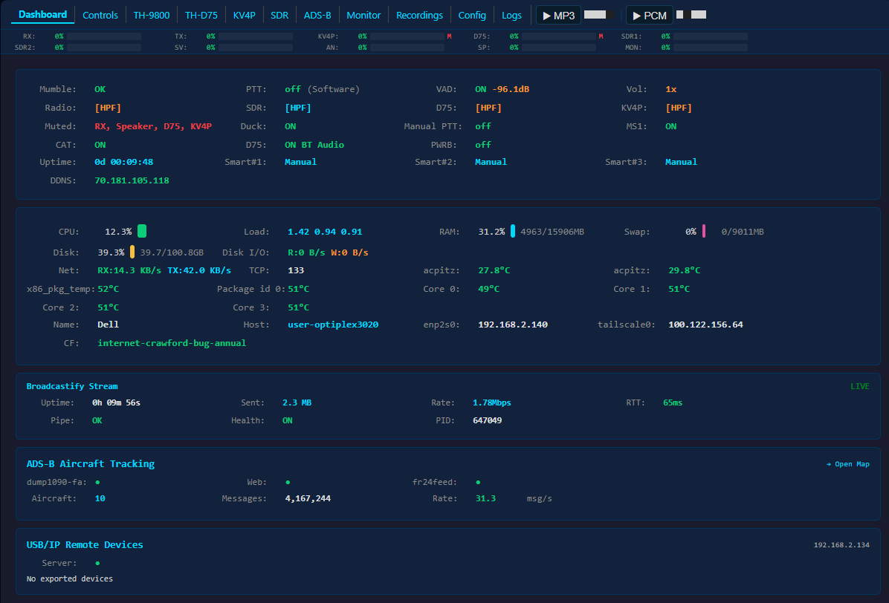
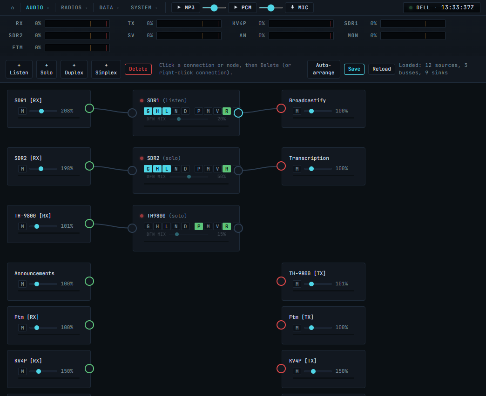
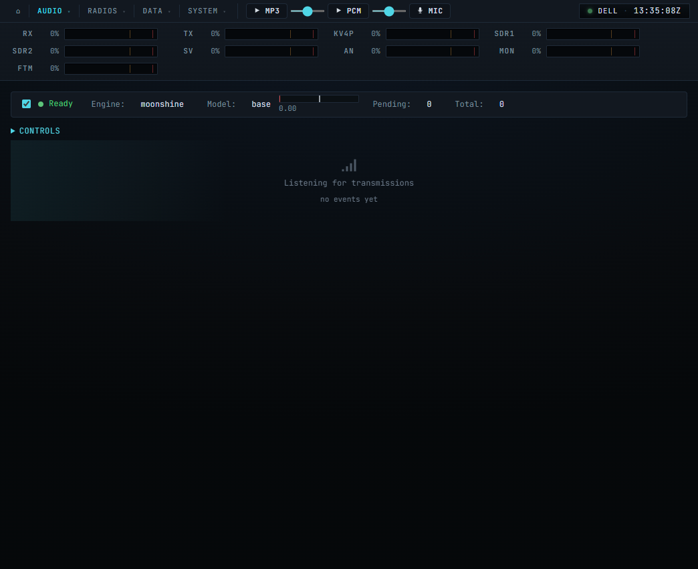
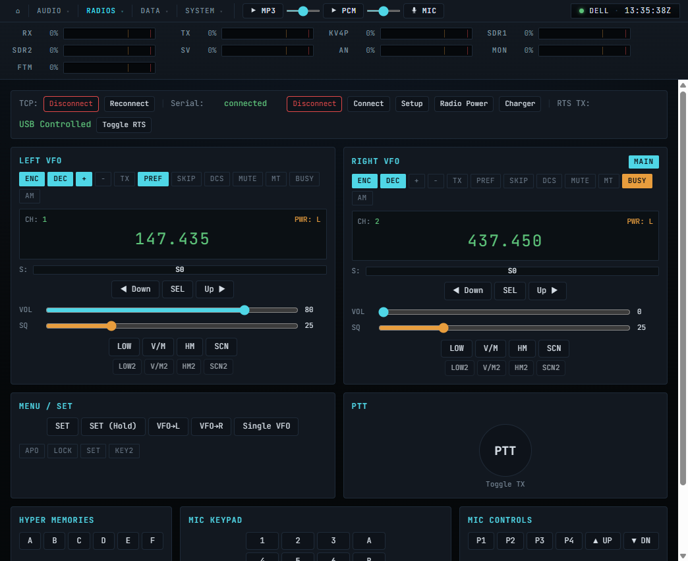
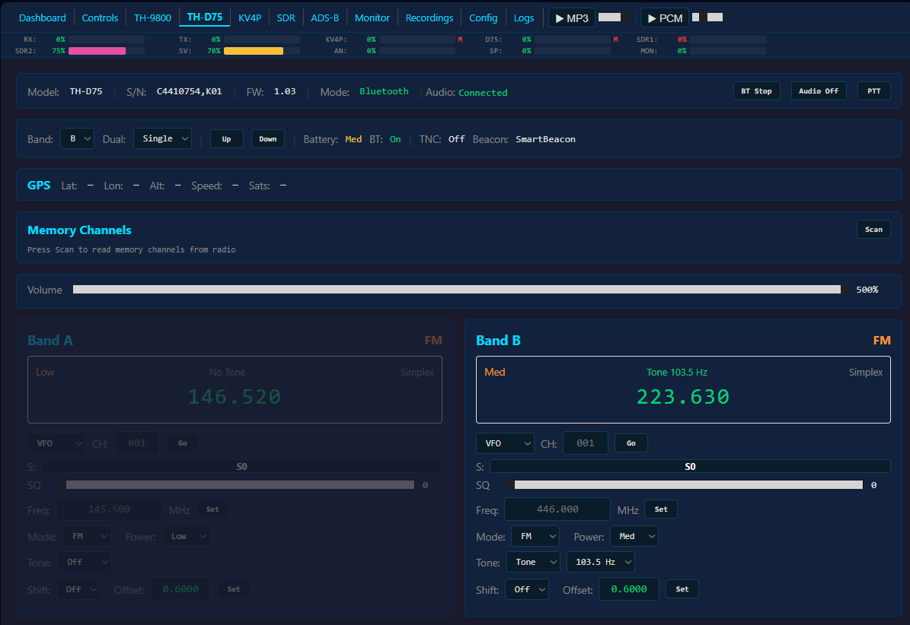
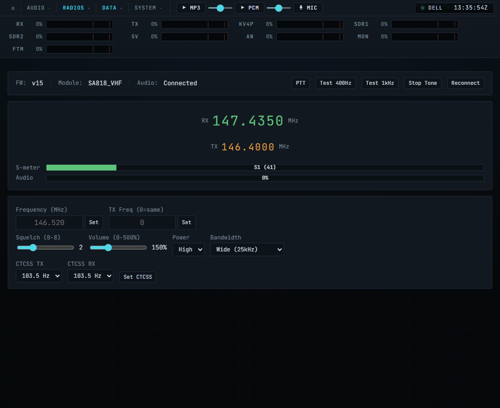
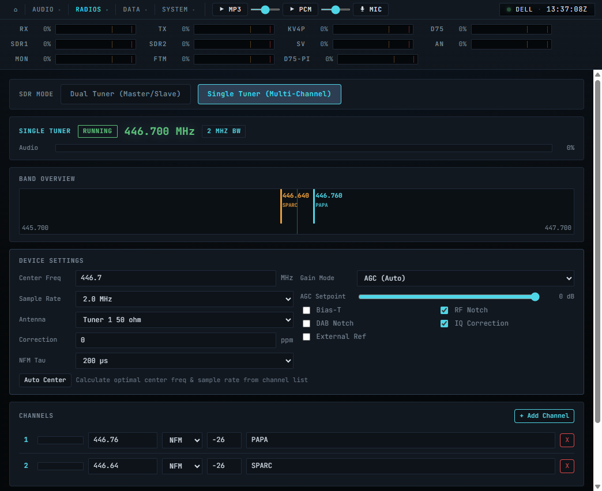
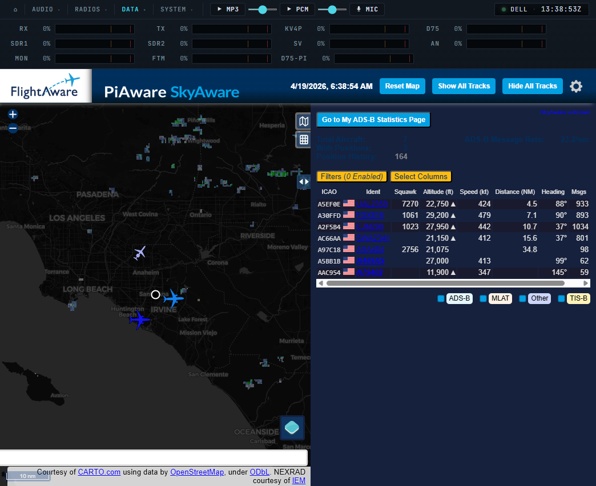
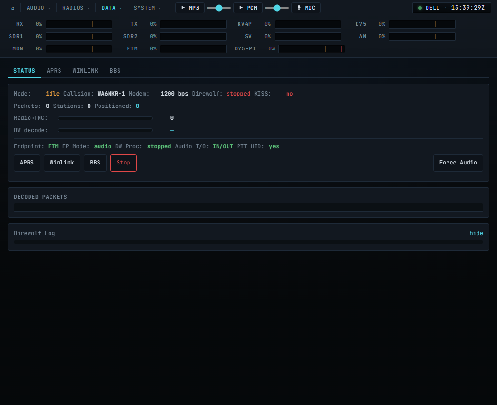

# Radio Gateway

A full-stack Linux radio gateway that bridges analog and digital two-way radios to the internet: Mumble VoIP, Broadcastify streaming, Winlink email over packet radio, APRS tracking, Telegram bot control, AI-powered announcements, distributed AI transcription, and scheduled fleet health checks — all driven from a single Python process with a 20+ page web UI. Bus-based audio routing with a visual drag-and-drop editor, plugin-based radio support that scales across multiple machines via the link endpoint protocol, per-stream diagnostic tracing, and 173 MCP tools for AI control.

**Radios:** TH-9800 (AIOC USBIP), TH-D75 (Bluetooth RFCOMM + SCO), KV4P (USB serial), FTM-150 (remote AIOC endpoint), IC-7100 (CI-V remote endpoint), RSPduo dual SDR receiver.

## Screenshots

| Dashboard | Routing | Transcription |
|:-:|:-:|:-:|
|  |  |  |

| TH-9800 | TH-D75 | KV4P |
|:-:|:-:|:-:|
|  |  |  |

| SDR | ADS-B | Packet Radio |
|:-:|:-:|:-:|
|  |  |  |

More screenshots in `docs/screenshots/`.

## What it does

**Radio hardware** — TH-9800 (AIOC USB + CAT control), TH-D75 over Bluetooth, KV4P HT (SA818/DRA818), RSPduo SDR (single-tuner multi-channel *or* dual-tuner master/slave), plus any AIOC/CI-V-equipped radio as a remote endpoint via [Gateway Link](docs/gateway_link.md).

**Audio routing v2.0** — bus-based mixer with a visual drag-and-drop editor at `/routing`. Four bus types (Listen / Solo / Duplex / Simplex Repeater), per-bus processing chain (gate / HPF / LPF / notch / **neural denoise** with RNNoise *or* DeepFilterNet 3), per-bus PCM + MP3 streaming, NUL sink for recording-only paths. Independent TX/RX muting per radio.

**Transcription** — distributed pool. Moonshine (linear cost, wins on short clips) + Whisper via faster-whisper (better accuracy on long clips), routed by clip length. Local engine or [remote workers](docs/transcription-pool.md) on other Linux boxes. Silero v5 VAD. Per-utterance frequency tagging and Mumble/Telegram cross-posting.

**Loop recorder** — per-bus continuous recording (1h – 7d retention), canvas waveform with click-to-play and drag-select export. Server-owned playback so it survives browser close.

**Packet radio + Winlink** — Direwolf TNC on an FTM-150 link endpoint, automatic audio/data mode switching. APRS decode + Leaflet map. Winlink email via [Pat](https://getpat.io). BBS terminal.

**AllStarLink** — bridge into the AllStar network without running a radio node on the gateway. An in-gateway USRP (DVSwitch) plugin talks to a headless ASL3 bridge node; a `/usrp` panel connects to any node on demand (per-node disconnect, conference view), and AllStar audio routes to/from any bus like another radio. See [docs/allstar_bridge.md](docs/allstar_bridge.md).

**Streaming** — Broadcastify / Icecast via internal ffmpeg pipe (no DarkIce, no ALSA loopback). Auto-reconnect. Cloudflare quick-tunnel for free public HTTPS with URL discovery via Google Drive.

**Control surfaces** — 20+ page web UI, 173 MCP tools, Telegram bot (text routes through Claude Code + MCP; voice notes stream straight to radio TX), Mumble chat commands (`!speak`, `!cw`), web mic + Android room monitor.

**Fleet Manager** — document-driven autonomous monitoring. Plain-English tasks in `hourly.md` / `daily.md` are handed to a Claude session on a schedule; structured reports come back with Telegram escalation on `elevated` severity. Auto-discovers nodes that change DHCP IP. See [docs/fleet-manager.md](docs/fleet-manager.md).

**Telemetry, AI, automation** — Smart Announcements (Claude CLI → Kokoro/Edge TTS → broadcast on schedule), scheduled automation tasks, live transcription, dashboard CPU breakdown (real-time critical / background nice / iowait / per-core load avg).

**Smaller features** — Kokoro ONNX offline TTS (54 voices, 9 languages, default) + Edge TTS + gTTS; voice dropdown auto-populated per engine; soundboard with 10 announcement slots; EchoLink via named pipes; optional embedded Mumble server (1 or 2 instances); GPS receiver; ARD repeater directory with proximity search and SDR auto-tune; ADS-B aircraft tracking; DDNS; Gmail notifications.

## What's new

See [CHANGELOG.md](CHANGELOG.md) for the detailed release history. Highlights:

- **v4.6** (2026-08-27) — evidence-based health: a Broadcastify reconnect isn't "successful" until bytes reach the wire, and reconnect workers are serialised so they stop killing each other's connections; a sink can now only be fed by one bus; plugin radios key on audio level as well as the PTT flag, closing a gap where the same source keyed a link endpoint but never the TH-9800; the config form stopped shipping secrets to the browser; manager checks run as one-shot `claude -p` (68M → ~86k tokens per run); Windows client gained live device switching and self-update; DDNS only updates on IP change and alarms on hostname expiry.
- **v4.5** (2026-08-03) — persistent AllStar links with a backoff/dormant reconciler (`ilink 3` is one-shot; app_rpt never re-establishes it); shared node address book (`usrp_nodes.json`); browser mic is now hold-to-talk with a dead-man release and a 120 s time-out timer.
- **v4.4** (2026-08-02) — AS1 / AS2 monitor taps in the shell bar: listen to either AllStar instance from any page.
- **v4.3** (2026-08-02) — background music beds with per-bed spoken announcements over a broadcast duck envelope; hot-swappable TTS engine with a GUI dropdown and 85 more voices; soundboard category picker with a 15 s clip cap; playback slots configurable (default 20); resampling made ~100× faster; Broadcastify encoder-pipe deadlock that made reconnect unreachable; all four fleet-manager auto-fix actions, which had silently never worked (polkit denial reported as success).
- **v4.2** (2026-07-29) — transcribe workers self-register with the gateway (no worker address in config; DHCP-proof); dashboard split into four sub-pages (Overview with subsystem annunciator / Endpoints with worker cards / Services / Operate); Radios nav driven by live plugin state; single shared `/status` poll; table-driven route dispatch; 156 MCP tools.
- **v4.1** (2026-07-28) — dual-channel Broadcastify feed (a different receiver on each of L/R); measurement-led audio-path cleanup — metrics fed from the wrong place, a stream bitrate that was never applied, and stream metadata that was never sent.
- **v4.0** (2026-06-26) — AllStarLink integration (USRP bridge + USRP2 dual-node, `/usrp` panel, link quality stats, AMI node control); Kokoro ONNX offline TTS (54 voices, 9 languages, new default engine); IC-7100 squelch underrun fix; MCP tool overhaul (134 tools, 13 new — AllStar, broadcastify, smart announce, relay, ADS-B); plugin platform made fully generic over discovered plugins.
- **v3.7** (2026-05-18) — distributed transcription pool, audio meter unification (RG.vu), Fleet Manager docs, 6-hourly gdrive backup of operational docs, install.sh package-manager detection fix (#3).
- **v3.6** (2026-05-08) — Fleet Manager: document-driven autonomous monitoring with scheduled Claude-driven checks, manifest-based fleet topology, Telegram escalation.
- **v3.5** (2026-05-03) — persistent transcription log with FTS5 + plain-English search; tabbed dashboard; bus tick refactor with per-sink drain threads.
- **v3.3** (2026-04-19) — DeepFilterNet 3 denoise, phase-aligned wet/dry, per-stream transcription workers.
- **v3.2** (2026-04-19) — Moonshine ASR + Silero VAD + RNNoise.
- **v3.0** (2026-04-08) — Unified audio engine + Loop Recorder + plugin auto-discovery.
- **v2.0** (2026-04-01) — Bus-based routing + visual UI + plugin architecture.

## Quick start

> Full walkthrough in **[INSTALL.md](INSTALL.md)** — prereqs, credential setup, per-feature checklists, troubleshooting. Summary below covers the happy path.

```bash
git clone https://github.com/ukbodypilot/radio-gateway.git
cd radio-gateway
bash scripts/install.sh
```

The installer walks 15 phases (distro detection, system packages, ALSA loopback, Python packages, KV4P driver, UDEV rules, audio + realtime groups, optional Darkice / SDR / Mumble server, systemd unit). Ends with a health check that flags anything off.

After it finishes:

1. **Log out and back in** (or `newgrp audio`) so group memberships take effect.
2. Edit `gateway_config.txt` — at minimum `[mumble] MUMBLE_SERVER / MUMBLE_PORT / MUMBLE_USERNAME / MUMBLE_PASSWORD`. The example config opens with a Fresh-Install-Minimum block.
3. Start: `sudo systemctl enable --now radio-gateway && sudo journalctl -u radio-gateway -f`.
4. Open `http://<host>:8080/dashboard`.

## Documentation

Start at **[docs/index.md](docs/index.md)** — pages grouped by audience (install / operate / extend / understand decisions).

A few that are likely the most useful:

- [docs/web-ui.md](docs/web-ui.md) — the shell + the four dashboard sub-pages (Overview / Endpoints / Services / Operate)
- [docs/transcription-pool.md](docs/transcription-pool.md) — distributed ASR architecture + deploying a remote worker
- [docs/fleet-manager.md](docs/fleet-manager.md) — document-driven monitoring with worked English-task examples
- [docs/gateway_link.md](docs/gateway_link.md) — link endpoint protocol for remote radios
- [docs/allstar_bridge.md](docs/allstar_bridge.md) — AllStarLink bridge node + in-gateway USRP plugin + `/usrp` panel
- [docs/plugin-development.md](docs/plugin-development.md) — writing a new radio plugin
- [docs/config-reference.md](docs/config-reference.md) — every `gateway_config.txt` key, grouped by feature

## Repository layout

```
radio-gateway/
├── radio_gateway.py            entry point
├── gateway_core.py             RadioGateway class, main loop
├── gateway_setup.py            phased initialization helpers
├── gateway_mcp.py              MCP server entry point (173 tools, stdio)
├── web_server.py               HTTP/WS server + config UI
├── config_format.py            gateway_config.txt value read/write rules (quoting, inline comments)
├── web_routes_*.py             per-domain POST handlers (transcribe / radio / audio / text / system / voice / manager / automation)
├── audio_bus.py, bus_manager.py        bus mixer
├── audio_sources.py            all source/sink classes
├── transcriber.py, transcribe_engine.py    ASR + pool dispatcher
├── manager_engine.py           Fleet Manager scheduler
├── plugins/                    radio plugins (th9800, sdr, packet, usrp, usrp2)
├── tools/*_link_plugin.py      link-endpoint plugins (d75, kv4p, ic7100), deployed to the endpoint host
├── gateway_link.py             link endpoint protocol + server
├── loop_recorder.py            per-bus continuous recording
├── packet_radio.py             Direwolf TNC + Pat client
├── smart_announce.py, radio_automation.py
├── web_pages/                  HTML pages + common.css/.js (shell) + dash.css/.js (dashboard family)
├── docs/                       feature docs grouped by audience (see docs/index.md)
├── scripts/                    install.sh + systemd unit templates
├── tools/                      telegram_bot.py, transcribe_worker.py, link_endpoint.py
└── examples/gateway_config.txt the canonical config template (read this once)
```

## License

MIT.

## Contributing

Issues and PRs welcome. See [docs/plugin-development.md](docs/plugin-development.md) for the plugin contract — adding a new radio is the most common contribution shape.
